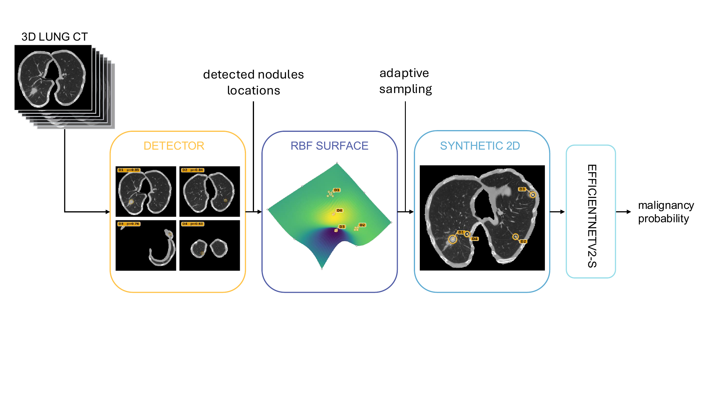

# Detection-Guided Adaptive 2D Synthesis for Lung CT

This repository contains the code for patient-level lung malignancy assessment from LUNA16/LIDC-IDRI CT volumes. The method uses a 3D nodule detector to guide the construction of a compact, patient-specific 2D representation that can be classified with standard 2D backbones.

## Method

The pipeline:

1. preprocesses each CT volume to isotropic spacing and a lung-focused field of view;
2. detects candidate pulmonary nodules with CPMNetv2;
3. retains the highest-confidence candidates at the selected operating point;
4. converts candidate centers and contours into control points for an adaptive RBF surface;
5. samples the CT volume along that surface to create a three-channel synthetic image; and
6. predicts patient-level malignancy with a 2D classifier.



*Figure 2. Detection-guided adaptive 2D synthesis. Detector candidates define the control points of the RBF surface; sampling the CT along this surface concentrates spatially separated abnormalities into one inspectable 2D representation.*

## Paper results

Pooled out-of-fold performance over the 10 patient-level LUNA16 test folds (`n = 796`). AUC uses continuous prediction scores; MCC, F1, and accuracy use the saved binary predictions. The soft slice-attention experiment used an actual batch size of 8.

| Family | Approach | AUC | MCC | F1 | Accuracy |
|---|---|---:|---:|---:|---:|
| Detector-guided adaptive | **Adaptive RBF (EfficientNetV2-S)** | **0.8149** | **0.4780** | **0.6806** | **0.7513** |
| Detector-guided adaptive | Adaptive Shepard (EfficientNetV2-S) | 0.7793 | 0.4308 | 0.6283 | 0.7324 |
| Non-adaptive 2D/2.5D | MIP axial (EfficientNetV2-S) | 0.6075 | 0.1604 | 0.5061 | 0.5930 |
| Non-adaptive 2D/2.5D | MIP tri-view (EfficientNetV2-S) | 0.6175 | 0.1556 | 0.5008 | 0.5917 |
| Non-adaptive 2D/2.5D | Central axial slice (EfficientNetV2-S) | 0.6153 | 0.1610 | 0.4668 | 0.6068 |
| Non-adaptive 2D/2.5D | Soft slice attention (EfficientNet-B0, half-frozen, batch 8) | 0.5482 | 0.0685 | 0.3908 | 0.5691 |
| Detector/geometric ablation | Detector crop-MIL attention | 0.5410 | 0.1861 | 0.5942 | 0.4510 |
| Detector/geometric ablation | Fixed-control RBF | 0.5878 | 0.1109 | 0.4499 | 0.5791 |
| Detector/geometric ablation | Random-control RBF | 0.6105 | 0.1877 | 0.5207 | 0.6068 |
| Volumetric | 3D ResNet18 | 0.5659 | 0.0989 | 0.4870 | 0.5553 |
| Foundation model | Rad-JEPA-3D resize-32 | 0.5679 | 0.1373 | 0.4868 | 0.5842 |
| Foundation model | Rad-JEPA-3D sliding mean | 0.5838 | 0.1504 | 0.4914 | 0.5917 |
| Foundation model | Rad-JEPA-3D sliding max | 0.5765 | 0.1498 | 0.5103 | 0.5829 |
| Foundation model | Rad-JEPA-3D sliding mean+max | 0.5934 | 0.1615 | 0.5231 | 0.5854 |
| Foundation model | 3DINO-ViT partial fine-tuning, mean+max | 0.5169 | 0.0338 | 0.4097 | 0.5402 |

Adaptive RBF was the strongest evaluated configuration. Paired DeLong and exact McNemar tests against the planned comparators are reported in the paper.

## Repository layout

```text
bash/                         Experiment launchers, one folder per src/ package (see bash/README.md)
assets/                       Figures displayed in this README
src/det/CPMNetv2/             3D nodule detector
src/luna16_synthetic_2d/      Adaptive synthesis and 2D classifiers
src/luna16_slice_attention_2p5d/  Full-volume soft slice-attention baseline
src/luna16_detection_mil/     Detector-crop MIL baseline
src/luna16_volume_3d/         3D ResNet18 volumetric baseline
src/luna16_radjepa_3d/        Frozen Rad-JEPA-3D linear-probe baseline
src/luna16_3dino_3d/          Partially fine-tuned 3DINO-ViT baseline
src/prs/                      Preprocessing and label-generation utilities
```

Large datasets, model checkpoints, generated outputs, experiment reports, and manuscript files are kept locally and excluded from Git.

## Installation

```bash
python -m venv .venv
source .venv/bin/activate
pip install --upgrade pip
pip install -r requirements.txt
```

GPU-enabled PyTorch and detector-specific dependencies may need to be adapted to the local CUDA installation.

## Data

Raw and preprocessed medical images are not distributed with the repository. The experiments expect local LUNA16/LIDC-IDRI volumes and patient-level split CSVs. The same patient grouping and labels are used across all 10 folds.

Typical local paths are:

```text
data/raw/LUNA16/              raw LUNA16 subsets and annotations
data/processed/               preprocessed volumes and masks (DATA_ROOT)
data/processed/cv_splits/     patient-level fold CSVs (SPLITS_DIR)
data/synthetic_2d/            generated synthetic 2D images (SYNTHETIC_ROOT)
data/2d_baselines/            MIP / central-slice baseline images
outputs/                      checkpoints, predictions and metrics
```

Each entry can be a symlink to a larger disk; the launchers read these locations through the environment variables shown.

## Main experiments

The principal detector-guided experiment uses CPMNetv2 candidates with probability threshold `0.50` and `top-k = 4`, followed by RBF synthesis and EfficientNetV2-S classification. It runs end to end with:

```bash
bash bash/preprocessing/luna16_preprocessing.sh
bash bash/preprocessing/reorganize_luna16_subsets.sh
bash bash/cpmnetv2/train_10fold.sh
bash bash/luna16_synthetic_2d/generate_top4_minprob0.5_rbf.sh
bash bash/luna16_synthetic_2d/train_top4_minprob0.5_rbf.sh
```

Every baseline in the results table has its own launcher; [`bash/README.md`](bash/README.md) maps scripts to experiments and lists the environment variables used to point them at local data and GPUs.

Grad-CAM explanations can be generated with `bash bash/luna16_synthetic_2d/gradcam_top4_minprob0.5_rbf.sh`, or directly with:

```bash
python -m src.luna16_synthetic_2d.explain_gradcam \
  --checkpoint /path/to/best.ckpt \
  --synthetic-images-dir /path/to/synthetic/images \
  --split-csv data/processed/cv_splits/luna16_classification_fold0.csv \
  --fold 0 \
  --backbone efficientnet_v2_s \
  --processed-dir /path/to/LUNA16_preprocessed \
  --clip-gt-to-lung \
  --require-gt-inside-visible-lung \
  --target-class predicted
```

The Rad-JEPA-3D baseline evaluates frozen whole-volume and sliding-window embeddings using linear probes. The 3DINO-ViT baseline partially fine-tunes the final 12 transformer blocks and aggregates overlapping `112^3` windows through mean+max pooling. Neither foundation-model baseline uses detector candidates, nodule coordinates, or masks.
