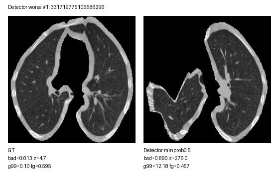
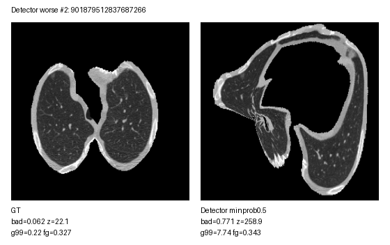
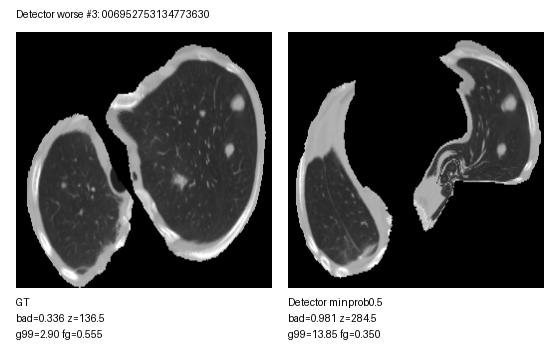
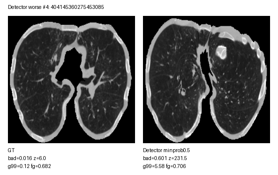
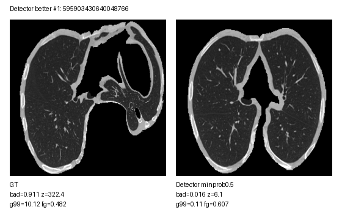
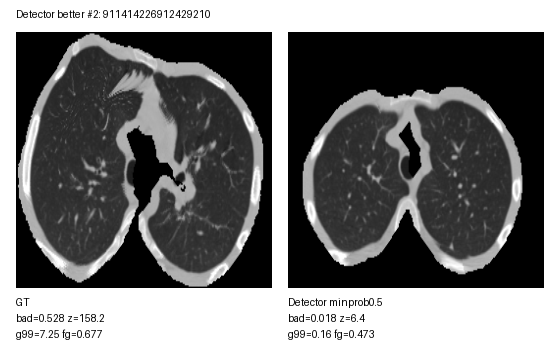
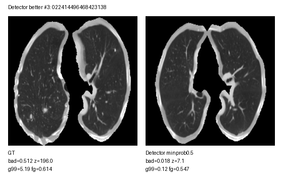
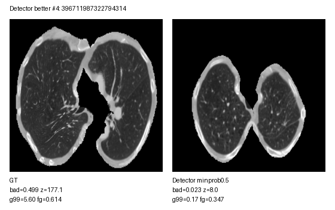

# LUNA16 Detector vs Ground-Truth Synthetic Surface QC

Lower `qc_badness` is better. The score is a triage heuristic combining foreground coverage, foreground contrast, z-surface range, edge variation, and surface gradient roughness.

- Ground-truth generated cases analyzed: **888**
- Detector top-5 minprob0.5 generated cases analyzed: **888**
- Paired cases compared by `seriesuid`: **888**
- Detector lower/better `qc_badness`: **224 / 888 (25.2%)**
- Detector equal-or-higher/worse `qc_badness`: **664 / 888 (74.8%)**

## Visualization Links

- Synthetic surface notebook: [visualize_synthetic_surfaces.ipynb](../../src/luna16_synthetic_2d/visualize_synthetic_surfaces.ipynb)
- Ground-truth synthetic surfaces: [outputs/luna16_saliency_synthetic_gt](../../outputs/luna16_saliency_synthetic_gt)
- Detector synthetic surfaces: [outputs/luna16_saliency_synthetic_detector_top5_minprob0.5](../../outputs/luna16_saliency_synthetic_detector_top5_minprob0.5)

## Visual Examples

Detector worse than ground truth by `qc_badness`:

Detector better than ground truth by `qc_badness`:

## Source Summary

| source                   |   n |   qc_badness_mean |   qc_badness_median |   qc_badness_p95 |   foreground_fraction_mean |   z_range_mean |   grad_p99_mean |
|:-------------------------|----:|------------------:|--------------------:|-----------------:|---------------------------:|---------------:|----------------:|
| ground_truth             | 888 |             0.098 |               0.030 |            0.363 |                      0.537 |         37.910 |           0.780 |
| detector_top5_minprob0.5 | 888 |             0.179 |               0.147 |            0.477 |                      0.510 |         67.480 |           1.352 |

## QC Buckets

`good_or_low_review` is `qc_badness <= 0.10`, `moderate_review` is `0.10 < qc_badness <= 0.30`, and `high_review` is `qc_badness > 0.30`.

| source                   | qc_bucket          |   n |
|:-------------------------|:-------------------|----:|
| ground_truth             | good_or_low_review | 587 |
| ground_truth             | moderate_review    | 223 |
| ground_truth             | high_review        |  78 |
| detector_top5_minprob0.5 | good_or_low_review | 366 |
| detector_top5_minprob0.5 | moderate_review    | 318 |
| detector_top5_minprob0.5 | high_review        | 204 |

## Likely Explanation

The detector run contains all 888 cases. Cases without detections above the configured threshold are represented through the detector-negative pseudo fallback, so those samples should be interpreted separately from true no-nodule ground truth.

The main QC failure mode is geometric roughness: detector candidates spread across a larger cranio-caudal span force the interpolated surface through farther-apart control points, increasing `z_range` and `grad_p99`.

| source                   |   control_labels |   count |   mean |   median |
|:-------------------------|-----------------:|--------:|-------:|---------:|
| ground_truth             |                5 |     456 |  0.017 |    0.012 |
| ground_truth             |               10 |     240 |  0.144 |    0.112 |
| ground_truth             |               15 |      96 |  0.189 |    0.180 |
| ground_truth             |               20 |      34 |  0.239 |    0.228 |
| ground_truth             |               25 |      30 |  0.287 |    0.325 |
| ground_truth             |               30 |      13 |  0.229 |    0.188 |
| ground_truth             |               35 |       7 |  0.415 |    0.418 |
| ground_truth             |               40 |       4 |  0.279 |    0.274 |
| ground_truth             |               45 |       7 |  0.369 |    0.390 |
| ground_truth             |               60 |       1 |  0.401 |    0.401 |
| detector_top5_minprob0.5 |                5 |     263 |  0.019 |    0.013 |
| detector_top5_minprob0.5 |               10 |     199 |  0.148 |    0.125 |
| detector_top5_minprob0.5 |               15 |     137 |  0.251 |    0.233 |
| detector_top5_minprob0.5 |               20 |      79 |  0.278 |    0.280 |
| detector_top5_minprob0.5 |               25 |     202 |  0.321 |    0.297 |
| detector_top5_minprob0.5 |               30 |       3 |  0.507 |    0.548 |
| detector_top5_minprob0.5 |               35 |       1 |  0.451 |    0.451 |
| detector_top5_minprob0.5 |               40 |       1 |  0.508 |    0.508 |
| detector_top5_minprob0.5 |               45 |       3 |  0.400 |    0.398 |

## Paired Delta Summary

Delta is detector minus ground truth; negative `qc_badness` means detector is better by this heuristic.

| metric                                      |   mean |    std |      5% |    25% |   50% |    75% |     95% |
|:--------------------------------------------|-------:|-------:|--------:|-------:|------:|-------:|--------:|
| foreground_fraction_delta_detector_minus_gt | -0.027 |  0.142 |  -0.347 | -0.039 | 0.000 |  0.016 |   0.169 |
| foreground_std_delta_detector_minus_gt      |  0.000 |  0.013 |  -0.013 | -0.003 | 0.000 |  0.004 |   0.017 |
| z_range_delta_detector_minus_gt             | 29.570 | 67.607 | -72.606 | -0.048 | 3.258 | 60.705 | 156.303 |
| z_std_delta_detector_minus_gt               |  6.136 | 14.109 | -15.210 | -0.021 | 0.819 | 12.739 |  33.214 |
| grad_p99_delta_detector_minus_gt            |  0.573 |  1.645 |  -1.377 | -0.000 | 0.057 |  1.237 |   3.412 |
| grad_max_delta_detector_minus_gt            |  1.866 |  8.189 |  -2.651 |  0.000 | 0.126 |  2.142 |  11.379 |
| qc_badness_delta_detector_minus_gt          |  0.081 |  0.175 |  -0.169 | -0.000 | 0.017 |  0.184 |   0.390 |

## Detector Most Worse Than Ground Truth

| seriesuid                                                        |   qc_badness_gt |   qc_badness_detector |   qc_badness_delta_detector_minus_gt |   z_range_gt |   z_range_detector |   grad_p99_gt |   grad_p99_detector |   foreground_fraction_gt |   foreground_fraction_detector |
|:-----------------------------------------------------------------|----------------:|----------------------:|-------------------------------------:|-------------:|-------------------:|--------------:|--------------------:|-------------------------:|-------------------------------:|
| 1.3.6.1.4.1.14519.5.2.1.6279.6001.283733738239331719775105586296 |           0.013 |                 0.890 |                                0.878 |        4.736 |            276.000 |         0.102 |              12.182 |                    0.595 |                          0.457 |
| 1.3.6.1.4.1.14519.5.2.1.6279.6001.199975006921901879512837687266 |           0.062 |                 0.771 |                                0.709 |       22.082 |            258.865 |         0.218 |               7.741 |                    0.327 |                          0.343 |
| 1.3.6.1.4.1.14519.5.2.1.6279.6001.153536305742006952753134773630 |           0.336 |                 0.981 |                                0.645 |      136.530 |            284.534 |         2.904 |              13.852 |                    0.555 |                          0.350 |
| 1.3.6.1.4.1.14519.5.2.1.6279.6001.168605638657404145360275453085 |           0.016 |                 0.601 |                                0.585 |        5.972 |            231.544 |         0.119 |               5.584 |                    0.682 |                          0.706 |
| 1.3.6.1.4.1.14519.5.2.1.6279.6001.373433682859788429397781158572 |           0.011 |                 0.593 |                                0.581 |        4.278 |            206.110 |         0.091 |               5.900 |                    0.652 |                          0.336 |
| 1.3.6.1.4.1.14519.5.2.1.6279.6001.159996104466052855396410079250 |           0.015 |                 0.578 |                                0.564 |        5.381 |            251.989 |         0.119 |               2.868 |                    0.694 |                          0.614 |
| 1.3.6.1.4.1.14519.5.2.1.6279.6001.137773550852881583165286615668 |           0.043 |                 0.605 |                                0.562 |       16.269 |            205.503 |         0.404 |               6.487 |                    0.661 |                          0.664 |
| 1.3.6.1.4.1.14519.5.2.1.6279.6001.428038562098395445838061018440 |           0.012 |                 0.570 |                                0.558 |        4.425 |            235.597 |         0.105 |               4.247 |                    0.626 |                          0.623 |
| 1.3.6.1.4.1.14519.5.2.1.6279.6001.300136985030081433029390459071 |           0.073 |                 0.626 |                                0.553 |       28.642 |            187.576 |         0.521 |               8.248 |                    0.637 |                          0.505 |
| 1.3.6.1.4.1.14519.5.2.1.6279.6001.168737928729363683423228050295 |           0.016 |                 0.568 |                                0.552 |        5.958 |            221.830 |         0.147 |               5.602 |                    0.595 |                          0.534 |
| 1.3.6.1.4.1.14519.5.2.1.6279.6001.138813197521718693188313387015 |           0.005 |                 0.556 |                                0.551 |        1.939 |            208.065 |         0.042 |               5.708 |                    0.532 |                          0.602 |
| 1.3.6.1.4.1.14519.5.2.1.6279.6001.246225645401227472829175288633 |           0.015 |                 0.565 |                                0.550 |        5.396 |            244.206 |         0.120 |               3.986 |                    0.620 |                          0.666 |

## Detector Most Better Than Ground Truth

| seriesuid                                                        |   qc_badness_gt |   qc_badness_detector |   qc_badness_delta_detector_minus_gt |   z_range_gt |   z_range_detector |   grad_p99_gt |   grad_p99_detector |   foreground_fraction_gt |   foreground_fraction_detector |
|:-----------------------------------------------------------------|----------------:|----------------------:|-------------------------------------:|-------------:|-------------------:|--------------:|--------------------:|-------------------------:|-------------------------------:|
| 1.3.6.1.4.1.14519.5.2.1.6279.6001.111780708132595903430640048766 |           0.911 |                 0.016 |                               -0.895 |      322.425 |              6.089 |        10.119 |               0.113 |                    0.482 |                          0.607 |
| 1.3.6.1.4.1.14519.5.2.1.6279.6001.286061375572911414226912429210 |           0.528 |                 0.018 |                               -0.510 |      158.220 |              6.446 |         7.254 |               0.163 |                    0.677 |                          0.473 |
| 1.3.6.1.4.1.14519.5.2.1.6279.6001.140253591510022414496468423138 |           0.512 |                 0.018 |                               -0.494 |      195.964 |              7.111 |         5.193 |               0.117 |                    0.614 |                          0.547 |
| 1.3.6.1.4.1.14519.5.2.1.6279.6001.264090899378396711987322794314 |           0.499 |                 0.023 |                               -0.476 |      177.082 |              7.985 |         5.600 |               0.168 |                    0.614 |                          0.347 |
| 1.3.6.1.4.1.14519.5.2.1.6279.6001.124656777236468248920498636247 |           0.414 |                 0.010 |                               -0.404 |      140.233 |              4.005 |         5.476 |               0.076 |                    0.492 |                          0.550 |
| 1.3.6.1.4.1.14519.5.2.1.6279.6001.139444426690868429919252698606 |           0.405 |                 0.011 |                               -0.394 |      134.596 |              3.890 |         5.013 |               0.106 |                    0.608 |                          0.612 |
| 1.3.6.1.4.1.14519.5.2.1.6279.6001.232058316950007760548968840196 |           0.397 |                 0.014 |                               -0.383 |      128.202 |              5.241 |         4.478 |               0.102 |                    0.504 |                          0.526 |
| 1.3.6.1.4.1.14519.5.2.1.6279.6001.177985905159808659201278495182 |           0.369 |                 0.013 |                               -0.356 |      118.819 |              4.806 |         4.777 |               0.106 |                    0.589 |                          0.586 |
| 1.3.6.1.4.1.14519.5.2.1.6279.6001.333319057944372470283038483725 |           0.340 |                 0.006 |                               -0.335 |      129.195 |              2.008 |         2.958 |               0.046 |                    0.515 |                          0.588 |
| 1.3.6.1.4.1.14519.5.2.1.6279.6001.249404938669582150398726875826 |           0.346 |                 0.014 |                               -0.331 |      123.709 |              5.134 |         3.259 |               0.114 |                    0.378 |                          0.608 |
| 1.3.6.1.4.1.14519.5.2.1.6279.6001.306948744223170422945185006551 |           0.337 |                 0.007 |                               -0.330 |      117.428 |              2.363 |         3.879 |               0.056 |                    0.552 |                          0.550 |
| 1.3.6.1.4.1.14519.5.2.1.6279.6001.910757789941076242457816491305 |           0.338 |                 0.012 |                               -0.326 |      121.346 |              4.253 |         3.882 |               0.091 |                    0.587 |                          0.507 |

## Output Files

- `ground_truth_surface_qc_metrics.csv`
- `detector_top5_surface_qc_metrics.csv`
- `paired_surface_qc_comparison.csv`
