# LUNA16 No-Nodule Synthetic Surface QC Report

This report analyzes only generated synthetic surfaces for scans without ground-truth nodules.

- Source metrics: `docs/luna16_saliency_synthetic_gt_qc_report/surface_qc_metrics.csv`
- No-nodule cases analyzed: **287**
- High-review cases (`qc_badness > 0.30`): **25** (8.7%)
- Wide-surface cases (`z_range > 150`): **9** (3.1%)
- Rough-surface cases (`grad_p99 > 5`): **14** (4.9%)
- Low-foreground cases (`foreground_fraction < 0.35`): **5** (1.7%)

## Summary Statistics

|       |   foreground_fraction |   foreground_std |   z_range |   z_std |   grad_p99 |   grad_max |   qc_badness |
|:------|----------------------:|-----------------:|----------:|--------:|-----------:|-----------:|-------------:|
| count |               287.000 |          287.000 |   287.000 | 287.000 |    287.000 |    287.000 |      287.000 |
| mean  |                 0.561 |            0.232 |    37.643 |   7.832 |      0.954 |      2.700 |        0.101 |
| std   |                 0.076 |            0.012 |    49.909 |   9.802 |      1.747 |      7.774 |        0.143 |
| min   |                 0.263 |            0.196 |     1.513 |   0.422 |      0.037 |      0.056 |        0.004 |
| 1%    |                 0.317 |            0.204 |     1.850 |   0.480 |      0.042 |      0.061 |        0.005 |
| 5%    |                 0.416 |            0.214 |     2.969 |   0.785 |      0.064 |      0.091 |        0.008 |
| 25%   |                 0.529 |            0.224 |     4.450 |   1.219 |      0.098 |      0.137 |        0.012 |
| 50%   |                 0.572 |            0.231 |     9.374 |   1.979 |      0.172 |      0.247 |        0.028 |
| 75%   |                 0.611 |            0.239 |    61.017 |  12.587 |      1.017 |      1.348 |        0.156 |
| 95%   |                 0.656 |            0.252 |   135.215 |  25.482 |      4.687 |     15.738 |        0.389 |
| 99%   |                 0.681 |            0.266 |   210.772 |  35.543 |      8.115 |     37.930 |        0.634 |
| max   |                 0.717 |            0.279 |   322.425 |  67.526 |     13.431 |     78.480 |        0.911 |

## Pseudo-Region Count Distribution

|   pseudo_region_count |   scan_count |   probability |
|----------------------:|-------------:|--------------:|
|                 1.000 |      142.000 |         0.495 |
|                 2.000 |       85.000 |         0.296 |
|                 3.000 |       32.000 |         0.111 |
|                 4.000 |       10.000 |         0.035 |
|                 5.000 |        6.000 |         0.021 |
|                 6.000 |        4.000 |         0.014 |
|                 7.000 |        3.000 |         0.010 |
|                 8.000 |        2.000 |         0.007 |
|                 9.000 |        3.000 |         0.010 |

## QC By Pseudo-Region Count

|   pseudo_region_count |   n |   qc_badness_mean |   qc_badness_median |   qc_badness_p95 |   z_range_mean |   z_range_p95 |   grad_p99_mean | bad_zrange_gt_150   |
|----------------------:|----:|------------------:|--------------------:|-----------------:|---------------:|--------------:|----------------:|:--------------------|
|                     1 | 142 |             0.015 |               0.012 |            0.034 |          5.015 |        10.624 |           0.109 | 0.0%                |
|                     2 |  85 |             0.134 |               0.103 |            0.295 |         52.591 |       115.535 |           1.119 | 2.4%                |
|                     3 |  32 |             0.184 |               0.171 |            0.365 |         70.374 |       124.431 |           1.689 | 3.1%                |
|                     4 |  10 |             0.268 |               0.206 |            0.618 |        102.031 |       225.074 |           2.477 | 10.0%               |
|                     5 |   6 |             0.356 |               0.373 |            0.573 |        121.207 |       188.255 |           4.100 | 16.7%               |
|                     6 |   4 |             0.376 |               0.392 |            0.535 |        126.026 |       170.613 |           4.897 | 25.0%               |
|                     7 |   3 |             0.428 |               0.451 |            0.520 |        142.345 |       161.237 |           5.181 | 66.7%               |
|                     8 |   2 |             0.418 |               0.418 |            0.499 |        149.683 |       162.467 |           4.251 | 50.0%               |
|                     9 |   3 |             0.400 |               0.398 |            0.471 |        130.353 |       144.339 |           5.388 | 0.0%                |

## Best No-Nodule Cases

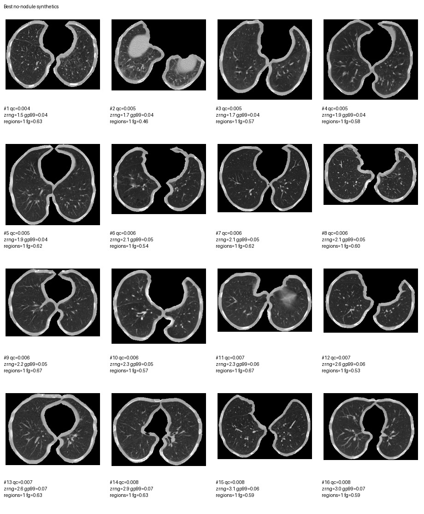

|   qc_rank_best_no_nodule | seriesuid                                                        |   qc_badness |   foreground_fraction |   z_range |   grad_p99 |   grad_max |   pseudo_region_count |   control_labels |
|-------------------------:|:-----------------------------------------------------------------|-------------:|----------------------:|----------:|-----------:|-----------:|----------------------:|-----------------:|
|                        1 | 1.3.6.1.4.1.14519.5.2.1.6279.6001.250438451287314206124484591986 |        0.004 |                 0.629 |     1.513 |      0.044 |      0.062 |                     1 |                5 |
|                        2 | 1.3.6.1.4.1.14519.5.2.1.6279.6001.138894439026794145866157853158 |        0.005 |                 0.461 |     1.710 |      0.042 |      0.058 |                     1 |                5 |
|                        3 | 1.3.6.1.4.1.14519.5.2.1.6279.6001.201890795870532056891161597218 |        0.005 |                 0.575 |     1.749 |      0.042 |      0.063 |                     1 |                5 |
|                        4 | 1.3.6.1.4.1.14519.5.2.1.6279.6001.219281726101239572270900838145 |        0.005 |                 0.579 |     1.867 |      0.037 |      0.056 |                     1 |                5 |
|                        5 | 1.3.6.1.4.1.14519.5.2.1.6279.6001.504324996863016748259361352296 |        0.005 |                 0.624 |     1.932 |      0.039 |      0.058 |                     1 |                5 |
|                        6 | 1.3.6.1.4.1.14519.5.2.1.6279.6001.897279226481700053115245043064 |        0.006 |                 0.538 |     2.084 |      0.055 |      0.125 |                     1 |                5 |
|                        7 | 1.3.6.1.4.1.14519.5.2.1.6279.6001.671278273674156798801285503514 |        0.006 |                 0.622 |     2.114 |      0.052 |      0.074 |                     1 |                5 |
|                        8 | 1.3.6.1.4.1.14519.5.2.1.6279.6001.330043769832606379655473292782 |        0.006 |                 0.597 |     2.123 |      0.054 |      0.071 |                     1 |                5 |
|                        9 | 1.3.6.1.4.1.14519.5.2.1.6279.6001.216652640878960522552873394709 |        0.006 |                 0.666 |     2.199 |      0.054 |      0.075 |                     1 |                5 |
|                       10 | 1.3.6.1.4.1.14519.5.2.1.6279.6001.320967206808467952819309001585 |        0.006 |                 0.569 |     2.309 |      0.054 |      0.079 |                     1 |                5 |
|                       11 | 1.3.6.1.4.1.14519.5.2.1.6279.6001.975254950136384517744116790879 |        0.007 |                 0.672 |     2.333 |      0.058 |      0.078 |                     1 |                5 |
|                       12 | 1.3.6.1.4.1.14519.5.2.1.6279.6001.980362852713685276785310240144 |        0.007 |                 0.529 |     2.553 |      0.061 |      0.083 |                     1 |                5 |
|                       13 | 1.3.6.1.4.1.14519.5.2.1.6279.6001.303865116731361029078599241306 |        0.007 |                 0.631 |     2.591 |      0.072 |      0.104 |                     1 |                5 |
|                       14 | 1.3.6.1.4.1.14519.5.2.1.6279.6001.749871569713868632259874663577 |        0.008 |                 0.633 |     2.884 |      0.072 |      0.103 |                     1 |                5 |
|                       15 | 1.3.6.1.4.1.14519.5.2.1.6279.6001.211071908915618528829547301883 |        0.008 |                 0.589 |     3.090 |      0.058 |      0.081 |                     1 |                5 |
|                       16 | 1.3.6.1.4.1.14519.5.2.1.6279.6001.385151742584074711135621089321 |        0.008 |                 0.590 |     2.962 |      0.066 |      0.092 |                     1 |                5 |

### Best Case Images

**Best rank 1 - `1.3.6.1.4.1.14519.5.2.1.6279.6001.250438451287314206124484591986`**  
qc=0.004, z_range=1.5, grad_p99=0.044, pseudo_regions=1

**Best rank 2 - `1.3.6.1.4.1.14519.5.2.1.6279.6001.138894439026794145866157853158`**  
qc=0.005, z_range=1.7, grad_p99=0.042, pseudo_regions=1

**Best rank 3 - `1.3.6.1.4.1.14519.5.2.1.6279.6001.201890795870532056891161597218`**  
qc=0.005, z_range=1.7, grad_p99=0.042, pseudo_regions=1

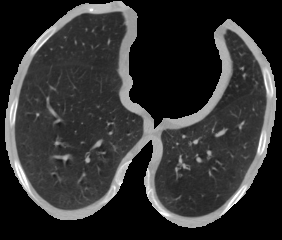

**Best rank 4 - `1.3.6.1.4.1.14519.5.2.1.6279.6001.219281726101239572270900838145`**  
qc=0.005, z_range=1.9, grad_p99=0.037, pseudo_regions=1

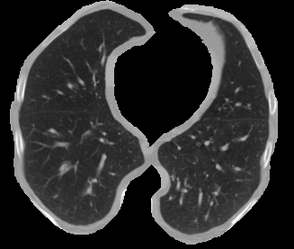

**Best rank 5 - `1.3.6.1.4.1.14519.5.2.1.6279.6001.504324996863016748259361352296`**  
qc=0.005, z_range=1.9, grad_p99=0.039, pseudo_regions=1

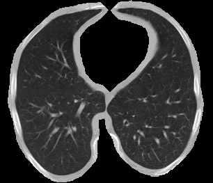

**Best rank 6 - `1.3.6.1.4.1.14519.5.2.1.6279.6001.897279226481700053115245043064`**  
qc=0.006, z_range=2.1, grad_p99=0.055, pseudo_regions=1

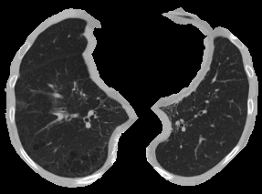

**Best rank 7 - `1.3.6.1.4.1.14519.5.2.1.6279.6001.671278273674156798801285503514`**  
qc=0.006, z_range=2.1, grad_p99=0.052, pseudo_regions=1

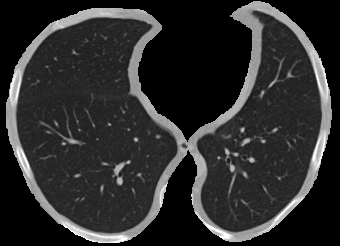

**Best rank 8 - `1.3.6.1.4.1.14519.5.2.1.6279.6001.330043769832606379655473292782`**  
qc=0.006, z_range=2.1, grad_p99=0.054, pseudo_regions=1

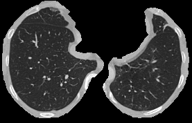

**Best rank 9 - `1.3.6.1.4.1.14519.5.2.1.6279.6001.216652640878960522552873394709`**  
qc=0.006, z_range=2.2, grad_p99=0.054, pseudo_regions=1

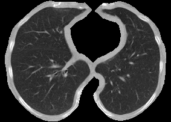

**Best rank 10 - `1.3.6.1.4.1.14519.5.2.1.6279.6001.320967206808467952819309001585`**  
qc=0.006, z_range=2.3, grad_p99=0.054, pseudo_regions=1

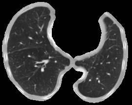

**Best rank 11 - `1.3.6.1.4.1.14519.5.2.1.6279.6001.975254950136384517744116790879`**  
qc=0.007, z_range=2.3, grad_p99=0.058, pseudo_regions=1

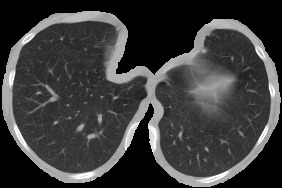

**Best rank 12 - `1.3.6.1.4.1.14519.5.2.1.6279.6001.980362852713685276785310240144`**  
qc=0.007, z_range=2.6, grad_p99=0.061, pseudo_regions=1

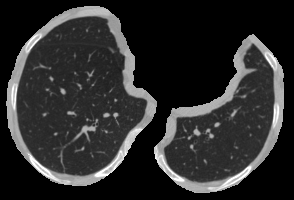

**Best rank 13 - `1.3.6.1.4.1.14519.5.2.1.6279.6001.303865116731361029078599241306`**  
qc=0.007, z_range=2.6, grad_p99=0.072, pseudo_regions=1

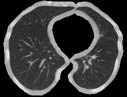

**Best rank 14 - `1.3.6.1.4.1.14519.5.2.1.6279.6001.749871569713868632259874663577`**  
qc=0.008, z_range=2.9, grad_p99=0.072, pseudo_regions=1

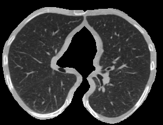

**Best rank 15 - `1.3.6.1.4.1.14519.5.2.1.6279.6001.211071908915618528829547301883`**  
qc=0.008, z_range=3.1, grad_p99=0.058, pseudo_regions=1

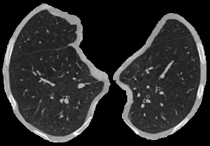

**Best rank 16 - `1.3.6.1.4.1.14519.5.2.1.6279.6001.385151742584074711135621089321`**  
qc=0.008, z_range=3.0, grad_p99=0.066, pseudo_regions=1

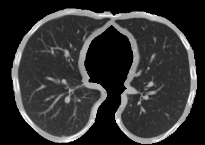

## Worst No-Nodule Cases

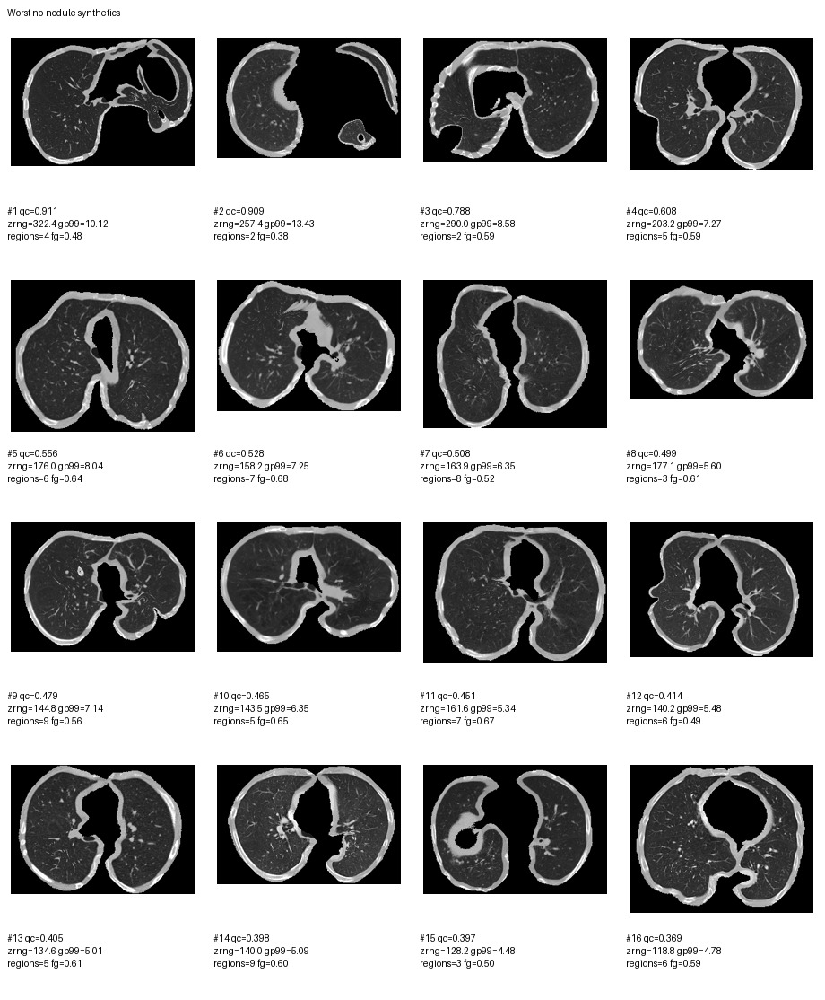

|   qc_rank_worst_no_nodule | seriesuid                                                        |   qc_badness |   foreground_fraction |   z_range |   grad_p99 |   grad_max |   pseudo_region_count |   control_labels |
|--------------------------:|:-----------------------------------------------------------------|-------------:|----------------------:|----------:|-----------:|-----------:|----------------------:|-----------------:|
|                         1 | 1.3.6.1.4.1.14519.5.2.1.6279.6001.111780708132595903430640048766 |        0.911 |                 0.482 |   322.425 |     10.119 |     78.480 |                     4 |               20 |
|                         2 | 1.3.6.1.4.1.14519.5.2.1.6279.6001.331211682377519763144559212009 |        0.909 |                 0.384 |   257.416 |     13.431 |     50.596 |                     2 |               10 |
|                         3 | 1.3.6.1.4.1.14519.5.2.1.6279.6001.116703382344406837243058680403 |        0.788 |                 0.594 |   290.000 |      8.585 |     36.238 |                     2 |               10 |
|                         4 | 1.3.6.1.4.1.14519.5.2.1.6279.6001.307946352302138765071461362398 |        0.608 |                 0.594 |   203.179 |      7.274 |     17.639 |                     5 |               25 |
|                         5 | 1.3.6.1.4.1.14519.5.2.1.6279.6001.100684836163890911914061745866 |        0.556 |                 0.642 |   175.974 |      8.038 |     39.011 |                     6 |               30 |
|                         6 | 1.3.6.1.4.1.14519.5.2.1.6279.6001.286061375572911414226912429210 |        0.528 |                 0.677 |   158.220 |      7.254 |     16.015 |                     7 |               35 |
|                         7 | 1.3.6.1.4.1.14519.5.2.1.6279.6001.306112617218006614029386065035 |        0.508 |                 0.522 |   163.887 |      6.352 |     18.743 |                     8 |               40 |
|                         8 | 1.3.6.1.4.1.14519.5.2.1.6279.6001.264090899378396711987322794314 |        0.499 |                 0.614 |   177.082 |      5.600 |     11.730 |                     3 |               15 |
|                         9 | 1.3.6.1.4.1.14519.5.2.1.6279.6001.229664630348267553620068691756 |        0.479 |                 0.557 |   144.818 |      7.140 |     37.754 |                     9 |               45 |
|                        10 | 1.3.6.1.4.1.14519.5.2.1.6279.6001.203741923654363010377298352671 |        0.465 |                 0.649 |   143.484 |      6.345 |     15.754 |                     5 |               25 |
|                        11 | 1.3.6.1.4.1.14519.5.2.1.6279.6001.237915456403882324748189195892 |        0.451 |                 0.668 |   161.572 |      5.343 |     25.400 |                     7 |               35 |
|                        12 | 1.3.6.1.4.1.14519.5.2.1.6279.6001.124656777236468248920498636247 |        0.414 |                 0.492 |   140.233 |      5.476 |     34.969 |                     6 |               30 |
|                        13 | 1.3.6.1.4.1.14519.5.2.1.6279.6001.139444426690868429919252698606 |        0.405 |                 0.608 |   134.596 |      5.013 |     18.433 |                     5 |               25 |
|                        14 | 1.3.6.1.4.1.14519.5.2.1.6279.6001.248360766706804179966476685510 |        0.398 |                 0.598 |   140.033 |      5.088 |     15.701 |                     9 |               45 |
|                        15 | 1.3.6.1.4.1.14519.5.2.1.6279.6001.232058316950007760548968840196 |        0.397 |                 0.504 |   128.202 |      4.478 |     22.419 |                     3 |               15 |
|                        16 | 1.3.6.1.4.1.14519.5.2.1.6279.6001.177985905159808659201278495182 |        0.369 |                 0.589 |   118.819 |      4.777 |     14.225 |                     6 |               30 |

### Worst Case Images

**Worst rank 1 - `1.3.6.1.4.1.14519.5.2.1.6279.6001.111780708132595903430640048766`**  
qc=0.911, z_range=322.4, grad_p99=10.119, pseudo_regions=4

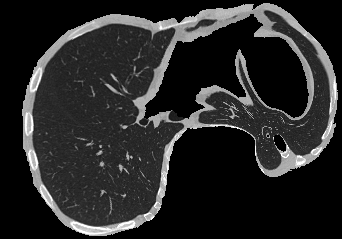

**Worst rank 2 - `1.3.6.1.4.1.14519.5.2.1.6279.6001.331211682377519763144559212009`**  
qc=0.909, z_range=257.4, grad_p99=13.431, pseudo_regions=2

**Worst rank 3 - `1.3.6.1.4.1.14519.5.2.1.6279.6001.116703382344406837243058680403`**  
qc=0.788, z_range=290.0, grad_p99=8.585, pseudo_regions=2

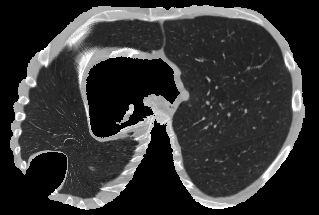

**Worst rank 4 - `1.3.6.1.4.1.14519.5.2.1.6279.6001.307946352302138765071461362398`**  
qc=0.608, z_range=203.2, grad_p99=7.274, pseudo_regions=5

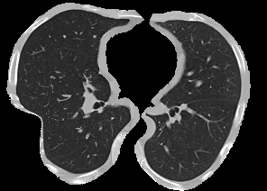

**Worst rank 5 - `1.3.6.1.4.1.14519.5.2.1.6279.6001.100684836163890911914061745866`**  
qc=0.556, z_range=176.0, grad_p99=8.038, pseudo_regions=6

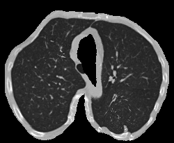

**Worst rank 6 - `1.3.6.1.4.1.14519.5.2.1.6279.6001.286061375572911414226912429210`**  
qc=0.528, z_range=158.2, grad_p99=7.254, pseudo_regions=7

**Worst rank 7 - `1.3.6.1.4.1.14519.5.2.1.6279.6001.306112617218006614029386065035`**  
qc=0.508, z_range=163.9, grad_p99=6.352, pseudo_regions=8

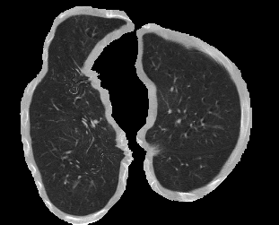

**Worst rank 8 - `1.3.6.1.4.1.14519.5.2.1.6279.6001.264090899378396711987322794314`**  
qc=0.499, z_range=177.1, grad_p99=5.600, pseudo_regions=3

**Worst rank 9 - `1.3.6.1.4.1.14519.5.2.1.6279.6001.229664630348267553620068691756`**  
qc=0.479, z_range=144.8, grad_p99=7.140, pseudo_regions=9

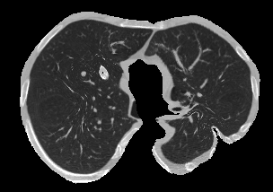

**Worst rank 10 - `1.3.6.1.4.1.14519.5.2.1.6279.6001.203741923654363010377298352671`**  
qc=0.465, z_range=143.5, grad_p99=6.345, pseudo_regions=5

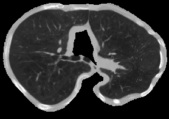

**Worst rank 11 - `1.3.6.1.4.1.14519.5.2.1.6279.6001.237915456403882324748189195892`**  
qc=0.451, z_range=161.6, grad_p99=5.343, pseudo_regions=7

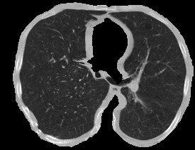

**Worst rank 12 - `1.3.6.1.4.1.14519.5.2.1.6279.6001.124656777236468248920498636247`**  
qc=0.414, z_range=140.2, grad_p99=5.476, pseudo_regions=6

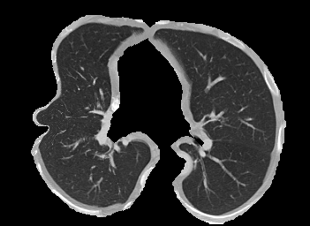

**Worst rank 13 - `1.3.6.1.4.1.14519.5.2.1.6279.6001.139444426690868429919252698606`**  
qc=0.405, z_range=134.6, grad_p99=5.013, pseudo_regions=5

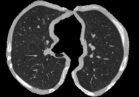

**Worst rank 14 - `1.3.6.1.4.1.14519.5.2.1.6279.6001.248360766706804179966476685510`**  
qc=0.398, z_range=140.0, grad_p99=5.088, pseudo_regions=9

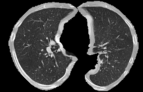

**Worst rank 15 - `1.3.6.1.4.1.14519.5.2.1.6279.6001.232058316950007760548968840196`**  
qc=0.397, z_range=128.2, grad_p99=4.478, pseudo_regions=3

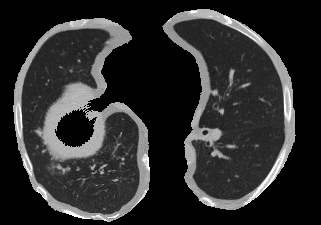

**Worst rank 16 - `1.3.6.1.4.1.14519.5.2.1.6279.6001.177985905159808659201278495182`**  
qc=0.369, z_range=118.8, grad_p99=4.777, pseudo_regions=6

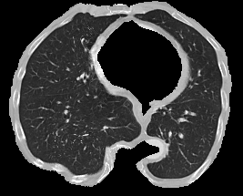

## Interpretation

- The cleanest no-nodule synthetics are almost all single pseudo-region cases with very low `z_range` and `grad_p99`.
- The worst no-nodule cases are driven mainly by very wide or rough interpolated surfaces, not by low foreground coverage.
- The no-nodule high-risk tail grows with pseudo-region count, so a cap on pseudo-regions remains the most direct quality-control lever.

## Files

- `no_nodule_surface_qc_metrics.csv`
- `best_no_nodule_cases.csv`
- `worst_no_nodule_cases.csv`
- `no_nodule_region_count_qc_summary.csv`
- `no_nodule_pseudo_region_count_distribution.csv`