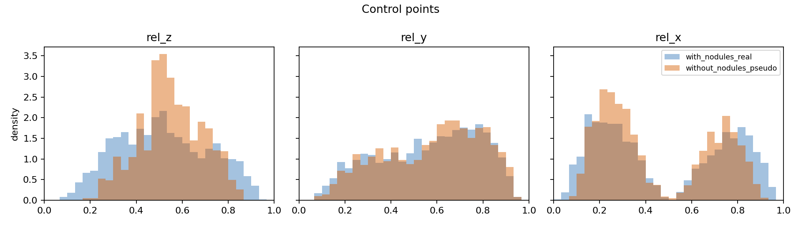
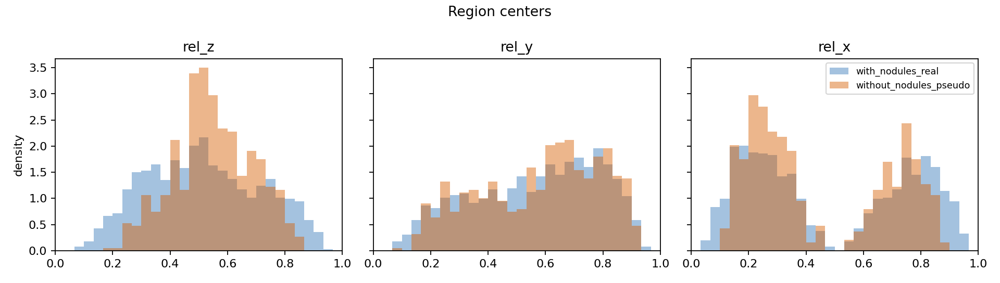
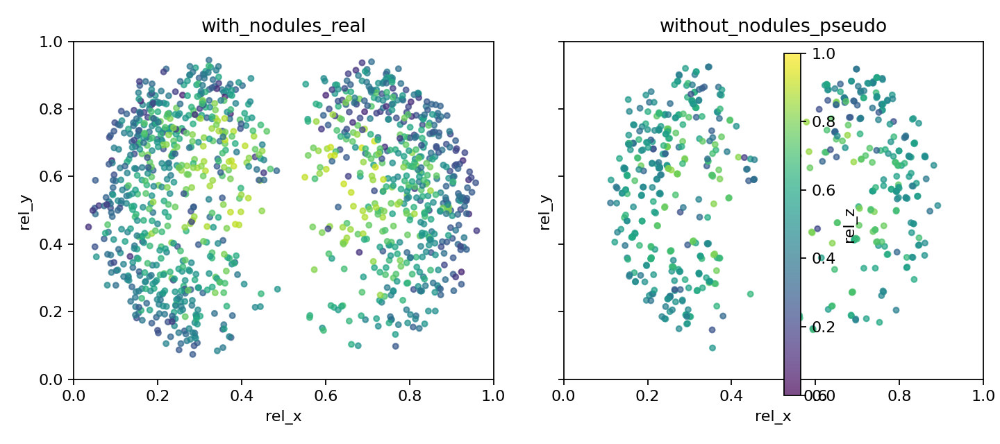

# Control Point Position Distribution Comparison

Comparison between generated pseudo-regions in scans without nodules and real nodule-derived regions in scans with nodules. Coordinates are normalized to relative `z,y,x` in `[0,1]` using preprocessed volume metadata when available.

Missing metadata scans using surface-grid fallback: **0**.

## Sample Counts

| group                  |   control_points |   region_centers |
|:-----------------------|-----------------:|-----------------:|
| with_nodules_real      |             5895 |             1179 |
| without_nodules_pseudo |             2830 |              566 |

## KS Distances

KS distance close to 0 means similar 1D distributions; larger values mean more mismatch.

| sample_level   | axis   |   ks_distance |
|:---------------|:-------|--------------:|
| control_points | rel_z  |         0.186 |
| control_points | rel_y  |         0.042 |
| control_points | rel_x  |         0.101 |
| region_centers | rel_z  |         0.185 |
| region_centers | rel_y  |         0.051 |
| region_centers | rel_x  |         0.111 |

## Summary Statistics

| sample_level   | group                  |    n |   rel_z_mean |   rel_z_std |   rel_z_p05 |   rel_z_p50 |   rel_z_p95 |   rel_y_mean |   rel_y_std |   rel_y_p05 |   rel_y_p50 |   rel_y_p95 |   rel_x_mean |   rel_x_std |   rel_x_p05 |   rel_x_p50 |   rel_x_p95 |
|:---------------|:-----------------------|-----:|-------------:|------------:|------------:|------------:|------------:|-------------:|------------:|------------:|------------:|------------:|-------------:|------------:|------------:|------------:|------------:|
| control_points | with_nodules_real      | 5895 |        0.515 |       0.197 |       0.209 |       0.505 |       0.845 |        0.564 |       0.219 |       0.183 |       0.597 |       0.873 |        0.481 |       0.28  |       0.115 |       0.378 |       0.891 |
| control_points | without_nodules_pseudo | 2830 |        0.55  |       0.136 |       0.315 |       0.545 |       0.78  |        0.579 |       0.212 |       0.205 |       0.62  |       0.878 |        0.453 |       0.246 |       0.151 |       0.349 |       0.831 |
| region_centers | with_nodules_real      | 1179 |        0.515 |       0.197 |       0.21  |       0.505 |       0.845 |        0.564 |       0.219 |       0.185 |       0.598 |       0.872 |        0.483 |       0.28  |       0.116 |       0.381 |       0.893 |
| region_centers | without_nodules_pseudo |  566 |        0.551 |       0.137 |       0.315 |       0.545 |       0.779 |        0.58  |       0.209 |       0.209 |       0.624 |       0.872 |        0.452 |       0.245 |       0.154 |       0.346 |       0.829 |

## Plots

## Interpretation

- The largest region-center mismatch is on `rel_z` with KS=0.185.

- The comparison is better judged on region centers than on all control points, because each region contributes one center plus contour points.