# LUNA16 Synthetic Surface QC Report

Output root analyzed: `outputs/luna16_saliency_synthetic_gt`

Total complete cases analyzed: **888**

## Method

Each generated PNG was scored with a heuristic combining visible foreground fraction, foreground contrast, surface roughness (`grad_p99`), and z-range. The score is for triage: higher means more suspicious, not necessarily unusable.

Important metrics:

- `foreground_fraction`: fraction of non-black pixels in the synthetic image. Low values suggest little lung content.

- `foreground_std`: contrast inside visible content. Low values suggest flat/low-information images.

- `grad_p99` / `grad_max`: surface roughness. High values indicate cliffs or unstable interpolation.

- `z_range`: total cranio-caudal span sampled by the surface. Very wide ranges can indicate overly bent surfaces.

## Summary Statistics

|       |   foreground_fraction |   foreground_std |   z_range |   z_std |   grad_p99 |   grad_max |   qc_badness |
|:------|----------------------:|-----------------:|----------:|--------:|-----------:|-----------:|-------------:|
| count |               888.000 |          888.000 |   888.000 | 888.000 |    888.000 |    888.000 |      888.000 |
| mean  |                 0.538 |            0.233 |    39.338 |   8.032 |      0.802 |      1.686 |        0.065 |
| std   |                 0.097 |            0.013 |    50.169 |   9.962 |      1.225 |      4.040 |        0.074 |
| min   |                 0.181 |            0.178 |     1.026 |   0.281 |      0.021 |      0.031 |        0.001 |
| 1%    |                 0.225 |            0.201 |     1.809 |   0.472 |      0.040 |      0.056 |        0.002 |
| 5%    |                 0.332 |            0.213 |     2.505 |   0.653 |      0.054 |      0.074 |        0.003 |
| 25%   |                 0.501 |            0.225 |     4.301 |   1.123 |      0.097 |      0.134 |        0.006 |
| 50%   |                 0.561 |            0.232 |     8.451 |   1.899 |      0.170 |      0.249 |        0.033 |
| 75%   |                 0.602 |            0.241 |    67.155 |  13.267 |      1.075 |      1.398 |        0.106 |
| 95%   |                 0.653 |            0.256 |   142.372 |  29.436 |      3.362 |      7.056 |        0.216 |
| 99%   |                 0.673 |            0.267 |   196.153 |  40.365 |      5.387 |     20.427 |        0.278 |
| max   |                 0.717 |            0.280 |   278.076 |  49.885 |     10.559 |     46.733 |        0.360 |

## Worst Cases

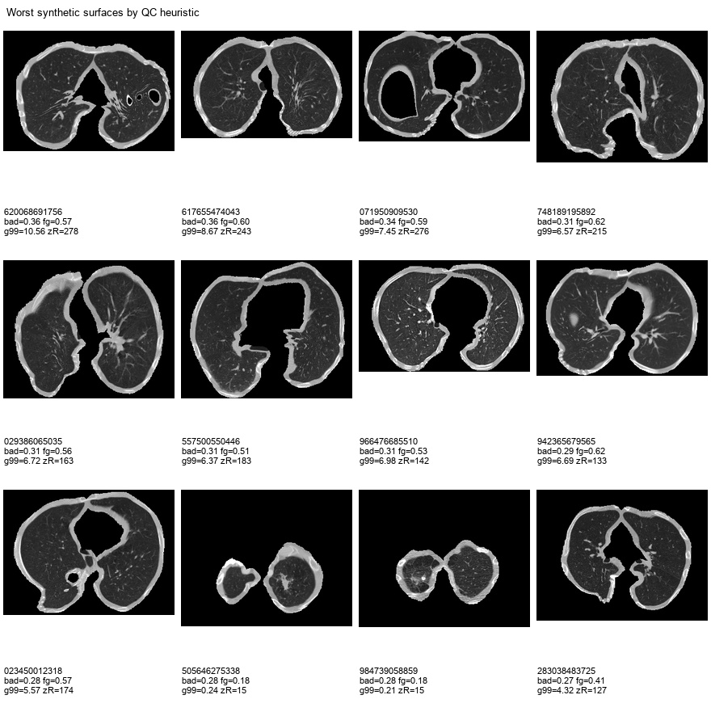

|   qc_rank_worst | seriesuid                                                        |   qc_badness |   foreground_fraction |   foreground_std |   grad_p99 |   grad_max |   z_range |   control_labels |   anchor_labels |
|----------------:|:-----------------------------------------------------------------|-------------:|----------------------:|-----------------:|-----------:|-----------:|----------:|-----------------:|----------------:|
|               1 | 1.3.6.1.4.1.14519.5.2.1.6279.6001.229664630348267553620068691756 |        0.360 |                 0.575 |            0.231 |     10.559 |     36.085 |   278.076 |               45 |               8 |
|               2 | 1.3.6.1.4.1.14519.5.2.1.6279.6001.811825890493256320617655474043 |        0.360 |                 0.602 |            0.227 |      8.673 |     18.207 |   243.024 |               25 |               8 |
|               3 | 1.3.6.1.4.1.14519.5.2.1.6279.6001.167500254299688235071950909530 |        0.342 |                 0.589 |            0.234 |      7.448 |     46.733 |   275.967 |               15 |               8 |
|               4 | 1.3.6.1.4.1.14519.5.2.1.6279.6001.237915456403882324748189195892 |        0.314 |                 0.620 |            0.228 |      6.574 |     16.226 |   214.906 |               35 |               8 |
|               5 | 1.3.6.1.4.1.14519.5.2.1.6279.6001.306112617218006614029386065035 |        0.309 |                 0.562 |            0.225 |      6.720 |     13.301 |   162.512 |               40 |               8 |
|               6 | 1.3.6.1.4.1.14519.5.2.1.6279.6001.324649110927013926557500550446 |        0.307 |                 0.510 |            0.231 |      6.369 |     32.157 |   182.885 |               10 |               8 |
|               7 | 1.3.6.1.4.1.14519.5.2.1.6279.6001.248360766706804179966476685510 |        0.306 |                 0.528 |            0.239 |      6.984 |     20.261 |   142.380 |               45 |               8 |
|               8 | 1.3.6.1.4.1.14519.5.2.1.6279.6001.188484197846284733942365679565 |        0.291 |                 0.616 |            0.223 |      6.690 |     25.126 |   133.061 |               35 |               8 |
|               9 | 1.3.6.1.4.1.14519.5.2.1.6279.6001.184019785706727365023450012318 |        0.278 |                 0.573 |            0.233 |      5.567 |     19.783 |   174.335 |               40 |               8 |
|              10 | 1.3.6.1.4.1.14519.5.2.1.6279.6001.771831598853841017505646275338 |        0.278 |                 0.181 |            0.263 |      0.239 |      0.292 |    15.110 |                5 |               8 |
|              11 | 1.3.6.1.4.1.14519.5.2.1.6279.6001.167919147233131417984739058859 |        0.277 |                 0.181 |            0.249 |      0.211 |      0.265 |    15.070 |                5 |               8 |
|              12 | 1.3.6.1.4.1.14519.5.2.1.6279.6001.333319057944372470283038483725 |        0.274 |                 0.408 |            0.239 |      4.317 |     12.969 |   127.333 |               25 |               8 |

### Worst Case PNGs

**Rank 1 - 1.3.6.1.4.1.14519.5.2.1.6279.6001.229664630348267553620068691756**  
bad=0.360, fg=0.575, grad_p99=10.559, z_range=278.1

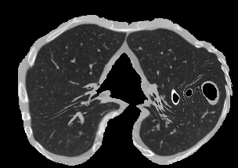

**Rank 2 - 1.3.6.1.4.1.14519.5.2.1.6279.6001.811825890493256320617655474043**  
bad=0.360, fg=0.602, grad_p99=8.673, z_range=243.0

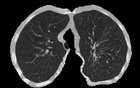

**Rank 3 - 1.3.6.1.4.1.14519.5.2.1.6279.6001.167500254299688235071950909530**  
bad=0.342, fg=0.589, grad_p99=7.448, z_range=276.0

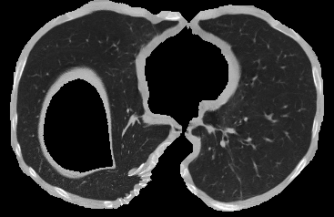

**Rank 4 - 1.3.6.1.4.1.14519.5.2.1.6279.6001.237915456403882324748189195892**  
bad=0.314, fg=0.620, grad_p99=6.574, z_range=214.9

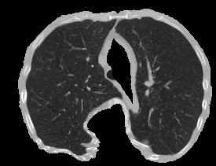

**Rank 5 - 1.3.6.1.4.1.14519.5.2.1.6279.6001.306112617218006614029386065035**  
bad=0.309, fg=0.562, grad_p99=6.720, z_range=162.5

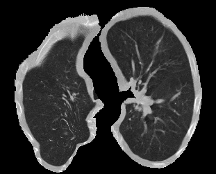

**Rank 6 - 1.3.6.1.4.1.14519.5.2.1.6279.6001.324649110927013926557500550446**  
bad=0.307, fg=0.510, grad_p99=6.369, z_range=182.9

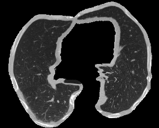

**Rank 7 - 1.3.6.1.4.1.14519.5.2.1.6279.6001.248360766706804179966476685510**  
bad=0.306, fg=0.528, grad_p99=6.984, z_range=142.4

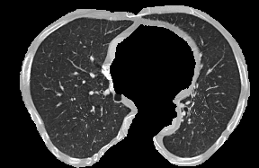

**Rank 8 - 1.3.6.1.4.1.14519.5.2.1.6279.6001.188484197846284733942365679565**  
bad=0.291, fg=0.616, grad_p99=6.690, z_range=133.1

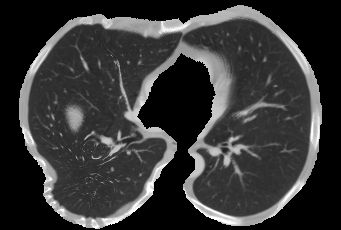

**Rank 9 - 1.3.6.1.4.1.14519.5.2.1.6279.6001.184019785706727365023450012318**  
bad=0.278, fg=0.573, grad_p99=5.567, z_range=174.3

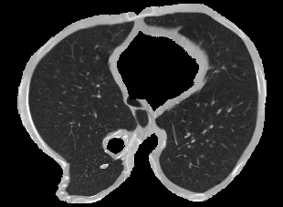

**Rank 10 - 1.3.6.1.4.1.14519.5.2.1.6279.6001.771831598853841017505646275338**  
bad=0.278, fg=0.181, grad_p99=0.239, z_range=15.1

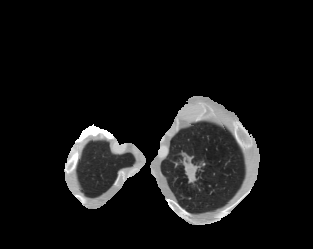

**Rank 11 - 1.3.6.1.4.1.14519.5.2.1.6279.6001.167919147233131417984739058859**  
bad=0.277, fg=0.181, grad_p99=0.211, z_range=15.1

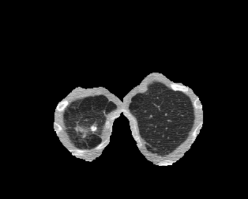

**Rank 12 - 1.3.6.1.4.1.14519.5.2.1.6279.6001.333319057944372470283038483725**  
bad=0.274, fg=0.408, grad_p99=4.317, z_range=127.3

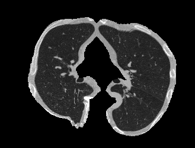

## Best Cases

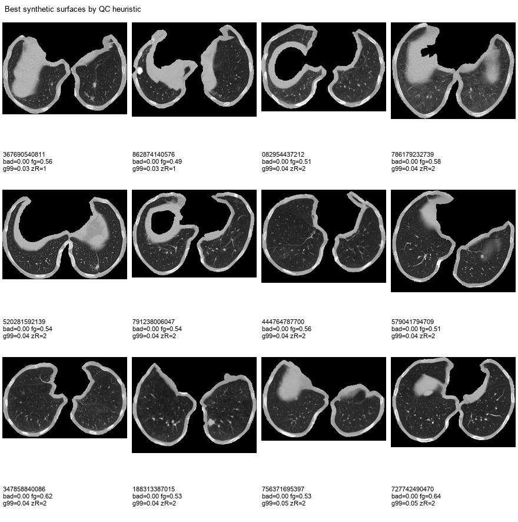

| seriesuid                                                        |   qc_badness |   foreground_fraction |   foreground_std |   grad_p99 |   grad_max |   z_range |   control_labels |   anchor_labels |
|:-----------------------------------------------------------------|-------------:|----------------------:|-----------------:|-----------:|-----------:|----------:|-----------------:|----------------:|
| 1.3.6.1.4.1.14519.5.2.1.6279.6001.235364978775280910367690540811 |        0.001 |                 0.561 |            0.242 |      0.026 |      0.036 |     1.026 |                5 |               8 |
| 1.3.6.1.4.1.14519.5.2.1.6279.6001.119304665257760307862874140576 |        0.002 |                 0.488 |            0.257 |      0.035 |      0.048 |     1.472 |                5 |               8 |
| 1.3.6.1.4.1.14519.5.2.1.6279.6001.286627485198831346082954437212 |        0.002 |                 0.507 |            0.241 |      0.039 |      0.054 |     1.668 |                5 |               8 |
| 1.3.6.1.4.1.14519.5.2.1.6279.6001.707218743153927597786179232739 |        0.002 |                 0.581 |            0.209 |      0.040 |      0.058 |     1.692 |                5 |               8 |
| 1.3.6.1.4.1.14519.5.2.1.6279.6001.149041668385192796520281592139 |        0.002 |                 0.536 |            0.245 |      0.040 |      0.054 |     1.918 |                5 |               8 |
| 1.3.6.1.4.1.14519.5.2.1.6279.6001.228934821089041845791238006047 |        0.002 |                 0.541 |            0.247 |      0.039 |      0.053 |     1.976 |                5 |               8 |
| 1.3.6.1.4.1.14519.5.2.1.6279.6001.483655032093002252444764787700 |        0.002 |                 0.564 |            0.229 |      0.040 |      0.056 |     2.013 |                5 |               8 |
| 1.3.6.1.4.1.14519.5.2.1.6279.6001.178680586845223339579041794709 |        0.002 |                 0.512 |            0.220 |      0.041 |      0.060 |     2.012 |                5 |               8 |
| 1.3.6.1.4.1.14519.5.2.1.6279.6001.101228986346984399347858840086 |        0.002 |                 0.620 |            0.217 |      0.045 |      0.060 |     1.792 |                5 |               8 |
| 1.3.6.1.4.1.14519.5.2.1.6279.6001.138813197521718693188313387015 |        0.002 |                 0.532 |            0.218 |      0.042 |      0.062 |     1.939 |                5 |               8 |
| 1.3.6.1.4.1.14519.5.2.1.6279.6001.145759169833745025756371695397 |        0.003 |                 0.533 |            0.233 |      0.047 |      0.063 |     1.811 |                5 |               8 |
| 1.3.6.1.4.1.14519.5.2.1.6279.6001.122621219961396951727742490470 |        0.003 |                 0.638 |            0.237 |      0.045 |      0.064 |     2.069 |                5 |               8 |

### Best Case PNGs

**1.3.6.1.4.1.14519.5.2.1.6279.6001.235364978775280910367690540811**  
bad=0.001, fg=0.561, grad_p99=0.026, z_range=1.0

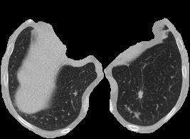

**1.3.6.1.4.1.14519.5.2.1.6279.6001.119304665257760307862874140576**  
bad=0.002, fg=0.488, grad_p99=0.035, z_range=1.5

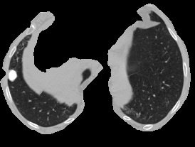

**1.3.6.1.4.1.14519.5.2.1.6279.6001.286627485198831346082954437212**  
bad=0.002, fg=0.507, grad_p99=0.039, z_range=1.7

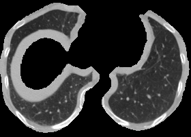

**1.3.6.1.4.1.14519.5.2.1.6279.6001.707218743153927597786179232739**  
bad=0.002, fg=0.581, grad_p99=0.040, z_range=1.7

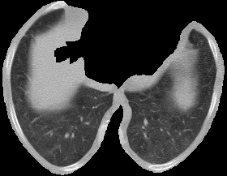

**1.3.6.1.4.1.14519.5.2.1.6279.6001.149041668385192796520281592139**  
bad=0.002, fg=0.536, grad_p99=0.040, z_range=1.9

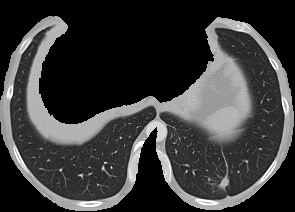

**1.3.6.1.4.1.14519.5.2.1.6279.6001.228934821089041845791238006047**  
bad=0.002, fg=0.541, grad_p99=0.039, z_range=2.0

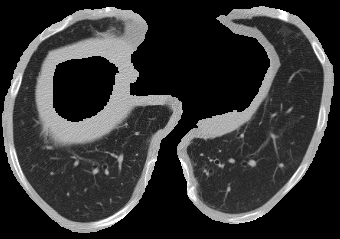

**1.3.6.1.4.1.14519.5.2.1.6279.6001.483655032093002252444764787700**  
bad=0.002, fg=0.564, grad_p99=0.040, z_range=2.0

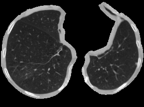

**1.3.6.1.4.1.14519.5.2.1.6279.6001.178680586845223339579041794709**  
bad=0.002, fg=0.512, grad_p99=0.041, z_range=2.0

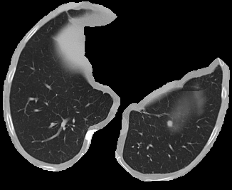

**1.3.6.1.4.1.14519.5.2.1.6279.6001.101228986346984399347858840086**  
bad=0.002, fg=0.620, grad_p99=0.045, z_range=1.8

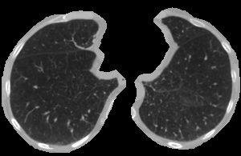

**1.3.6.1.4.1.14519.5.2.1.6279.6001.138813197521718693188313387015**  
bad=0.002, fg=0.532, grad_p99=0.042, z_range=1.9

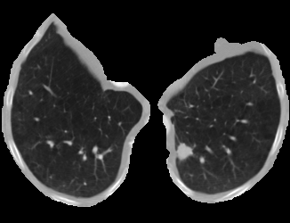

**1.3.6.1.4.1.14519.5.2.1.6279.6001.145759169833745025756371695397**  
bad=0.003, fg=0.533, grad_p99=0.047, z_range=1.8

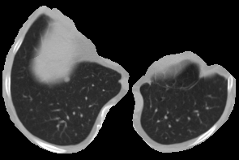

**1.3.6.1.4.1.14519.5.2.1.6279.6001.122621219961396951727742490470**  
bad=0.003, fg=0.638, grad_p99=0.045, z_range=2.1

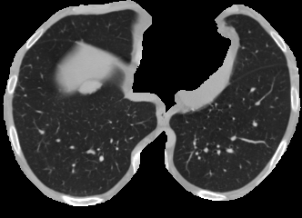

## Region Count Effect

The main qualitative failure mode is strongly associated with the number of nodule/pseudo-nodule regions used as control points. Cases with one region tend to produce nearly planar, stable surfaces; cases with many regions often pull the RBF surface across a large cranio-caudal span, increasing `z_range` and surface roughness.

| region_count | n cases | mean qc_badness | mean z_range | mean grad_p99 | bad rate (`z_range > 150`) |
|---:|---:|---:|---:|---:|---:|
| 1 | 455 | 0.032 | 4.9 | 0.11 | 9.7% |
| 2 | 241 | 0.080 | 61.6 | 1.11 | 11.6% |
| 3 | 96 | 0.099 | 76.0 | 1.48 | 12.5% |
| 4 | 34 | 0.128 | 97.5 | 1.95 | 20.6% |
| 5 | 30 | 0.157 | 116.1 | 2.74 | 43.3% |
| 6 | 13 | 0.117 | 80.3 | 1.86 | 30.8% |
| 7 | 7 | 0.218 | 155.2 | 4.21 | 85.7% |
| 8 | 4 | 0.185 | 110.6 | 3.74 | 50.0% |
| 9 | 7 | 0.217 | 153.3 | 4.67 | 71.4% |
| 12 | 1 | 0.213 | 146.6 | 4.06 | 100.0% |

The best 12 cases all have one region. The worst 12 are dominated by scans with 5, 7, 8, or 9 regions, with a few exceptions where the issue is low visible lung content rather than surface roughness.

Recommendation: cap the empirical pseudo-region sampler at `max_regions=4` for scans without real nodules. A stricter cap of 3 would likely improve surface regularity further, but `max_regions=4` preserves more of the empirical multi-nodule distribution while removing the highest-risk tail.

## Empirical Distribution Checks

The pseudo-region sampler for scans without nodules is empirically matched to the real nodule distribution. The comparison below uses the currently generated outputs and the scan status table. For generated samples, the number of regions is estimated as `control_labels / 5`, because each region contributes one center plus four contour/control points.

### Region Count Distribution

The number of pseudo-regions in scans without nodules closely matches the real nodule-count distribution in scans with nodules at the aggregate level.

| group | n | mean | median | max | p95 |
|---|---:|---:|---:|---:|---:|
| without nodules, generated pseudo-regions | 287 | 1.97 | 2 | 9 | 5 |
| with nodules, real nodule count | 601 | 1.97 | 1 | 12 | 5 |
| with nodules, generated control regions | 601 | 1.96 | 1 | 12 | 5 |

For scans without nodules, the generated pseudo-region distribution is:

| pseudo-region count | scan count | probability |
|---:|---:|---:|
| 1 | 142 | 49.5% |
| 2 | 85 | 29.6% |
| 3 | 32 | 11.1% |
| 4 | 10 | 3.5% |
| 5 | 6 | 2.1% |
| 6 | 4 | 1.4% |
| 7 | 3 | 1.0% |
| 8 | 2 | 0.7% |
| 9 | 3 | 1.0% |

For scans with nodules, the real nodule-count distribution is:

| real nodule count | scan count | probability |
|---:|---:|---:|
| 1 | 310 | 51.6% |
| 2 | 159 | 26.5% |
| 3 | 63 | 10.5% |
| 4 | 24 | 4.0% |
| 5 | 23 | 3.8% |
| 6 | 11 | 1.8% |
| 7 | 4 | 0.7% |
| 8 | 2 | 0.3% |
| 9 | 4 | 0.7% |
| 12 | 1 | 0.2% |

Interpretation: the empirical count matching is working, but the high-count tail is risky for surface quality. In scans without nodules, `5+` pseudo-regions occur in 18/287 cases (6.3%). These cases are over-represented among the worst surfaces.

CSV outputs:

- [`nodule_region_count_distribution_comparison.csv`](nodule_region_count_distribution_comparison.csv)
- [`nodule_region_count_distribution_comparison_wide.csv`](nodule_region_count_distribution_comparison_wide.csv)

### Relative Position Distribution

The relative `z,y,x` distributions of pseudo-region centers are broadly similar to the real nodule-derived region centers. The largest mismatch is on `rel_y`; `rel_z` and `rel_x` are very close.

KS distances for region centers:

| axis | KS distance |
|---|---:|
| `rel_z` | 0.102 |
| `rel_y` | 0.145 |
| `rel_x` | 0.100 |

Mean relative positions:

| group | rel_z mean | rel_y mean | rel_x mean |
|---|---:|---:|---:|
| with nodules, real regions | 0.832 | 0.564 | 0.481 |
| without nodules, pseudo-regions | 0.832 | 0.617 | 0.478 |

Interpretation: there is no large spatial bias. The pseudo-regions reproduce the real distribution well in `z` and `x`. There is a modest shift in `y` (`+0.05` relative units), with pseudo-regions slightly more concentrated toward higher `rel_y` values. This residual bias appears less important than the surface-quality issue caused by too many regions.

Position distribution plots:

Detailed report and CSV outputs:

- [`control_point_position_distribution_comparison.md`](control_point_position_distribution_comparison.md)
- [`control_point_position_distribution_summary.csv`](control_point_position_distribution_summary.csv)
- [`control_point_position_distribution_ks.csv`](control_point_position_distribution_ks.csv)
- [`control_point_position_distribution_region_centers.csv`](control_point_position_distribution_region_centers.csv)
- [`control_point_position_distribution_points.csv`](control_point_position_distribution_points.csv)

## Notes

- This report evaluates the files currently present on disk. If old PNGs were not regenerated, they are still included.

- Cases with very low `foreground_fraction` should be inspected first: they often correspond to surfaces through apical/basal slices with little lung content.

- Cases with high `grad_p99`/`grad_max` indicate surface irregularity or residual generated surfaces from a previous snap-to-lung run.

- Su 888 immagini analizzate:
foreground_fraction < 0.35: 55 casi
grad_p99 > 3.0: 55 casi
z_range > 120: 87 casi
z_range > 150: 35 casi
Se usiamo il filtro “da scartare/rivedere”:
foreground_fraction < 0.35 OR grad_p99 > 3.0 OR z_range > 120
sono 153 casi, cioè 17.2%.
Con soglia più permissiva:
foreground_fraction < 0.35 OR grad_p99 > 3.0 OR z_range > 150
sono 122 casi, cioè 13.7%.
