# LUNA16 Synthetic Surface QC Report

Output root analyzed: `outputs/luna16_saliency_synthetic_gt`

Total complete cases analyzed: **888**

## Method

Each generated PNG was scored with a heuristic combining visible foreground fraction, foreground contrast, surface roughness (`grad_p99`), edge variation, and z-range. The score is for triage: higher means more suspicious, not necessarily unusable.

## Summary Statistics

|       |   foreground_fraction |   foreground_std |   z_range |   z_std |   grad_p99 |   grad_max |   qc_badness |
|:------|----------------------:|-----------------:|----------:|--------:|-----------:|-----------:|-------------:|
| count |               888.000 |          888.000 |   888.000 | 888.000 |    888.000 |    888.000 |      888.000 |
| mean  |                 0.537 |            0.233 |    37.910 |   7.857 |      0.780 |      1.682 |        0.098 |
| std   |                 0.100 |            0.013 |    49.398 |   9.964 |      1.282 |      4.807 |        0.127 |
| min   |                 0.181 |            0.178 |     1.026 |   0.281 |      0.021 |      0.031 |        0.003 |
| 1%    |                 0.225 |            0.201 |     1.806 |   0.474 |      0.040 |      0.056 |        0.005 |
| 5%    |                 0.327 |            0.213 |     2.385 |   0.637 |      0.053 |      0.074 |        0.006 |
| 25%   |                 0.498 |            0.225 |     4.322 |   1.142 |      0.096 |      0.132 |        0.012 |
| 50%   |                 0.562 |            0.232 |     7.263 |   1.819 |      0.155 |      0.215 |        0.030 |
| 75%   |                 0.604 |            0.241 |    63.212 |  12.813 |      0.987 |      1.328 |        0.158 |
| 95%   |                 0.656 |            0.257 |   140.170 |  28.063 |      3.238 |      6.725 |        0.363 |
| 99%   |                 0.681 |            0.267 |   196.153 |  40.920 |      5.697 |     18.799 |        0.508 |
| max   |                 0.717 |            0.280 |   322.425 |  67.526 |     13.431 |     78.480 |        0.911 |

## QC Buckets

`good_or_low_review` is `qc_badness <= 0.10`, `moderate_review` is `0.10 < qc_badness <= 0.30`, and `high_review` is `qc_badness > 0.30`.

| qc_bucket          |   n |
|:-------------------|----:|
| good_or_low_review | 587 |
| moderate_review    | 223 |
| high_review        |  78 |

## Worst Cases

|   qc_rank_worst | seriesuid                                                        |   qc_badness |   foreground_fraction |   foreground_std |   grad_p99 |   grad_max |   z_range |   control_labels |   anchor_labels |
|----------------:|:-----------------------------------------------------------------|-------------:|----------------------:|-----------------:|-----------:|-----------:|----------:|-----------------:|----------------:|
|               1 | 1.3.6.1.4.1.14519.5.2.1.6279.6001.111780708132595903430640048766 |        0.911 |                 0.482 |            0.242 |     10.119 |     78.480 |   322.425 |               20 |               8 |
|               2 | 1.3.6.1.4.1.14519.5.2.1.6279.6001.331211682377519763144559212009 |        0.909 |                 0.384 |            0.236 |     13.431 |     50.596 |   257.416 |               10 |               8 |
|               3 | 1.3.6.1.4.1.14519.5.2.1.6279.6001.116703382344406837243058680403 |        0.788 |                 0.594 |            0.253 |      8.585 |     36.238 |   290.000 |               10 |               8 |
|               4 | 1.3.6.1.4.1.14519.5.2.1.6279.6001.307946352302138765071461362398 |        0.608 |                 0.594 |            0.242 |      7.274 |     17.639 |   203.179 |               25 |               8 |
|               5 | 1.3.6.1.4.1.14519.5.2.1.6279.6001.100684836163890911914061745866 |        0.556 |                 0.642 |            0.230 |      8.038 |     39.011 |   175.974 |               30 |               8 |
|               6 | 1.3.6.1.4.1.14519.5.2.1.6279.6001.286061375572911414226912429210 |        0.528 |                 0.677 |            0.247 |      7.254 |     16.015 |   158.220 |               35 |               8 |
|               7 | 1.3.6.1.4.1.14519.5.2.1.6279.6001.169128136262002764211589185953 |        0.520 |                 0.566 |            0.222 |      4.763 |      8.213 |   209.674 |               35 |               8 |
|               8 | 1.3.6.1.4.1.14519.5.2.1.6279.6001.140253591510022414496468423138 |        0.512 |                 0.614 |            0.237 |      5.193 |      8.230 |   195.964 |               15 |               8 |
|               9 | 1.3.6.1.4.1.14519.5.2.1.6279.6001.219087313261026510628926082729 |        0.508 |                 0.619 |            0.254 |      5.352 |      9.765 |   177.662 |               10 |               8 |
|              10 | 1.3.6.1.4.1.14519.5.2.1.6279.6001.306112617218006614029386065035 |        0.508 |                 0.522 |            0.223 |      6.352 |     18.743 |   163.887 |               40 |               8 |
|              11 | 1.3.6.1.4.1.14519.5.2.1.6279.6001.264090899378396711987322794314 |        0.499 |                 0.614 |            0.223 |      5.600 |     11.730 |   177.082 |               15 |               8 |
|              12 | 1.3.6.1.4.1.14519.5.2.1.6279.6001.324567010179873305471925391582 |        0.490 |                 0.522 |            0.229 |      3.423 |      4.723 |   205.563 |               15 |               8 |

### Worst Case PNGs

**Rank 1 - 1.3.6.1.4.1.14519.5.2.1.6279.6001.111780708132595903430640048766**  
bad=0.911, fg=0.482, grad_p99=10.119, z_range=322.4

**Rank 2 - 1.3.6.1.4.1.14519.5.2.1.6279.6001.331211682377519763144559212009**  
bad=0.909, fg=0.384, grad_p99=13.431, z_range=257.4

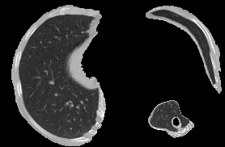

**Rank 3 - 1.3.6.1.4.1.14519.5.2.1.6279.6001.116703382344406837243058680403**  
bad=0.788, fg=0.594, grad_p99=8.585, z_range=290.0

**Rank 4 - 1.3.6.1.4.1.14519.5.2.1.6279.6001.307946352302138765071461362398**  
bad=0.608, fg=0.594, grad_p99=7.274, z_range=203.2

**Rank 5 - 1.3.6.1.4.1.14519.5.2.1.6279.6001.100684836163890911914061745866**  
bad=0.556, fg=0.642, grad_p99=8.038, z_range=176.0

**Rank 6 - 1.3.6.1.4.1.14519.5.2.1.6279.6001.286061375572911414226912429210**  
bad=0.528, fg=0.677, grad_p99=7.254, z_range=158.2

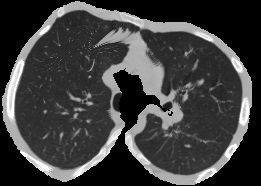

**Rank 7 - 1.3.6.1.4.1.14519.5.2.1.6279.6001.169128136262002764211589185953**  
bad=0.520, fg=0.566, grad_p99=4.763, z_range=209.7

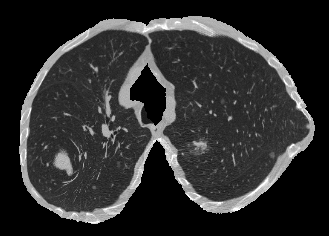

**Rank 8 - 1.3.6.1.4.1.14519.5.2.1.6279.6001.140253591510022414496468423138**  
bad=0.512, fg=0.614, grad_p99=5.193, z_range=196.0

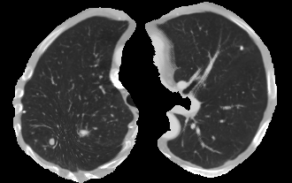

**Rank 9 - 1.3.6.1.4.1.14519.5.2.1.6279.6001.219087313261026510628926082729**  
bad=0.508, fg=0.619, grad_p99=5.352, z_range=177.7

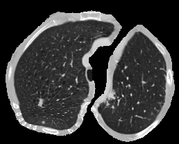

**Rank 10 - 1.3.6.1.4.1.14519.5.2.1.6279.6001.306112617218006614029386065035**  
bad=0.508, fg=0.522, grad_p99=6.352, z_range=163.9

**Rank 11 - 1.3.6.1.4.1.14519.5.2.1.6279.6001.264090899378396711987322794314**  
bad=0.499, fg=0.614, grad_p99=5.600, z_range=177.1

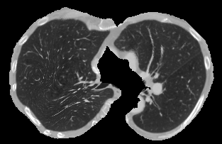

**Rank 12 - 1.3.6.1.4.1.14519.5.2.1.6279.6001.324567010179873305471925391582**  
bad=0.490, fg=0.522, grad_p99=3.423, z_range=205.6

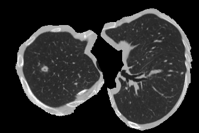

## Best Cases

| seriesuid                                                        |   qc_badness |   foreground_fraction |   foreground_std |   grad_p99 |   grad_max |   z_range |   control_labels |   anchor_labels |
|:-----------------------------------------------------------------|-------------:|----------------------:|-----------------:|-----------:|-----------:|----------:|-----------------:|----------------:|
| 1.3.6.1.4.1.14519.5.2.1.6279.6001.235364978775280910367690540811 |        0.003 |                 0.561 |            0.242 |      0.026 |      0.036 |     1.026 |                5 |               8 |
| 1.3.6.1.4.1.14519.5.2.1.6279.6001.119304665257760307862874140576 |        0.004 |                 0.488 |            0.257 |      0.035 |      0.048 |     1.472 |                5 |               8 |
| 1.3.6.1.4.1.14519.5.2.1.6279.6001.250438451287314206124484591986 |        0.004 |                 0.629 |            0.228 |      0.044 |      0.062 |     1.513 |                5 |               8 |
| 1.3.6.1.4.1.14519.5.2.1.6279.6001.624425075947752229712087113746 |        0.004 |                 0.446 |            0.210 |      0.038 |      0.051 |     1.618 |                5 |               8 |
| 1.3.6.1.4.1.14519.5.2.1.6279.6001.304700823314998198591652152637 |        0.004 |                 0.366 |            0.250 |      0.040 |      0.052 |     1.610 |                5 |               8 |
| 1.3.6.1.4.1.14519.5.2.1.6279.6001.241083615484551649610616348856 |        0.005 |                 0.438 |            0.215 |      0.040 |      0.058 |     1.685 |                5 |               8 |
| 1.3.6.1.4.1.14519.5.2.1.6279.6001.138894439026794145866157853158 |        0.005 |                 0.461 |            0.207 |      0.042 |      0.058 |     1.710 |                5 |               8 |
| 1.3.6.1.4.1.14519.5.2.1.6279.6001.201890795870532056891161597218 |        0.005 |                 0.575 |            0.213 |      0.042 |      0.063 |     1.749 |                5 |               8 |
| 1.3.6.1.4.1.14519.5.2.1.6279.6001.219281726101239572270900838145 |        0.005 |                 0.579 |            0.203 |      0.037 |      0.056 |     1.867 |                5 |               8 |
| 1.3.6.1.4.1.14519.5.2.1.6279.6001.504324996863016748259361352296 |        0.005 |                 0.624 |            0.224 |      0.039 |      0.058 |     1.932 |                5 |               8 |
| 1.3.6.1.4.1.14519.5.2.1.6279.6001.149041668385192796520281592139 |        0.005 |                 0.536 |            0.245 |      0.040 |      0.054 |     1.918 |                5 |               8 |
| 1.3.6.1.4.1.14519.5.2.1.6279.6001.271307051432838466826189754230 |        0.005 |                 0.478 |            0.255 |      0.042 |      0.056 |     1.877 |                5 |               8 |

### Best Case PNGs

**1.3.6.1.4.1.14519.5.2.1.6279.6001.235364978775280910367690540811**  
bad=0.003, fg=0.561, grad_p99=0.026, z_range=1.0

**1.3.6.1.4.1.14519.5.2.1.6279.6001.119304665257760307862874140576**  
bad=0.004, fg=0.488, grad_p99=0.035, z_range=1.5

**1.3.6.1.4.1.14519.5.2.1.6279.6001.250438451287314206124484591986**  
bad=0.004, fg=0.629, grad_p99=0.044, z_range=1.5

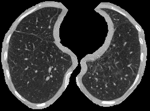

**1.3.6.1.4.1.14519.5.2.1.6279.6001.624425075947752229712087113746**  
bad=0.004, fg=0.446, grad_p99=0.038, z_range=1.6

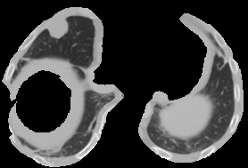

**1.3.6.1.4.1.14519.5.2.1.6279.6001.304700823314998198591652152637**  
bad=0.004, fg=0.366, grad_p99=0.040, z_range=1.6

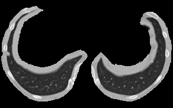

**1.3.6.1.4.1.14519.5.2.1.6279.6001.241083615484551649610616348856**  
bad=0.005, fg=0.438, grad_p99=0.040, z_range=1.7

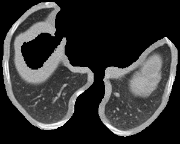

**1.3.6.1.4.1.14519.5.2.1.6279.6001.138894439026794145866157853158**  
bad=0.005, fg=0.461, grad_p99=0.042, z_range=1.7

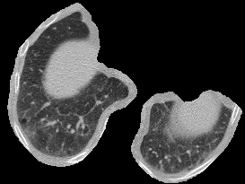

**1.3.6.1.4.1.14519.5.2.1.6279.6001.201890795870532056891161597218**  
bad=0.005, fg=0.575, grad_p99=0.042, z_range=1.7

**1.3.6.1.4.1.14519.5.2.1.6279.6001.219281726101239572270900838145**  
bad=0.005, fg=0.579, grad_p99=0.037, z_range=1.9

**1.3.6.1.4.1.14519.5.2.1.6279.6001.504324996863016748259361352296**  
bad=0.005, fg=0.624, grad_p99=0.039, z_range=1.9

**1.3.6.1.4.1.14519.5.2.1.6279.6001.149041668385192796520281592139**  
bad=0.005, fg=0.536, grad_p99=0.040, z_range=1.9

**1.3.6.1.4.1.14519.5.2.1.6279.6001.271307051432838466826189754230**  
bad=0.005, fg=0.478, grad_p99=0.042, z_range=1.9

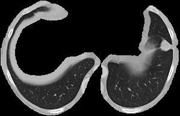

## Region Count Effect

The main qualitative failure mode is associated with the number of nodule/pseudo-nodule regions used as control points. More regions tend to pull the interpolated surface across a larger cranio-caudal span, increasing `z_range` and surface roughness.

|   region_count |   n cases |   mean qc_badness |   mean z_range |   mean grad_p99 | bad rate (`z_range > 150`)   |
|---------------:|----------:|------------------:|---------------:|----------------:|:-----------------------------|
|              1 |       456 |             0.017 |          4.744 |           0.105 | 0.0%                         |
|              2 |       240 |             0.144 |         58.395 |           1.069 | 5.0%                         |
|              3 |        96 |             0.189 |         75.760 |           1.479 | 4.2%                         |
|              4 |        34 |             0.239 |         95.273 |           1.944 | 8.8%                         |
|              5 |        30 |             0.287 |        110.873 |           2.585 | 16.7%                        |
|              6 |        13 |             0.229 |         84.454 |           2.270 | 7.7%                         |
|              7 |         7 |             0.415 |        154.171 |           4.055 | 71.4%                        |
|              8 |         4 |             0.279 |        101.244 |           2.792 | 25.0%                        |
|              9 |         7 |             0.369 |        131.315 |           4.159 | 28.6%                        |
|             12 |         1 |             0.401 |        146.557 |           4.057 | 0.0%                         |

## Output Files

- `surface_qc_metrics.csv`
- `best_cases.csv`
- `worst_cases.csv`
