# LUNA16 Synthetic 2D GradCAM

- Manifest: `docs/luna16_synthetic_2d_gradcam_all_predicted/gradcam_manifest.csv`
- Overlay generated: 6368 / 6368
- Report preview rows: 1000 / 6368
- Full image list is available in the manifest CSV.

## luna16_synthetic_2d_gt

### benign

| rank_kind | rank_order | backbone | fold | sample_id | prediction_name | score | true_class_score | gradcam_target_name | gradcam_overlay_path |
| --- | --- | --- | --- | --- | --- | --- | --- | --- | --- |
| all | 18 | efficientnet_v2_s | 0 | 1.3.6.1.4.1.14519.5.2.1.6279.6001.310626494937915759224334597176 | benign | 4.92116e-07 | 1 | benign | 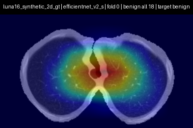 |
| all | 22 | efficientnet_v2_s | 0 | 1.3.6.1.4.1.14519.5.2.1.6279.6001.231645134739451754302647733304 | benign | 1.53765e-06 | 0.999998 | benign | 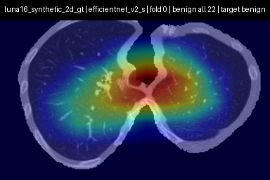 |
| all | 62 | efficientnet_v2_s | 0 | 1.3.6.1.4.1.14519.5.2.1.6279.6001.139713436241461669335487719526 | benign | 2.46083e-05 | 0.999975 | benign | 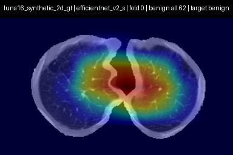 |
| all | 78 | efficientnet_v2_s | 0 | 1.3.6.1.4.1.14519.5.2.1.6279.6001.323302986710576400812869264321 | benign | 3.78459e-05 | 0.999962 | benign | 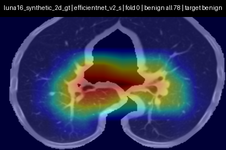 |
| all | 84 | efficientnet_v2_s | 0 | 1.3.6.1.4.1.14519.5.2.1.6279.6001.144438612068946916340281098509 | benign | 4.15382e-05 | 0.999958 | benign | 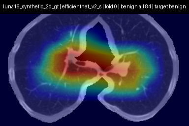 |
| all | 95 | efficientnet_v2_s | 0 | 1.3.6.1.4.1.14519.5.2.1.6279.6001.122763913896761494371822656720 | benign | 5.5181e-05 | 0.999945 | benign | 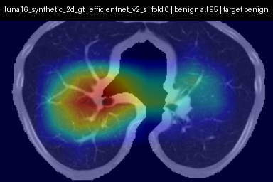 |
| all | 96 | efficientnet_v2_s | 0 | 1.3.6.1.4.1.14519.5.2.1.6279.6001.302134342469412607966016057827 | benign | 5.55833e-05 | 0.999944 | benign | 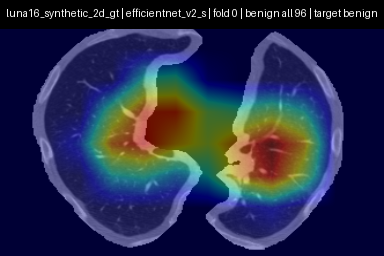 |
| all | 105 | efficientnet_v2_s | 0 | 1.3.6.1.4.1.14519.5.2.1.6279.6001.313605260055394498989743099991 | benign | 6.74559e-05 | 0.999933 | benign | 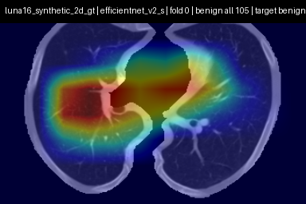 |
| all | 113 | efficientnet_v2_s | 0 | 1.3.6.1.4.1.14519.5.2.1.6279.6001.280972147860943609388015648430 | benign | 8.93164e-05 | 0.999911 | benign | 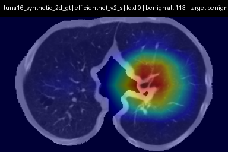 |
| all | 124 | efficientnet_v2_s | 0 | 1.3.6.1.4.1.14519.5.2.1.6279.6001.194465340552956447447896167830 | benign | 0.000112202 | 0.999888 | benign | 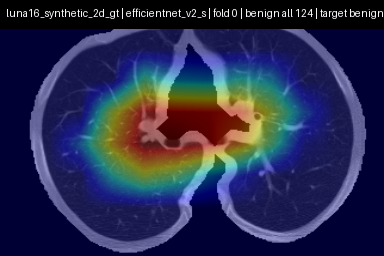 |
| all | 166 | efficientnet_v2_s | 0 | 1.3.6.1.4.1.14519.5.2.1.6279.6001.657775098760536289051744981056 | benign | 0.000261511 | 0.999738 | benign | 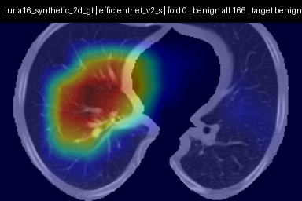 |
| all | 167 | efficientnet_v2_s | 0 | 1.3.6.1.4.1.14519.5.2.1.6279.6001.126121460017257137098781143514 | benign | 0.000269551 | 0.99973 | benign | 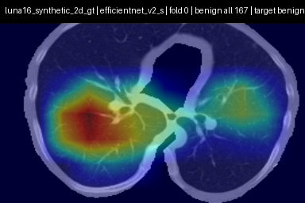 |
| all | 175 | efficientnet_v2_s | 0 | 1.3.6.1.4.1.14519.5.2.1.6279.6001.105756658031515062000744821260 | benign | 0.000310733 | 0.999689 | benign | 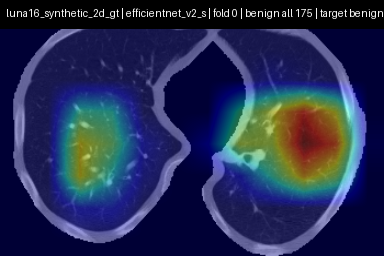 |
| all | 195 | efficientnet_v2_s | 0 | 1.3.6.1.4.1.14519.5.2.1.6279.6001.269689294231892620436462818860 | benign | 0.000415722 | 0.999584 | benign | 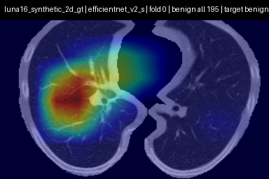 |
| all | 209 | efficientnet_v2_s | 0 | 1.3.6.1.4.1.14519.5.2.1.6279.6001.332453873575389860371315979768 | benign | 0.000511841 | 0.999488 | benign | 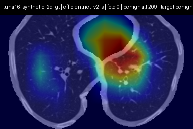 |
| all | 213 | efficientnet_v2_s | 0 | 1.3.6.1.4.1.14519.5.2.1.6279.6001.146429221666426688999739595820 | benign | 0.00055717 | 0.999443 | benign | 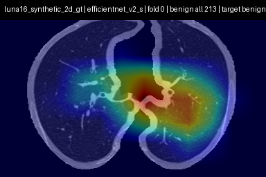 |
| all | 256 | efficientnet_v2_s | 0 | 1.3.6.1.4.1.14519.5.2.1.6279.6001.277445975068759205899107114231 | benign | 0.00120471 | 0.998795 | benign | 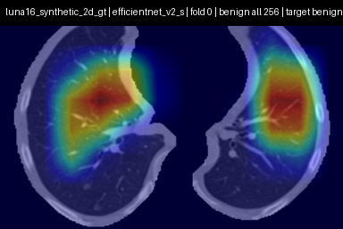 |
| all | 258 | efficientnet_v2_s | 0 | 1.3.6.1.4.1.14519.5.2.1.6279.6001.241570579760883349458693655367 | benign | 0.00122146 | 0.998779 | benign | 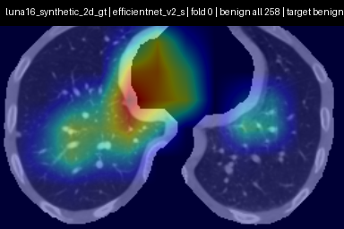 |
| all | 277 | efficientnet_v2_s | 0 | 1.3.6.1.4.1.14519.5.2.1.6279.6001.210837812047373739447725050963 | benign | 0.0017403 | 0.99826 | benign | 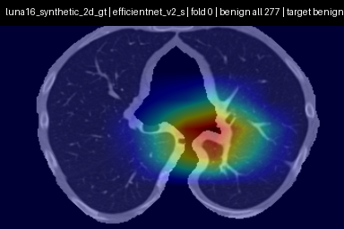 |
| all | 299 | efficientnet_v2_s | 0 | 1.3.6.1.4.1.14519.5.2.1.6279.6001.564534197011295112247542153557 | benign | 0.00271199 | 0.997288 | benign | 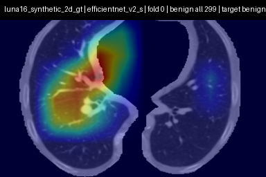 |
| all | 303 | efficientnet_v2_s | 0 | 1.3.6.1.4.1.14519.5.2.1.6279.6001.311981398931043315779172047718 | benign | 0.00306752 | 0.996932 | benign | 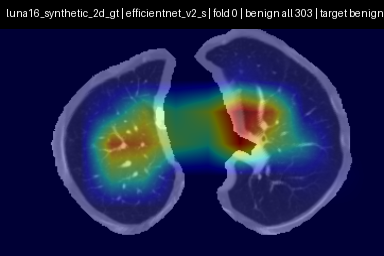 |
| all | 304 | efficientnet_v2_s | 0 | 1.3.6.1.4.1.14519.5.2.1.6279.6001.272042302501586336192628818865 | benign | 0.00308677 | 0.996913 | benign | 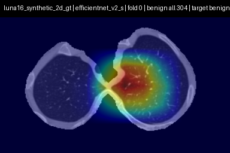 |
| all | 307 | efficientnet_v2_s | 0 | 1.3.6.1.4.1.14519.5.2.1.6279.6001.397062004302272014259317520874 | benign | 0.00329927 | 0.996701 | benign | 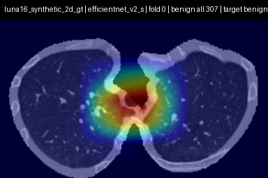 |
| all | 324 | efficientnet_v2_s | 0 | 1.3.6.1.4.1.14519.5.2.1.6279.6001.278660284797073139172446973682 | benign | 0.00710273 | 0.992897 | benign | 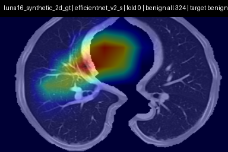 |
| all | 341 | efficientnet_v2_s | 0 | 1.3.6.1.4.1.14519.5.2.1.6279.6001.238522526736091851696274044574 | benign | 0.0127886 | 0.987211 | benign | 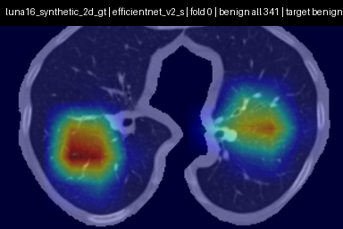 |
| all | 346 | efficientnet_v2_s | 0 | 1.3.6.1.4.1.14519.5.2.1.6279.6001.640729228179368154416184318668 | benign | 0.0157614 | 0.984239 | benign | 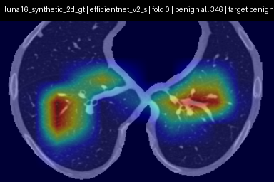 |
| all | 347 | efficientnet_v2_s | 0 | 1.3.6.1.4.1.14519.5.2.1.6279.6001.124154461048929153767743874565 | benign | 0.0195364 | 0.980464 | benign | 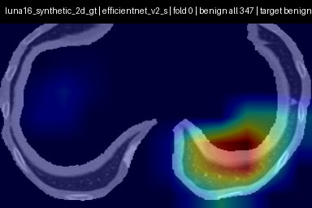 |
| all | 358 | efficientnet_v2_s | 0 | 1.3.6.1.4.1.14519.5.2.1.6279.6001.832260670372728970918746541371 | benign | 0.0365736 | 0.963426 | benign | 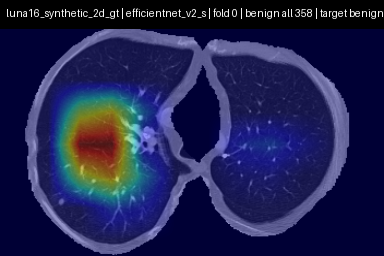 |
| all | 363 | efficientnet_v2_s | 0 | 1.3.6.1.4.1.14519.5.2.1.6279.6001.417815314896088956784723476543 | benign | 0.0399736 | 0.960026 | benign | 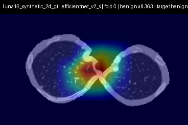 |
| all | 379 | efficientnet_v2_s | 0 | 1.3.6.1.4.1.14519.5.2.1.6279.6001.566816709786169715745131047975 | benign | 0.0786239 | 0.921376 | benign | 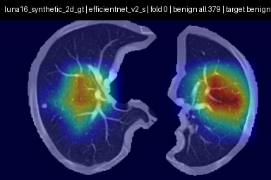 |
| all | 383 | efficientnet_v2_s | 0 | 1.3.6.1.4.1.14519.5.2.1.6279.6001.898642529028521482602829374444 | benign | 0.107227 | 0.892773 | benign | 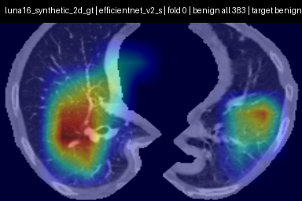 |
| all | 410 | efficientnet_v2_s | 0 | 1.3.6.1.4.1.14519.5.2.1.6279.6001.395623571499047043765181005112 | benign | 0.368403 | 0.631597 | benign | 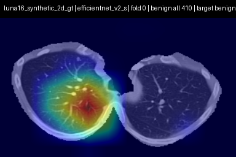 |
| all | 423 | efficientnet_v2_s | 0 | 1.3.6.1.4.1.14519.5.2.1.6279.6001.303421828981831854739626597495 | malignant | 0.63436 | 0.36564 | malignant | 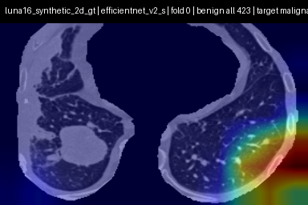 |
| all | 427 | efficientnet_v2_s | 0 | 1.3.6.1.4.1.14519.5.2.1.6279.6001.108197895896446896160048741492 | malignant | 0.747542 | 0.252458 | malignant | 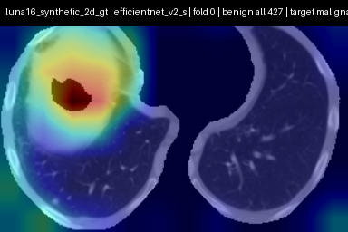 |
| all | 431 | efficientnet_v2_s | 0 | 1.3.6.1.4.1.14519.5.2.1.6279.6001.141069661700670042960678408762 | malignant | 0.854317 | 0.145683 | malignant | 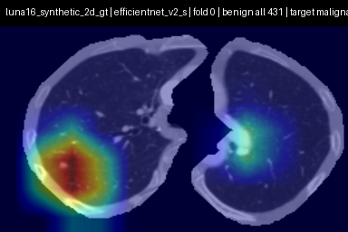 |
| all | 432 | efficientnet_v2_s | 0 | 1.3.6.1.4.1.14519.5.2.1.6279.6001.975254950136384517744116790879 | malignant | 0.855536 | 0.144464 | malignant | 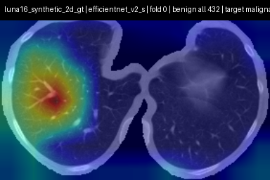 |
| all | 443 | efficientnet_v2_s | 0 | 1.3.6.1.4.1.14519.5.2.1.6279.6001.250438451287314206124484591986 | malignant | 0.967334 | 0.0326659 | malignant | 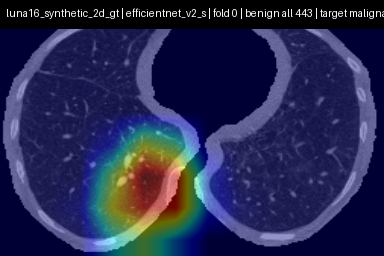 |
| all | 445 | efficientnet_v2_s | 0 | 1.3.6.1.4.1.14519.5.2.1.6279.6001.126264578931778258890371755354 | malignant | 0.970746 | 0.0292544 | malignant | 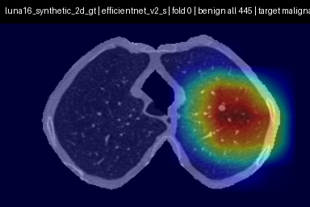 |
| all | 457 | efficientnet_v2_s | 0 | 1.3.6.1.4.1.14519.5.2.1.6279.6001.450501966058662668272378865145 | malignant | 0.985587 | 0.0144128 | malignant | 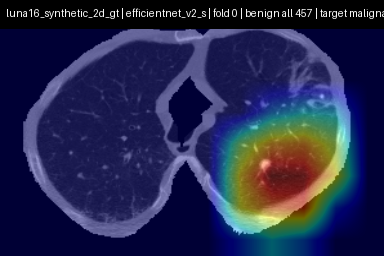 |
| all | 466 | efficientnet_v2_s | 0 | 1.3.6.1.4.1.14519.5.2.1.6279.6001.139258777898746693365877042411 | malignant | 0.996539 | 0.00346148 | malignant | 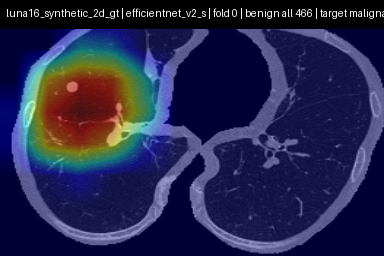 |
| all | 473 | efficientnet_v2_s | 0 | 1.3.6.1.4.1.14519.5.2.1.6279.6001.138080888843357047811238713686 | malignant | 0.999915 | 8.46386e-05 | malignant | 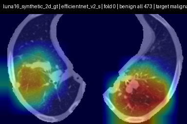 |
| all | 90 | efficientnet_v2_s | 1 | 1.3.6.1.4.1.14519.5.2.1.6279.6001.259018373683540453277752706262 | benign | 5.07019e-05 | 0.999949 | benign | 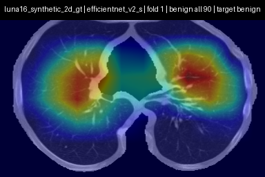 |
| all | 108 | efficientnet_v2_s | 1 | 1.3.6.1.4.1.14519.5.2.1.6279.6001.184019785706727365023450012318 | benign | 7.13643e-05 | 0.999929 | benign | 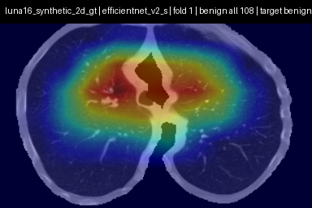 |
| all | 120 | efficientnet_v2_s | 1 | 1.3.6.1.4.1.14519.5.2.1.6279.6001.161073793312426102774780216551 | benign | 9.65072e-05 | 0.999903 | benign | 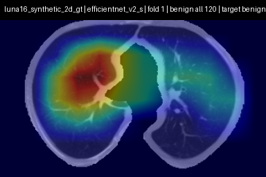 |
| all | 144 | efficientnet_v2_s | 1 | 1.3.6.1.4.1.14519.5.2.1.6279.6001.216652640878960522552873394709 | benign | 0.000169323 | 0.999831 | benign | 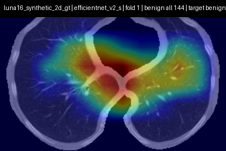 |
| all | 151 | efficientnet_v2_s | 1 | 1.3.6.1.4.1.14519.5.2.1.6279.6001.802595762867498341201607992711 | benign | 0.000206534 | 0.999793 | benign | 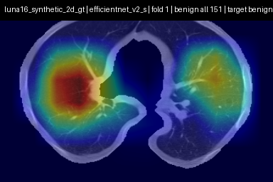 |
| all | 158 | efficientnet_v2_s | 1 | 1.3.6.1.4.1.14519.5.2.1.6279.6001.674809958213117379592437424616 | benign | 0.000238365 | 0.999762 | benign | 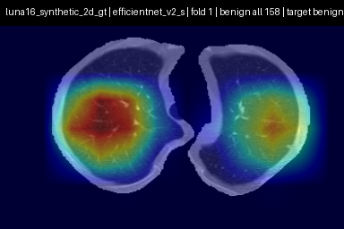 |
| all | 165 | efficientnet_v2_s | 1 | 1.3.6.1.4.1.14519.5.2.1.6279.6001.861997885565255340442123234170 | benign | 0.000260265 | 0.99974 | benign | 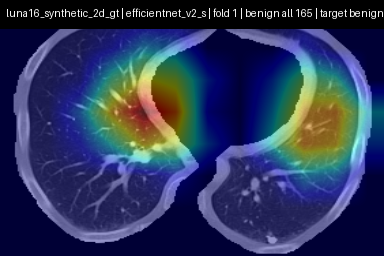 |
| all | 179 | efficientnet_v2_s | 1 | 1.3.6.1.4.1.14519.5.2.1.6279.6001.308183340111270052562662456038 | benign | 0.000339367 | 0.999661 | benign | 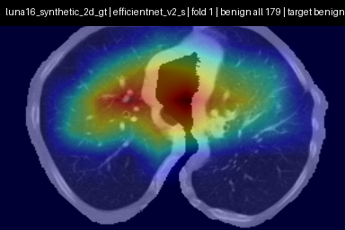 |
| all | 199 | efficientnet_v2_s | 1 | 1.3.6.1.4.1.14519.5.2.1.6279.6001.336894364358709782463716339027 | benign | 0.000437778 | 0.999562 | benign | 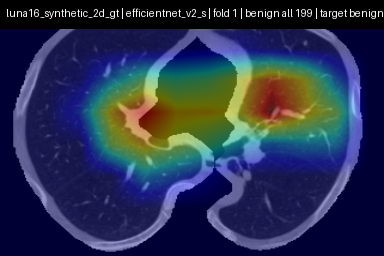 |
| all | 222 | efficientnet_v2_s | 1 | 1.3.6.1.4.1.14519.5.2.1.6279.6001.146603910507557786636779705509 | benign | 0.000625935 | 0.999374 | benign |  |
| all | 223 | efficientnet_v2_s | 1 | 1.3.6.1.4.1.14519.5.2.1.6279.6001.171919524048654494439256263785 | benign | 0.000627259 | 0.999373 | benign |  |
| all | 236 | efficientnet_v2_s | 1 | 1.3.6.1.4.1.14519.5.2.1.6279.6001.152684536713461901635595118048 | benign | 0.000743332 | 0.999257 | benign |  |
| all | 247 | efficientnet_v2_s | 1 | 1.3.6.1.4.1.14519.5.2.1.6279.6001.140527383975300992150799777603 | benign | 0.000926949 | 0.999073 | benign |  |
| all | 253 | efficientnet_v2_s | 1 | 1.3.6.1.4.1.14519.5.2.1.6279.6001.144943344795414353192059796098 | benign | 0.00112651 | 0.998873 | benign |  |
| all | 262 | efficientnet_v2_s | 1 | 1.3.6.1.4.1.14519.5.2.1.6279.6001.186021279664749879526003668137 | benign | 0.00140192 | 0.998598 | benign |  |
| all | 272 | efficientnet_v2_s | 1 | 1.3.6.1.4.1.14519.5.2.1.6279.6001.113697708991260454310623082679 | benign | 0.00168032 | 0.99832 | benign |  |
| all | 275 | efficientnet_v2_s | 1 | 1.3.6.1.4.1.14519.5.2.1.6279.6001.200558451375970945040979397866 | benign | 0.00170184 | 0.998298 | benign |  |
| all | 276 | efficientnet_v2_s | 1 | 1.3.6.1.4.1.14519.5.2.1.6279.6001.231834776365874788440767645596 | benign | 0.00170522 | 0.998295 | benign |  |
| all | 278 | efficientnet_v2_s | 1 | 1.3.6.1.4.1.14519.5.2.1.6279.6001.197987940182806628828566429132 | benign | 0.00175765 | 0.998242 | benign |  |
| all | 286 | efficientnet_v2_s | 1 | 1.3.6.1.4.1.14519.5.2.1.6279.6001.128059192202504367870633619224 | benign | 0.0021567 | 0.997843 | benign |  |
| all | 287 | efficientnet_v2_s | 1 | 1.3.6.1.4.1.14519.5.2.1.6279.6001.193408384740507320589857096592 | benign | 0.00221306 | 0.997787 | benign |  |
| all | 288 | efficientnet_v2_s | 1 | 1.3.6.1.4.1.14519.5.2.1.6279.6001.888291896309937415860209787179 | benign | 0.00222725 | 0.997773 | benign |  |
| all | 298 | efficientnet_v2_s | 1 | 1.3.6.1.4.1.14519.5.2.1.6279.6001.300271604576987336866436407488 | benign | 0.00269805 | 0.997302 | benign |  |
| all | 302 | efficientnet_v2_s | 1 | 1.3.6.1.4.1.14519.5.2.1.6279.6001.139595277234735528205899724196 | benign | 0.00297476 | 0.997025 | benign |  |
| all | 308 | efficientnet_v2_s | 1 | 1.3.6.1.4.1.14519.5.2.1.6279.6001.970264865033574190975654369557 | benign | 0.00330135 | 0.996699 | benign |  |
| all | 311 | efficientnet_v2_s | 1 | 1.3.6.1.4.1.14519.5.2.1.6279.6001.335866409407244673864352309754 | benign | 0.00434225 | 0.995658 | benign |  |
| all | 312 | efficientnet_v2_s | 1 | 1.3.6.1.4.1.14519.5.2.1.6279.6001.309672797925724868457151381131 | benign | 0.00447021 | 0.99553 | benign |  |
| all | 332 | efficientnet_v2_s | 1 | 1.3.6.1.4.1.14519.5.2.1.6279.6001.161002239822118346732951898613 | benign | 0.00965094 | 0.990349 | benign |  |
| all | 340 | efficientnet_v2_s | 1 | 1.3.6.1.4.1.14519.5.2.1.6279.6001.768276876111112560631432843476 | benign | 0.0127475 | 0.987252 | benign |  |
| all | 344 | efficientnet_v2_s | 1 | 1.3.6.1.4.1.14519.5.2.1.6279.6001.108231420525711026834210228428 | benign | 0.0152517 | 0.984748 | benign |  |
| all | 349 | efficientnet_v2_s | 1 | 1.3.6.1.4.1.14519.5.2.1.6279.6001.334105754605642100456249422350 | benign | 0.0224378 | 0.977562 | benign |  |
| all | 356 | efficientnet_v2_s | 1 | 1.3.6.1.4.1.14519.5.2.1.6279.6001.168605638657404145360275453085 | benign | 0.0339188 | 0.966081 | benign |  |
| all | 361 | efficientnet_v2_s | 1 | 1.3.6.1.4.1.14519.5.2.1.6279.6001.275766318636944297772360944907 | benign | 0.0394489 | 0.960551 | benign |  |
| all | 362 | efficientnet_v2_s | 1 | 1.3.6.1.4.1.14519.5.2.1.6279.6001.162207236104936931957809623059 | benign | 0.0398869 | 0.960113 | benign |  |
| all | 368 | efficientnet_v2_s | 1 | 1.3.6.1.4.1.14519.5.2.1.6279.6001.272961322147784625028175033640 | benign | 0.0542046 | 0.945795 | benign |  |
| all | 373 | efficientnet_v2_s | 1 | 1.3.6.1.4.1.14519.5.2.1.6279.6001.663019255629770796363333877035 | benign | 0.0639165 | 0.936084 | benign |  |
| all | 375 | efficientnet_v2_s | 1 | 1.3.6.1.4.1.14519.5.2.1.6279.6001.222087811960706096424718056430 | benign | 0.0656607 | 0.934339 | benign |  |
| all | 378 | efficientnet_v2_s | 1 | 1.3.6.1.4.1.14519.5.2.1.6279.6001.121824995088859376862458155637 | benign | 0.0680066 | 0.931993 | benign |  |
| all | 384 | efficientnet_v2_s | 1 | 1.3.6.1.4.1.14519.5.2.1.6279.6001.331211682377519763144559212009 | benign | 0.111348 | 0.888652 | benign |  |
| all | 389 | efficientnet_v2_s | 1 | 1.3.6.1.4.1.14519.5.2.1.6279.6001.286647622786041008124419915089 | benign | 0.132675 | 0.867325 | benign |  |
| all | 406 | efficientnet_v2_s | 1 | 1.3.6.1.4.1.14519.5.2.1.6279.6001.315214756157389122376518747372 | benign | 0.302093 | 0.697907 | benign |  |
| all | 413 | efficientnet_v2_s | 1 | 1.3.6.1.4.1.14519.5.2.1.6279.6001.231002159523969307155990628066 | benign | 0.399816 | 0.600184 | benign |  |
| all | 418 | efficientnet_v2_s | 1 | 1.3.6.1.4.1.14519.5.2.1.6279.6001.910607280658963002048724648683 | malignant | 0.520592 | 0.479408 | malignant |  |
| all | 421 | efficientnet_v2_s | 1 | 1.3.6.1.4.1.14519.5.2.1.6279.6001.952265563663939823135367733681 | malignant | 0.609919 | 0.390081 | malignant |  |
| all | 426 | efficientnet_v2_s | 1 | 1.3.6.1.4.1.14519.5.2.1.6279.6001.111017101339429664883879536171 | malignant | 0.74564 | 0.25436 | malignant |  |
| all | 439 | efficientnet_v2_s | 1 | 1.3.6.1.4.1.14519.5.2.1.6279.6001.183843376225716802567192412456 | malignant | 0.942901 | 0.0570988 | malignant |  |
| all | 440 | efficientnet_v2_s | 1 | 1.3.6.1.4.1.14519.5.2.1.6279.6001.162718361851587451505896742103 | malignant | 0.948708 | 0.051292 | malignant |  |
| all | 442 | efficientnet_v2_s | 1 | 1.3.6.1.4.1.14519.5.2.1.6279.6001.100684836163890911914061745866 | malignant | 0.965934 | 0.0340661 | malignant |  |
| all | 469 | efficientnet_v2_s | 1 | 1.3.6.1.4.1.14519.5.2.1.6279.6001.314789075871001236641548593165 | malignant | 0.998781 | 0.00121933 | malignant |  |
| all | 16 | efficientnet_v2_s | 2 | 1.3.6.1.4.1.14519.5.2.1.6279.6001.311236942972970815890902714604 | benign | 3.46358e-07 | 1 | benign |  |
| all | 42 | efficientnet_v2_s | 2 | 1.3.6.1.4.1.14519.5.2.1.6279.6001.220205300714852483483213840572 | benign | 8.36314e-06 | 0.999992 | benign |  |
| all | 45 | efficientnet_v2_s | 2 | 1.3.6.1.4.1.14519.5.2.1.6279.6001.156322145453198768801776721493 | benign | 8.80834e-06 | 0.999991 | benign |  |
| all | 51 | efficientnet_v2_s | 2 | 1.3.6.1.4.1.14519.5.2.1.6279.6001.223098610241551815995595311693 | benign | 1.41968e-05 | 0.999986 | benign |  |
| all | 59 | efficientnet_v2_s | 2 | 1.3.6.1.4.1.14519.5.2.1.6279.6001.265133389948279331857097127422 | benign | 2.15955e-05 | 0.999978 | benign |  |
| all | 67 | efficientnet_v2_s | 2 | 1.3.6.1.4.1.14519.5.2.1.6279.6001.116492508532884962903000261147 | benign | 2.90925e-05 | 0.999971 | benign |  |
| all | 68 | efficientnet_v2_s | 2 | 1.3.6.1.4.1.14519.5.2.1.6279.6001.272259794130271010519952623746 | benign | 2.99966e-05 | 0.99997 | benign |  |
| all | 75 | efficientnet_v2_s | 2 | 1.3.6.1.4.1.14519.5.2.1.6279.6001.191301539558980174217770205256 | benign | 3.52677e-05 | 0.999965 | benign |  |
| all | 79 | efficientnet_v2_s | 2 | 1.3.6.1.4.1.14519.5.2.1.6279.6001.267519732763035023633235877753 | benign | 3.8117e-05 | 0.999962 | benign |  |
| all | 85 | efficientnet_v2_s | 2 | 1.3.6.1.4.1.14519.5.2.1.6279.6001.213022585153512920098588556742 | benign | 4.37339e-05 | 0.999956 | benign |  |
| all | 88 | efficientnet_v2_s | 2 | 1.3.6.1.4.1.14519.5.2.1.6279.6001.707218743153927597786179232739 | benign | 4.97561e-05 | 0.99995 | benign |  |
| all | 93 | efficientnet_v2_s | 2 | 1.3.6.1.4.1.14519.5.2.1.6279.6001.296863826932699509516219450076 | benign | 5.32674e-05 | 0.999947 | benign |  |
| all | 104 | efficientnet_v2_s | 2 | 1.3.6.1.4.1.14519.5.2.1.6279.6001.253283426904813468115158375647 | benign | 6.56222e-05 | 0.999934 | benign |  |
| all | 112 | efficientnet_v2_s | 2 | 1.3.6.1.4.1.14519.5.2.1.6279.6001.504324996863016748259361352296 | benign | 8.58414e-05 | 0.999914 | benign |  |
| all | 121 | efficientnet_v2_s | 2 | 1.3.6.1.4.1.14519.5.2.1.6279.6001.461155505515403114280165935891 | benign | 9.97574e-05 | 0.9999 | benign |  |
| all | 122 | efficientnet_v2_s | 2 | 1.3.6.1.4.1.14519.5.2.1.6279.6001.176362912420491262783064585333 | benign | 0.000110502 | 0.999889 | benign |  |
| all | 129 | efficientnet_v2_s | 2 | 1.3.6.1.4.1.14519.5.2.1.6279.6001.443400977949406454649939526179 | benign | 0.000124399 | 0.999876 | benign |  |
| all | 141 | efficientnet_v2_s | 2 | 1.3.6.1.4.1.14519.5.2.1.6279.6001.669518152156802508672627785405 | benign | 0.000163903 | 0.999836 | benign |  |
| all | 146 | efficientnet_v2_s | 2 | 1.3.6.1.4.1.14519.5.2.1.6279.6001.227885601428639043345478571594 | benign | 0.000190017 | 0.99981 | benign |  |
| all | 149 | efficientnet_v2_s | 2 | 1.3.6.1.4.1.14519.5.2.1.6279.6001.102133688497886810253331438797 | benign | 0.000194054 | 0.999806 | benign |  |
| all | 160 | efficientnet_v2_s | 2 | 1.3.6.1.4.1.14519.5.2.1.6279.6001.184412674007117333405073397832 | benign | 0.000247233 | 0.999753 | benign |  |
| all | 163 | efficientnet_v2_s | 2 | 1.3.6.1.4.1.14519.5.2.1.6279.6001.156579001330474859527530187095 | benign | 0.0002563 | 0.999744 | benign |  |
| all | 164 | efficientnet_v2_s | 2 | 1.3.6.1.4.1.14519.5.2.1.6279.6001.885292267869246639232975687131 | benign | 0.000259142 | 0.999741 | benign |  |
| all | 169 | efficientnet_v2_s | 2 | 1.3.6.1.4.1.14519.5.2.1.6279.6001.281967919138248195763602360723 | benign | 0.000281803 | 0.999718 | benign |  |
| all | 174 | efficientnet_v2_s | 2 | 1.3.6.1.4.1.14519.5.2.1.6279.6001.776429308535398795601496131524 | benign | 0.000307794 | 0.999692 | benign |  |
| all | 177 | efficientnet_v2_s | 2 | 1.3.6.1.4.1.14519.5.2.1.6279.6001.216526102138308489357443843021 | benign | 0.000320059 | 0.99968 | benign |  |
| all | 178 | efficientnet_v2_s | 2 | 1.3.6.1.4.1.14519.5.2.1.6279.6001.139444426690868429919252698606 | benign | 0.000320918 | 0.999679 | benign |  |
| all | 188 | efficientnet_v2_s | 2 | 1.3.6.1.4.1.14519.5.2.1.6279.6001.217697417596902141600884006982 | benign | 0.000393864 | 0.999606 | benign |  |
| all | 190 | efficientnet_v2_s | 2 | 1.3.6.1.4.1.14519.5.2.1.6279.6001.306788423710427765311352901943 | benign | 0.000394616 | 0.999605 | benign |  |
| all | 200 | efficientnet_v2_s | 2 | 1.3.6.1.4.1.14519.5.2.1.6279.6001.325580698241281352835338693869 | benign | 0.000452674 | 0.999547 | benign |  |
| all | 204 | efficientnet_v2_s | 2 | 1.3.6.1.4.1.14519.5.2.1.6279.6001.199171741859530285887752432478 | benign | 0.000478563 | 0.999521 | benign |  |
| all | 226 | efficientnet_v2_s | 2 | 1.3.6.1.4.1.14519.5.2.1.6279.6001.113586291551175790743673929831 | benign | 0.000665401 | 0.999335 | benign |  |
| all | 227 | efficientnet_v2_s | 2 | 1.3.6.1.4.1.14519.5.2.1.6279.6001.230078008964732806419498631442 | benign | 0.00067585 | 0.999324 | benign |  |
| all | 263 | efficientnet_v2_s | 2 | 1.3.6.1.4.1.14519.5.2.1.6279.6001.299767339686526858593516834230 | benign | 0.00141277 | 0.998587 | benign |  |
| all | 264 | efficientnet_v2_s | 2 | 1.3.6.1.4.1.14519.5.2.1.6279.6001.172845185165807139298420209778 | benign | 0.00142569 | 0.998574 | benign |  |
| all | 268 | efficientnet_v2_s | 2 | 1.3.6.1.4.1.14519.5.2.1.6279.6001.221945191226273284587353530424 | benign | 0.0014907 | 0.998509 | benign |  |
| all | 290 | efficientnet_v2_s | 2 | 1.3.6.1.4.1.14519.5.2.1.6279.6001.159521777966998275980367008904 | benign | 0.00227586 | 0.997724 | benign |  |
| all | 318 | efficientnet_v2_s | 2 | 1.3.6.1.4.1.14519.5.2.1.6279.6001.227796349777753378641347819780 | benign | 0.00587349 | 0.994127 | benign |  |
| all | 351 | efficientnet_v2_s | 2 | 1.3.6.1.4.1.14519.5.2.1.6279.6001.466284753932369813717081722101 | benign | 0.0254125 | 0.974587 | benign |  |
| all | 354 | efficientnet_v2_s | 2 | 1.3.6.1.4.1.14519.5.2.1.6279.6001.142485715518010940961688015191 | benign | 0.0295983 | 0.970402 | benign |  |
| all | 374 | efficientnet_v2_s | 2 | 1.3.6.1.4.1.14519.5.2.1.6279.6001.803808126682275425758092691689 | benign | 0.0656142 | 0.934386 | benign |  |
| all | 385 | efficientnet_v2_s | 2 | 1.3.6.1.4.1.14519.5.2.1.6279.6001.743969234977916254223533321294 | benign | 0.115946 | 0.884054 | benign |  |
| all | 411 | efficientnet_v2_s | 2 | 1.3.6.1.4.1.14519.5.2.1.6279.6001.557875302364105947813979213632 | benign | 0.389651 | 0.610349 | benign |  |
| all | 436 | efficientnet_v2_s | 2 | 1.3.6.1.4.1.14519.5.2.1.6279.6001.117383608379722740629083782428 | malignant | 0.908876 | 0.0911242 | malignant |  |
| all | 437 | efficientnet_v2_s | 2 | 1.3.6.1.4.1.14519.5.2.1.6279.6001.192256506776434538421891524301 | malignant | 0.925099 | 0.0749008 | malignant |  |
| all | 438 | efficientnet_v2_s | 2 | 1.3.6.1.4.1.14519.5.2.1.6279.6001.225154811831720426832024114593 | malignant | 0.93609 | 0.0639104 | malignant |  |
| all | 459 | efficientnet_v2_s | 2 | 1.3.6.1.4.1.14519.5.2.1.6279.6001.217589936421986638139451480826 | malignant | 0.988041 | 0.0119594 | malignant |  |
| all | 460 | efficientnet_v2_s | 2 | 1.3.6.1.4.1.14519.5.2.1.6279.6001.240969450540588211676803094518 | malignant | 0.990232 | 0.00976753 | malignant |  |
| all | 468 | efficientnet_v2_s | 2 | 1.3.6.1.4.1.14519.5.2.1.6279.6001.137375498893536422914241295628 | malignant | 0.997151 | 0.0028488 | malignant |  |
| all | 471 | efficientnet_v2_s | 2 | 1.3.6.1.4.1.14519.5.2.1.6279.6001.470912100568074901744259213968 | malignant | 0.999748 | 0.00025183 | malignant |  |
| all | 474 | efficientnet_v2_s | 2 | 1.3.6.1.4.1.14519.5.2.1.6279.6001.187966156856911682643615997798 | malignant | 0.99998 | 2.00272e-05 | malignant |  |
| all | 25 | efficientnet_v2_s | 3 | 1.3.6.1.4.1.14519.5.2.1.6279.6001.202476538079060560282495099956 | benign | 2.94758e-06 | 0.999997 | benign |  |
| all | 31 | efficientnet_v2_s | 3 | 1.3.6.1.4.1.14519.5.2.1.6279.6001.603166427542096384265514998412 | benign | 3.63566e-06 | 0.999996 | benign |  |
| all | 37 | efficientnet_v2_s | 3 | 1.3.6.1.4.1.14519.5.2.1.6279.6001.969607480572818589276327766720 | benign | 5.81377e-06 | 0.999994 | benign |  |
| all | 38 | efficientnet_v2_s | 3 | 1.3.6.1.4.1.14519.5.2.1.6279.6001.334022941831199910030220864961 | benign | 5.84345e-06 | 0.999994 | benign |  |
| all | 43 | efficientnet_v2_s | 3 | 1.3.6.1.4.1.14519.5.2.1.6279.6001.100620385482151095585000946543 | benign | 8.5101e-06 | 0.999991 | benign |  |
| all | 44 | efficientnet_v2_s | 3 | 1.3.6.1.4.1.14519.5.2.1.6279.6001.106164978370116976238911317774 | benign | 8.77257e-06 | 0.999991 | benign |  |
| all | 50 | efficientnet_v2_s | 3 | 1.3.6.1.4.1.14519.5.2.1.6279.6001.154703816225841204080664115280 | benign | 1.32256e-05 | 0.999987 | benign |  |
| all | 52 | efficientnet_v2_s | 3 | 1.3.6.1.4.1.14519.5.2.1.6279.6001.125356649712550043958727288500 | benign | 1.50411e-05 | 0.999985 | benign |  |
| all | 66 | efficientnet_v2_s | 3 | 1.3.6.1.4.1.14519.5.2.1.6279.6001.215086589927307766627151367533 | benign | 2.84815e-05 | 0.999972 | benign |  |
| all | 72 | efficientnet_v2_s | 3 | 1.3.6.1.4.1.14519.5.2.1.6279.6001.237428977311365557972720635401 | benign | 3.34008e-05 | 0.999967 | benign |  |
| all | 73 | efficientnet_v2_s | 3 | 1.3.6.1.4.1.14519.5.2.1.6279.6001.202464973819273687476049035824 | benign | 3.40744e-05 | 0.999966 | benign |  |
| all | 76 | efficientnet_v2_s | 3 | 1.3.6.1.4.1.14519.5.2.1.6279.6001.965620538050807352935663552285 | benign | 3.75483e-05 | 0.999962 | benign |  |
| all | 86 | efficientnet_v2_s | 3 | 1.3.6.1.4.1.14519.5.2.1.6279.6001.319009811633846643966578282371 | benign | 4.47604e-05 | 0.999955 | benign |  |
| all | 87 | efficientnet_v2_s | 3 | 1.3.6.1.4.1.14519.5.2.1.6279.6001.268589491017129166376960414534 | benign | 4.67389e-05 | 0.999953 | benign |  |
| all | 89 | efficientnet_v2_s | 3 | 1.3.6.1.4.1.14519.5.2.1.6279.6001.160216916075817913953530562493 | benign | 5.02234e-05 | 0.99995 | benign |  |
| all | 91 | efficientnet_v2_s | 3 | 1.3.6.1.4.1.14519.5.2.1.6279.6001.822128649427327893802314908658 | benign | 5.10963e-05 | 0.999949 | benign |  |
| all | 101 | efficientnet_v2_s | 3 | 1.3.6.1.4.1.14519.5.2.1.6279.6001.194488534645348916700259325236 | benign | 6.30731e-05 | 0.999937 | benign |  |
| all | 127 | efficientnet_v2_s | 3 | 1.3.6.1.4.1.14519.5.2.1.6279.6001.300246184547502297539521283806 | benign | 0.000116386 | 0.999884 | benign |  |
| all | 152 | efficientnet_v2_s | 3 | 1.3.6.1.4.1.14519.5.2.1.6279.6001.842317928015463083368074520378 | benign | 0.000211314 | 0.999789 | benign |  |
| all | 156 | efficientnet_v2_s | 3 | 1.3.6.1.4.1.14519.5.2.1.6279.6001.203741923654363010377298352671 | benign | 0.000232128 | 0.999768 | benign |  |
| all | 161 | efficientnet_v2_s | 3 | 1.3.6.1.4.1.14519.5.2.1.6279.6001.177985905159808659201278495182 | benign | 0.000248338 | 0.999752 | benign |  |
| all | 182 | efficientnet_v2_s | 3 | 1.3.6.1.4.1.14519.5.2.1.6279.6001.710845873679853791427022019413 | benign | 0.000366202 | 0.999634 | benign |  |
| all | 185 | efficientnet_v2_s | 3 | 1.3.6.1.4.1.14519.5.2.1.6279.6001.619372068417051974713149104919 | benign | 0.000387061 | 0.999613 | benign |  |
| all | 186 | efficientnet_v2_s | 3 | 1.3.6.1.4.1.14519.5.2.1.6279.6001.205852555362702089950453265567 | benign | 0.000390034 | 0.99961 | benign |  |
| all | 205 | efficientnet_v2_s | 3 | 1.3.6.1.4.1.14519.5.2.1.6279.6001.145474881373882284343459153872 | benign | 0.00048446 | 0.999516 | benign |  |
| all | 214 | efficientnet_v2_s | 3 | 1.3.6.1.4.1.14519.5.2.1.6279.6001.199069398344356765037879821616 | benign | 0.000559863 | 0.99944 | benign |  |
| all | 215 | efficientnet_v2_s | 3 | 1.3.6.1.4.1.14519.5.2.1.6279.6001.314519596680450457855054746285 | benign | 0.000572856 | 0.999427 | benign |  |
| all | 273 | efficientnet_v2_s | 3 | 1.3.6.1.4.1.14519.5.2.1.6279.6001.177785764461425908755977367558 | benign | 0.00168708 | 0.998313 | benign |  |
| all | 321 | efficientnet_v2_s | 3 | 1.3.6.1.4.1.14519.5.2.1.6279.6001.210426531621179400035178209430 | benign | 0.00630471 | 0.993695 | benign |  |
| all | 322 | efficientnet_v2_s | 3 | 1.3.6.1.4.1.14519.5.2.1.6279.6001.264090899378396711987322794314 | benign | 0.00689793 | 0.993102 | benign |  |
| all | 338 | efficientnet_v2_s | 3 | 1.3.6.1.4.1.14519.5.2.1.6279.6001.191617711875409989053242965150 | benign | 0.0121273 | 0.987873 | benign |  |
| all | 345 | efficientnet_v2_s | 3 | 1.3.6.1.4.1.14519.5.2.1.6279.6001.229664630348267553620068691756 | benign | 0.015359 | 0.984641 | benign |  |
| all | 352 | efficientnet_v2_s | 3 | 1.3.6.1.4.1.14519.5.2.1.6279.6001.398955972049286139436103068984 | benign | 0.0261082 | 0.973892 | benign |  |
| all | 364 | efficientnet_v2_s | 3 | 1.3.6.1.4.1.14519.5.2.1.6279.6001.162845309248822193437735868939 | benign | 0.046974 | 0.953026 | benign |  |
| all | 395 | efficientnet_v2_s | 3 | 1.3.6.1.4.1.14519.5.2.1.6279.6001.244204120220889433826451158706 | benign | 0.182928 | 0.817072 | benign |  |
| all | 430 | efficientnet_v2_s | 3 | 1.3.6.1.4.1.14519.5.2.1.6279.6001.100953483028192176989979435275 | malignant | 0.837353 | 0.162647 | malignant |  |
| all | 444 | efficientnet_v2_s | 3 | 1.3.6.1.4.1.14519.5.2.1.6279.6001.268838889380981659524993261082 | malignant | 0.967957 | 0.0320431 | malignant |  |
| all | 446 | efficientnet_v2_s | 3 | 1.3.6.1.4.1.14519.5.2.1.6279.6001.202187810895588720702176009630 | malignant | 0.971868 | 0.0281321 | malignant |  |
| all | 454 | efficientnet_v2_s | 3 | 1.3.6.1.4.1.14519.5.2.1.6279.6001.323541312620128092852212458228 | malignant | 0.982976 | 0.0170239 | malignant |  |
| all | 462 | efficientnet_v2_s | 3 | 1.3.6.1.4.1.14519.5.2.1.6279.6001.179730018513720561213088132029 | malignant | 0.993372 | 0.0066278 | malignant |  |
| all | 475 | efficientnet_v2_s | 3 | 1.3.6.1.4.1.14519.5.2.1.6279.6001.197063290812663596858124411210 | malignant | 0.999996 | 3.57628e-06 | malignant |  |
| all | 476 | efficientnet_v2_s | 3 | 1.3.6.1.4.1.14519.5.2.1.6279.6001.135657246677982059395844827629 | malignant | 1 | 2.38419e-07 | malignant |  |
| all | 11 | efficientnet_v2_s | 4 | 1.3.6.1.4.1.14519.5.2.1.6279.6001.125067060506283419853742462394 | benign | 1.7324e-07 | 1 | benign |  |
| all | 14 | efficientnet_v2_s | 4 | 1.3.6.1.4.1.14519.5.2.1.6279.6001.156821379677057223126714881626 | benign | 2.89722e-07 | 1 | benign |  |
| all | 29 | efficientnet_v2_s | 4 | 1.3.6.1.4.1.14519.5.2.1.6279.6001.232011770495640253949434620907 | benign | 3.48267e-06 | 0.999997 | benign |  |
| all | 30 | efficientnet_v2_s | 4 | 1.3.6.1.4.1.14519.5.2.1.6279.6001.203179378754043776171267611064 | benign | 3.51382e-06 | 0.999996 | benign |  |
| all | 34 | efficientnet_v2_s | 4 | 1.3.6.1.4.1.14519.5.2.1.6279.6001.329326052298830421573852261436 | benign | 4.73859e-06 | 0.999995 | benign |  |
| all | 36 | efficientnet_v2_s | 4 | 1.3.6.1.4.1.14519.5.2.1.6279.6001.303865116731361029078599241306 | benign | 5.10797e-06 | 0.999995 | benign |  |
| all | 39 | efficientnet_v2_s | 4 | 1.3.6.1.4.1.14519.5.2.1.6279.6001.449254134266555649028108149727 | benign | 5.95484e-06 | 0.999994 | benign |  |
| all | 53 | efficientnet_v2_s | 4 | 1.3.6.1.4.1.14519.5.2.1.6279.6001.811825890493256320617655474043 | benign | 1.59281e-05 | 0.999984 | benign |  |
| all | 63 | efficientnet_v2_s | 4 | 1.3.6.1.4.1.14519.5.2.1.6279.6001.390009458146468860187238398197 | benign | 2.5177e-05 | 0.999975 | benign |  |
| all | 64 | efficientnet_v2_s | 4 | 1.3.6.1.4.1.14519.5.2.1.6279.6001.100530488926682752765845212286 | benign | 2.59778e-05 | 0.999974 | benign |  |
| all | 70 | efficientnet_v2_s | 4 | 1.3.6.1.4.1.14519.5.2.1.6279.6001.320111824803959660037459294083 | benign | 3.26345e-05 | 0.999967 | benign |  |
| all | 103 | efficientnet_v2_s | 4 | 1.3.6.1.4.1.14519.5.2.1.6279.6001.261678072503577216586082745513 | benign | 6.48633e-05 | 0.999935 | benign |  |
| all | 133 | efficientnet_v2_s | 4 | 1.3.6.1.4.1.14519.5.2.1.6279.6001.145283812746259413053188838096 | benign | 0.000140846 | 0.999859 | benign |  |
| all | 153 | efficientnet_v2_s | 4 | 1.3.6.1.4.1.14519.5.2.1.6279.6001.797637294244261543517154417124 | benign | 0.000215346 | 0.999785 | benign |  |
| all | 155 | efficientnet_v2_s | 4 | 1.3.6.1.4.1.14519.5.2.1.6279.6001.385151742584074711135621089321 | benign | 0.000226983 | 0.999773 | benign |  |
| all | 172 | efficientnet_v2_s | 4 | 1.3.6.1.4.1.14519.5.2.1.6279.6001.885168397833922082085837240429 | benign | 0.000297447 | 0.999703 | benign |  |
| all | 183 | efficientnet_v2_s | 4 | 1.3.6.1.4.1.14519.5.2.1.6279.6001.320967206808467952819309001585 | benign | 0.000374561 | 0.999625 | benign |  |
| all | 187 | efficientnet_v2_s | 4 | 1.3.6.1.4.1.14519.5.2.1.6279.6001.148229375703208214308676934766 | benign | 0.000393595 | 0.999606 | benign |  |
| all | 210 | efficientnet_v2_s | 4 | 1.3.6.1.4.1.14519.5.2.1.6279.6001.401389720232123950202941034290 | benign | 0.000524213 | 0.999476 | benign |  |
| all | 218 | efficientnet_v2_s | 4 | 1.3.6.1.4.1.14519.5.2.1.6279.6001.799582546798528864710752164515 | benign | 0.000585331 | 0.999415 | benign |  |
| all | 259 | efficientnet_v2_s | 4 | 1.3.6.1.4.1.14519.5.2.1.6279.6001.104780906131535625872840889059 | benign | 0.00125711 | 0.998743 | benign |  |
| all | 261 | efficientnet_v2_s | 4 | 1.3.6.1.4.1.14519.5.2.1.6279.6001.200837896655745926888305239398 | benign | 0.00139045 | 0.99861 | benign |  |
| all | 265 | efficientnet_v2_s | 4 | 1.3.6.1.4.1.14519.5.2.1.6279.6001.268992195564407418480563388746 | benign | 0.00145605 | 0.998544 | benign |  |
| all | 294 | efficientnet_v2_s | 4 | 1.3.6.1.4.1.14519.5.2.1.6279.6001.163931625580639955914619627409 | benign | 0.00250639 | 0.997494 | benign |  |
| all | 309 | efficientnet_v2_s | 4 | 1.3.6.1.4.1.14519.5.2.1.6279.6001.304700823314998198591652152637 | benign | 0.00346178 | 0.996538 | benign |  |
| all | 316 | efficientnet_v2_s | 4 | 1.3.6.1.4.1.14519.5.2.1.6279.6001.333319057944372470283038483725 | benign | 0.00518936 | 0.994811 | benign |  |
| all | 317 | efficientnet_v2_s | 4 | 1.3.6.1.4.1.14519.5.2.1.6279.6001.209269973797560820442292189762 | benign | 0.00522937 | 0.994771 | benign |  |
| all | 320 | efficientnet_v2_s | 4 | 1.3.6.1.4.1.14519.5.2.1.6279.6001.265960756233787099041040311282 | benign | 0.00605387 | 0.993946 | benign |  |
| all | 326 | efficientnet_v2_s | 4 | 1.3.6.1.4.1.14519.5.2.1.6279.6001.304676828064484590312919543151 | benign | 0.00754424 | 0.992456 | benign |  |
| all | 336 | efficientnet_v2_s | 4 | 1.3.6.1.4.1.14519.5.2.1.6279.6001.330425234131526435132846006585 | benign | 0.0108355 | 0.989164 | benign |  |
| all | 355 | efficientnet_v2_s | 4 | 1.3.6.1.4.1.14519.5.2.1.6279.6001.419601611032172899567156073142 | benign | 0.0308664 | 0.969134 | benign |  |
| all | 366 | efficientnet_v2_s | 4 | 1.3.6.1.4.1.14519.5.2.1.6279.6001.119806527488108718706404165837 | benign | 0.0494252 | 0.950575 | benign |  |
| all | 377 | efficientnet_v2_s | 4 | 1.3.6.1.4.1.14519.5.2.1.6279.6001.631047517458234322522264161877 | benign | 0.0667849 | 0.933215 | benign |  |
| all | 381 | efficientnet_v2_s | 4 | 1.3.6.1.4.1.14519.5.2.1.6279.6001.122914038048856168343065566972 | benign | 0.0909144 | 0.909086 | benign |  |
| all | 386 | efficientnet_v2_s | 4 | 1.3.6.1.4.1.14519.5.2.1.6279.6001.780558315515979171413904604168 | benign | 0.12461 | 0.87539 | benign |  |
| all | 391 | efficientnet_v2_s | 4 | 1.3.6.1.4.1.14519.5.2.1.6279.6001.244590453955380448651329424024 | benign | 0.155137 | 0.844863 | benign |  |
| all | 404 | efficientnet_v2_s | 4 | 1.3.6.1.4.1.14519.5.2.1.6279.6001.211071908915618528829547301883 | benign | 0.274929 | 0.725071 | benign |  |
| all | 409 | efficientnet_v2_s | 4 | 1.3.6.1.4.1.14519.5.2.1.6279.6001.428038562098395445838061018440 | benign | 0.353046 | 0.646954 | benign |  |
| all | 422 | efficientnet_v2_s | 4 | 1.3.6.1.4.1.14519.5.2.1.6279.6001.103115201714075993579787468219 | malignant | 0.634 | 0.366 | malignant |  |
| all | 424 | efficientnet_v2_s | 4 | 1.3.6.1.4.1.14519.5.2.1.6279.6001.248357157975955379661896491341 | malignant | 0.652048 | 0.347952 | malignant |  |
| all | 428 | efficientnet_v2_s | 4 | 1.3.6.1.4.1.14519.5.2.1.6279.6001.232058316950007760548968840196 | malignant | 0.788657 | 0.211343 | malignant |  |
| all | 433 | efficientnet_v2_s | 4 | 1.3.6.1.4.1.14519.5.2.1.6279.6001.316393351033132458296975008261 | malignant | 0.876036 | 0.123964 | malignant |  |
| all | 449 | efficientnet_v2_s | 4 | 1.3.6.1.4.1.14519.5.2.1.6279.6001.185226274332527104841463955058 | malignant | 0.978589 | 0.0214109 | malignant |  |
| all | 453 | efficientnet_v2_s | 4 | 1.3.6.1.4.1.14519.5.2.1.6279.6001.287560874054243719452635194040 | malignant | 0.98196 | 0.0180402 | malignant |  |
| all | 456 | efficientnet_v2_s | 4 | 1.3.6.1.4.1.14519.5.2.1.6279.6001.218476624578721885561483687176 | malignant | 0.984649 | 0.0153508 | malignant |  |
| all | 55 | efficientnet_v2_s | 5 | 1.3.6.1.4.1.14519.5.2.1.6279.6001.100332161840553388986847034053 | benign | 1.63879e-05 | 0.999984 | benign |  |
| all | 77 | efficientnet_v2_s | 5 | 1.3.6.1.4.1.14519.5.2.1.6279.6001.219281726101239572270900838145 | benign | 3.78373e-05 | 0.999962 | benign |  |
| all | 82 | efficientnet_v2_s | 5 | 1.3.6.1.4.1.14519.5.2.1.6279.6001.553241901808946577644850294647 | benign | 4.14884e-05 | 0.999959 | benign |  |
| all | 97 | efficientnet_v2_s | 5 | 1.3.6.1.4.1.14519.5.2.1.6279.6001.986011151772797848993829243183 | benign | 5.79505e-05 | 0.999942 | benign |  |
| all | 100 | efficientnet_v2_s | 5 | 1.3.6.1.4.1.14519.5.2.1.6279.6001.334184846571549530235084187602 | benign | 6.15355e-05 | 0.999938 | benign |  |
| all | 102 | efficientnet_v2_s | 5 | 1.3.6.1.4.1.14519.5.2.1.6279.6001.152706273988004688708784163325 | benign | 6.35231e-05 | 0.999936 | benign |  |
| all | 106 | efficientnet_v2_s | 5 | 1.3.6.1.4.1.14519.5.2.1.6279.6001.143410010885830403003179808334 | benign | 7.02762e-05 | 0.99993 | benign |  |
| all | 107 | efficientnet_v2_s | 5 | 1.3.6.1.4.1.14519.5.2.1.6279.6001.285926554490515269336267972830 | benign | 7.07978e-05 | 0.999929 | benign |  |
| all | 111 | efficientnet_v2_s | 5 | 1.3.6.1.4.1.14519.5.2.1.6279.6001.205523326998654833765855998037 | benign | 8.3319e-05 | 0.999917 | benign |  |
| all | 116 | efficientnet_v2_s | 5 | 1.3.6.1.4.1.14519.5.2.1.6279.6001.178391668569567816549737454720 | benign | 9.20836e-05 | 0.999908 | benign |  |
| all | 117 | efficientnet_v2_s | 5 | 1.3.6.1.4.1.14519.5.2.1.6279.6001.183056151780567460322586876100 | benign | 9.32156e-05 | 0.999907 | benign |  |
| all | 118 | efficientnet_v2_s | 5 | 1.3.6.1.4.1.14519.5.2.1.6279.6001.980362852713685276785310240144 | benign | 9.40964e-05 | 0.999906 | benign |  |
| all | 126 | efficientnet_v2_s | 5 | 1.3.6.1.4.1.14519.5.2.1.6279.6001.229171189693734694696158152904 | benign | 0.000113702 | 0.999886 | benign |  |
| all | 128 | efficientnet_v2_s | 5 | 1.3.6.1.4.1.14519.5.2.1.6279.6001.596908385953413160131451426904 | benign | 0.000124304 | 0.999876 | benign |  |
| all | 130 | efficientnet_v2_s | 5 | 1.3.6.1.4.1.14519.5.2.1.6279.6001.201890795870532056891161597218 | benign | 0.000128499 | 0.999872 | benign |  |
| all | 135 | efficientnet_v2_s | 5 | 1.3.6.1.4.1.14519.5.2.1.6279.6001.245349763807614756148761326488 | benign | 0.000153211 | 0.999847 | benign |  |
| all | 139 | efficientnet_v2_s | 5 | 1.3.6.1.4.1.14519.5.2.1.6279.6001.120196332569034738680965284519 | benign | 0.000159607 | 0.99984 | benign |  |
| all | 140 | efficientnet_v2_s | 5 | 1.3.6.1.4.1.14519.5.2.1.6279.6001.134638281277099121660656324702 | benign | 0.000162743 | 0.999837 | benign |  |
| all | 148 | efficientnet_v2_s | 5 | 1.3.6.1.4.1.14519.5.2.1.6279.6001.101228986346984399347858840086 | benign | 0.000192695 | 0.999807 | benign |  |
| all | 159 | efficientnet_v2_s | 5 | 1.3.6.1.4.1.14519.5.2.1.6279.6001.246589849815292078281051154201 | benign | 0.00024166 | 0.999758 | benign |  |
| all | 180 | efficientnet_v2_s | 5 | 1.3.6.1.4.1.14519.5.2.1.6279.6001.234400932423244218697302970157 | benign | 0.000358117 | 0.999642 | benign |  |
| all | 181 | efficientnet_v2_s | 5 | 1.3.6.1.4.1.14519.5.2.1.6279.6001.842980983137518332429408284002 | benign | 0.000365887 | 0.999634 | benign |  |
| all | 189 | efficientnet_v2_s | 5 | 1.3.6.1.4.1.14519.5.2.1.6279.6001.245391706475696258069508046497 | benign | 0.000394054 | 0.999606 | benign |  |
| all | 196 | efficientnet_v2_s | 5 | 1.3.6.1.4.1.14519.5.2.1.6279.6001.309955814083231537823157605135 | benign | 0.000419378 | 0.999581 | benign |  |
| all | 197 | efficientnet_v2_s | 5 | 1.3.6.1.4.1.14519.5.2.1.6279.6001.205615524269596458818376243313 | benign | 0.000431971 | 0.999568 | benign |  |
| all | 201 | efficientnet_v2_s | 5 | 1.3.6.1.4.1.14519.5.2.1.6279.6001.133132722052053001903031735878 | benign | 0.00045343 | 0.999547 | benign |  |
| all | 219 | efficientnet_v2_s | 5 | 1.3.6.1.4.1.14519.5.2.1.6279.6001.244442540088515471945035689377 | benign | 0.000592867 | 0.999407 | benign |  |
| all | 224 | efficientnet_v2_s | 5 | 1.3.6.1.4.1.14519.5.2.1.6279.6001.174935793360491516757154875981 | benign | 0.000655595 | 0.999344 | benign |  |
| all | 231 | efficientnet_v2_s | 5 | 1.3.6.1.4.1.14519.5.2.1.6279.6001.910757789941076242457816491305 | benign | 0.000698932 | 0.999301 | benign |  |
| all | 232 | efficientnet_v2_s | 5 | 1.3.6.1.4.1.14519.5.2.1.6279.6001.338104567770715523699587505022 | benign | 0.000712176 | 0.999288 | benign |  |
| all | 250 | efficientnet_v2_s | 5 | 1.3.6.1.4.1.14519.5.2.1.6279.6001.100398138793540579077826395208 | benign | 0.00101426 | 0.998986 | benign |  |
| all | 255 | efficientnet_v2_s | 5 | 1.3.6.1.4.1.14519.5.2.1.6279.6001.745109871503276594185453478952 | benign | 0.00113951 | 0.99886 | benign |  |
| all | 269 | efficientnet_v2_s | 5 | 1.3.6.1.4.1.14519.5.2.1.6279.6001.106419850406056634877579573537 | benign | 0.00156336 | 0.998437 | benign |  |
| all | 271 | efficientnet_v2_s | 5 | 1.3.6.1.4.1.14519.5.2.1.6279.6001.190144948425835566841437565646 | benign | 0.00166778 | 0.998332 | benign |  |
| all | 274 | efficientnet_v2_s | 5 | 1.3.6.1.4.1.14519.5.2.1.6279.6001.262736997975960398949912434623 | benign | 0.00169828 | 0.998302 | benign |  |
| all | 282 | efficientnet_v2_s | 5 | 1.3.6.1.4.1.14519.5.2.1.6279.6001.160124400349792614505500125883 | benign | 0.00189577 | 0.998104 | benign |  |
| all | 293 | efficientnet_v2_s | 5 | 1.3.6.1.4.1.14519.5.2.1.6279.6001.129567032250534530765928856531 | benign | 0.00245095 | 0.997549 | benign |  |
| all | 300 | efficientnet_v2_s | 5 | 1.3.6.1.4.1.14519.5.2.1.6279.6001.238042459915048190592571019348 | benign | 0.00274529 | 0.997255 | benign |  |
| all | 305 | efficientnet_v2_s | 5 | 1.3.6.1.4.1.14519.5.2.1.6279.6001.273525289046256012743471155680 | benign | 0.0031749 | 0.996825 | benign |  |
| all | 306 | efficientnet_v2_s | 5 | 1.3.6.1.4.1.14519.5.2.1.6279.6001.258220324170977900491673635112 | benign | 0.00329418 | 0.996706 | benign |  |
| all | 337 | efficientnet_v2_s | 5 | 1.3.6.1.4.1.14519.5.2.1.6279.6001.111780708132595903430640048766 | benign | 0.0117508 | 0.988249 | benign |  |
| all | 348 | efficientnet_v2_s | 5 | 1.3.6.1.4.1.14519.5.2.1.6279.6001.143782059748737055784173697516 | benign | 0.0199505 | 0.98005 | benign |  |
| all | 353 | efficientnet_v2_s | 5 | 1.3.6.1.4.1.14519.5.2.1.6279.6001.275986221854423197884953496664 | benign | 0.0271244 | 0.972876 | benign |  |
| all | 359 | efficientnet_v2_s | 5 | 1.3.6.1.4.1.14519.5.2.1.6279.6001.138894439026794145866157853158 | benign | 0.0383214 | 0.961679 | benign |  |
| all | 372 | efficientnet_v2_s | 5 | 1.3.6.1.4.1.14519.5.2.1.6279.6001.200841000324240313648595016964 | benign | 0.059487 | 0.940513 | benign |  |
| all | 393 | efficientnet_v2_s | 5 | 1.3.6.1.4.1.14519.5.2.1.6279.6001.138904664700896606480369521124 | benign | 0.171628 | 0.828372 | benign |  |
| all | 394 | efficientnet_v2_s | 5 | 1.3.6.1.4.1.14519.5.2.1.6279.6001.397202838387416555106806022938 | benign | 0.178537 | 0.821463 | benign |  |
| all | 396 | efficientnet_v2_s | 5 | 1.3.6.1.4.1.14519.5.2.1.6279.6001.291539125579672469833850180824 | benign | 0.194908 | 0.805092 | benign |  |
| all | 415 | efficientnet_v2_s | 5 | 1.3.6.1.4.1.14519.5.2.1.6279.6001.188484197846284733942365679565 | benign | 0.436122 | 0.563878 | benign |  |
| all | 416 | efficientnet_v2_s | 5 | 1.3.6.1.4.1.14519.5.2.1.6279.6001.257840703452266097926250569223 | benign | 0.480749 | 0.519251 | benign |  |
| all | 434 | efficientnet_v2_s | 5 | 1.3.6.1.4.1.14519.5.2.1.6279.6001.866845763956586959109892274084 | malignant | 0.895115 | 0.104885 | malignant |  |
| all | 450 | efficientnet_v2_s | 5 | 1.3.6.1.4.1.14519.5.2.1.6279.6001.188265424231150847356515802868 | malignant | 0.979109 | 0.020891 | malignant |  |
| all | 451 | efficientnet_v2_s | 5 | 1.3.6.1.4.1.14519.5.2.1.6279.6001.439153572396640163898529626096 | malignant | 0.980005 | 0.0199947 | malignant |  |
| all | 455 | efficientnet_v2_s | 5 | 1.3.6.1.4.1.14519.5.2.1.6279.6001.328695385904874796172316226975 | malignant | 0.984492 | 0.0155077 | malignant |  |
| all | 1 | efficientnet_v2_s | 6 | 1.3.6.1.4.1.14519.5.2.1.6279.6001.255409701134762680010928250229 | benign | 1.70281e-10 | 1 | benign |  |
| all | 3 | efficientnet_v2_s | 6 | 1.3.6.1.4.1.14519.5.2.1.6279.6001.307921770358136677021532761235 | benign | 7.25655e-09 | 1 | benign |  |
| all | 4 | efficientnet_v2_s | 6 | 1.3.6.1.4.1.14519.5.2.1.6279.6001.290410217650314119074833254861 | benign | 9.4876e-09 | 1 | benign |  |
| all | 5 | efficientnet_v2_s | 6 | 1.3.6.1.4.1.14519.5.2.1.6279.6001.561423049201987049884663740668 | benign | 9.62643e-09 | 1 | benign |  |
| all | 6 | efficientnet_v2_s | 6 | 1.3.6.1.4.1.14519.5.2.1.6279.6001.147325126373007278009743173696 | benign | 3.4057e-08 | 1 | benign |  |
| all | 7 | efficientnet_v2_s | 6 | 1.3.6.1.4.1.14519.5.2.1.6279.6001.297251044869095073091780740645 | benign | 9.60549e-08 | 1 | benign |  |
| all | 8 | efficientnet_v2_s | 6 | 1.3.6.1.4.1.14519.5.2.1.6279.6001.190937805243443708408459490152 | benign | 9.62976e-08 | 1 | benign |  |
| all | 13 | efficientnet_v2_s | 6 | 1.3.6.1.4.1.14519.5.2.1.6279.6001.182798854785392200340436516930 | benign | 2.86205e-07 | 1 | benign |  |
| all | 17 | efficientnet_v2_s | 6 | 1.3.6.1.4.1.14519.5.2.1.6279.6001.282779922503707013097174625409 | benign | 4.37381e-07 | 1 | benign |  |
| all | 19 | efficientnet_v2_s | 6 | 1.3.6.1.4.1.14519.5.2.1.6279.6001.465032801496479029639448332481 | benign | 1.00958e-06 | 0.999999 | benign |  |
| all | 20 | efficientnet_v2_s | 6 | 1.3.6.1.4.1.14519.5.2.1.6279.6001.275849601663847251574860892603 | benign | 1.1547e-06 | 0.999999 | benign |  |
| all | 23 | efficientnet_v2_s | 6 | 1.3.6.1.4.1.14519.5.2.1.6279.6001.235217371152464582553341729176 | benign | 2.58786e-06 | 0.999997 | benign |  |
| all | 27 | efficientnet_v2_s | 6 | 1.3.6.1.4.1.14519.5.2.1.6279.6001.277452631455527999380186898011 | benign | 3.2089e-06 | 0.999997 | benign |  |
| all | 28 | efficientnet_v2_s | 6 | 1.3.6.1.4.1.14519.5.2.1.6279.6001.308153138776443962077214577161 | benign | 3.4765e-06 | 0.999997 | benign |  |
| all | 32 | efficientnet_v2_s | 6 | 1.3.6.1.4.1.14519.5.2.1.6279.6001.150684298696437181894923266019 | benign | 4.26581e-06 | 0.999996 | benign |  |
| all | 33 | efficientnet_v2_s | 6 | 1.3.6.1.4.1.14519.5.2.1.6279.6001.151764021165118974848436095034 | benign | 4.36322e-06 | 0.999996 | benign |  |
| all | 35 | efficientnet_v2_s | 6 | 1.3.6.1.4.1.14519.5.2.1.6279.6001.171682845383273105440297561095 | benign | 4.99512e-06 | 0.999995 | benign |  |
| all | 48 | efficientnet_v2_s | 6 | 1.3.6.1.4.1.14519.5.2.1.6279.6001.164790817284381538042494285101 | benign | 1.13905e-05 | 0.999989 | benign |  |
| all | 56 | efficientnet_v2_s | 6 | 1.3.6.1.4.1.14519.5.2.1.6279.6001.306558074682524259000586270818 | benign | 1.76741e-05 | 0.999982 | benign |  |
| all | 61 | efficientnet_v2_s | 6 | 1.3.6.1.4.1.14519.5.2.1.6279.6001.240630002689062442926543993263 | benign | 2.31374e-05 | 0.999977 | benign |  |
| all | 65 | efficientnet_v2_s | 6 | 1.3.6.1.4.1.14519.5.2.1.6279.6001.463588161905537526756964393219 | benign | 2.62811e-05 | 0.999974 | benign |  |
| all | 109 | efficientnet_v2_s | 6 | 1.3.6.1.4.1.14519.5.2.1.6279.6001.129007566048223160327836686225 | benign | 7.48169e-05 | 0.999925 | benign |  |
| all | 184 | efficientnet_v2_s | 6 | 1.3.6.1.4.1.14519.5.2.1.6279.6001.315187221221054114974341475212 | benign | 0.000381149 | 0.999619 | benign |  |
| all | 217 | efficientnet_v2_s | 6 | 1.3.6.1.4.1.14519.5.2.1.6279.6001.475325201787910087416720919680 | benign | 0.00057578 | 0.999424 | benign |  |
| all | 238 | efficientnet_v2_s | 6 | 1.3.6.1.4.1.14519.5.2.1.6279.6001.174168737938619557573021395302 | benign | 0.000762671 | 0.999237 | benign |  |
| all | 248 | efficientnet_v2_s | 6 | 1.3.6.1.4.1.14519.5.2.1.6279.6001.341557859428950960906150406596 | benign | 0.000934458 | 0.999066 | benign |  |
| all | 270 | efficientnet_v2_s | 6 | 1.3.6.1.4.1.14519.5.2.1.6279.6001.313756547848086902190878548835 | benign | 0.00158703 | 0.998413 | benign |  |
| all | 280 | efficientnet_v2_s | 6 | 1.3.6.1.4.1.14519.5.2.1.6279.6001.725236073737175770730904408416 | benign | 0.0018732 | 0.998127 | benign |  |
| all | 284 | efficientnet_v2_s | 6 | 1.3.6.1.4.1.14519.5.2.1.6279.6001.338447145504282422142824032832 | benign | 0.00191839 | 0.998082 | benign |  |
| all | 296 | efficientnet_v2_s | 6 | 1.3.6.1.4.1.14519.5.2.1.6279.6001.106630482085576298661469304872 | benign | 0.00260224 | 0.997398 | benign |  |
| all | 313 | efficientnet_v2_s | 6 | 1.3.6.1.4.1.14519.5.2.1.6279.6001.414288023902112119945238126594 | benign | 0.00476549 | 0.995235 | benign |  |
| all | 323 | efficientnet_v2_s | 6 | 1.3.6.1.4.1.14519.5.2.1.6279.6001.233652865358649579816568545171 | benign | 0.00705708 | 0.992943 | benign |  |
| all | 333 | efficientnet_v2_s | 6 | 1.3.6.1.4.1.14519.5.2.1.6279.6001.153646219551578201092527860224 | benign | 0.00970867 | 0.990291 | benign |  |
| all | 334 | efficientnet_v2_s | 6 | 1.3.6.1.4.1.14519.5.2.1.6279.6001.286217539434358186648717203667 | benign | 0.0106861 | 0.989314 | benign |  |
| all | 335 | efficientnet_v2_s | 6 | 1.3.6.1.4.1.14519.5.2.1.6279.6001.266009527139315622265711325223 | benign | 0.0107029 | 0.989297 | benign |  |
| all | 343 | efficientnet_v2_s | 6 | 1.3.6.1.4.1.14519.5.2.1.6279.6001.329624439086643515259182406526 | benign | 0.014263 | 0.985737 | benign |  |
| all | 350 | efficientnet_v2_s | 6 | 1.3.6.1.4.1.14519.5.2.1.6279.6001.168985655485163461062675655739 | benign | 0.0237312 | 0.976269 | benign |  |
| all | 357 | efficientnet_v2_s | 6 | 1.3.6.1.4.1.14519.5.2.1.6279.6001.803987517543436570820681016103 | benign | 0.0358419 | 0.964158 | benign |  |
| all | 398 | efficientnet_v2_s | 6 | 1.3.6.1.4.1.14519.5.2.1.6279.6001.156016499715048493339281864474 | benign | 0.201052 | 0.798948 | benign |  |
| all | 401 | efficientnet_v2_s | 6 | 1.3.6.1.4.1.14519.5.2.1.6279.6001.119515474430718803379832249911 | benign | 0.243908 | 0.756092 | benign |  |
| all | 402 | efficientnet_v2_s | 6 | 1.3.6.1.4.1.14519.5.2.1.6279.6001.119304665257760307862874140576 | benign | 0.252569 | 0.747431 | benign |  |
| all | 405 | efficientnet_v2_s | 6 | 1.3.6.1.4.1.14519.5.2.1.6279.6001.254138388912084634057282064266 | benign | 0.286316 | 0.713684 | benign |  |
| all | 417 | efficientnet_v2_s | 6 | 1.3.6.1.4.1.14519.5.2.1.6279.6001.226564372605239604660221582288 | malignant | 0.507298 | 0.492702 | malignant |  |
| all | 429 | efficientnet_v2_s | 6 | 1.3.6.1.4.1.14519.5.2.1.6279.6001.120842785645314664964010792308 | malignant | 0.801535 | 0.198465 | malignant |  |
| all | 435 | efficientnet_v2_s | 6 | 1.3.6.1.4.1.14519.5.2.1.6279.6001.130765375502800983459674173881 | malignant | 0.896165 | 0.103835 | malignant |  |
| all | 447 | efficientnet_v2_s | 6 | 1.3.6.1.4.1.14519.5.2.1.6279.6001.404457313935200882843898832756 | malignant | 0.97587 | 0.0241299 | malignant |  |
| all | 448 | efficientnet_v2_s | 6 | 1.3.6.1.4.1.14519.5.2.1.6279.6001.136830368929967292376608088362 | malignant | 0.97819 | 0.0218104 | malignant |  |
| all | 463 | efficientnet_v2_s | 6 | 1.3.6.1.4.1.14519.5.2.1.6279.6001.177888806135892723698313903329 | malignant | 0.99368 | 0.00632048 | malignant |  |
| all | 465 | efficientnet_v2_s | 6 | 1.3.6.1.4.1.14519.5.2.1.6279.6001.618434772073433276874225174904 | malignant | 0.996066 | 0.00393361 | malignant |  |
| all | 47 | efficientnet_v2_s | 7 | 1.3.6.1.4.1.14519.5.2.1.6279.6001.252709517998555732486024866345 | benign | 1.13803e-05 | 0.999989 | benign |  |
| all | 49 | efficientnet_v2_s | 7 | 1.3.6.1.4.1.14519.5.2.1.6279.6001.131150737314367975651717513386 | benign | 1.19008e-05 | 0.999988 | benign |  |
| all | 71 | efficientnet_v2_s | 7 | 1.3.6.1.4.1.14519.5.2.1.6279.6001.151669338315069779994664893123 | benign | 3.27515e-05 | 0.999967 | benign |  |
| all | 81 | efficientnet_v2_s | 7 | 1.3.6.1.4.1.14519.5.2.1.6279.6001.256542095129414948017808425649 | benign | 3.96418e-05 | 0.99996 | benign |  |
| all | 110 | efficientnet_v2_s | 7 | 1.3.6.1.4.1.14519.5.2.1.6279.6001.336198008634390022174744544656 | benign | 7.90326e-05 | 0.999921 | benign |  |
| all | 115 | efficientnet_v2_s | 7 | 1.3.6.1.4.1.14519.5.2.1.6279.6001.143813757344903170810482790787 | benign | 9.17783e-05 | 0.999908 | benign |  |
| all | 119 | efficientnet_v2_s | 7 | 1.3.6.1.4.1.14519.5.2.1.6279.6001.248360766706804179966476685510 | benign | 9.43967e-05 | 0.999906 | benign |  |
| all | 137 | efficientnet_v2_s | 7 | 1.3.6.1.4.1.14519.5.2.1.6279.6001.957384617596077920906744920611 | benign | 0.000157653 | 0.999842 | benign |  |
| all | 138 | efficientnet_v2_s | 7 | 1.3.6.1.4.1.14519.5.2.1.6279.6001.139889514693390832525232698200 | benign | 0.000157969 | 0.999842 | benign |  |
| all | 157 | efficientnet_v2_s | 7 | 1.3.6.1.4.1.14519.5.2.1.6279.6001.749871569713868632259874663577 | benign | 0.000233686 | 0.999766 | benign |  |
| all | 162 | efficientnet_v2_s | 7 | 1.3.6.1.4.1.14519.5.2.1.6279.6001.195913706607582347421429908613 | benign | 0.0002489 | 0.999751 | benign |  |
| all | 168 | efficientnet_v2_s | 7 | 1.3.6.1.4.1.14519.5.2.1.6279.6001.245546033414728092794968890929 | benign | 0.00027574 | 0.999724 | benign |  |
| all | 171 | efficientnet_v2_s | 7 | 1.3.6.1.4.1.14519.5.2.1.6279.6001.163217526257871051722166468085 | benign | 0.000292622 | 0.999707 | benign |  |
| all | 176 | efficientnet_v2_s | 7 | 1.3.6.1.4.1.14519.5.2.1.6279.6001.362762275895885013176610377950 | benign | 0.000318925 | 0.999681 | benign |  |
| all | 191 | efficientnet_v2_s | 7 | 1.3.6.1.4.1.14519.5.2.1.6279.6001.447468612991222399440694673357 | benign | 0.000410322 | 0.99959 | benign |  |
| all | 198 | efficientnet_v2_s | 7 | 1.3.6.1.4.1.14519.5.2.1.6279.6001.339039410276356623209709113755 | benign | 0.000435417 | 0.999565 | benign |  |
| all | 202 | efficientnet_v2_s | 7 | 1.3.6.1.4.1.14519.5.2.1.6279.6001.276351267409869539593937734609 | benign | 0.000473174 | 0.999527 | benign |  |
| all | 207 | efficientnet_v2_s | 7 | 1.3.6.1.4.1.14519.5.2.1.6279.6001.270788655216695628640355888562 | benign | 0.000501632 | 0.999498 | benign |  |
| all | 211 | efficientnet_v2_s | 7 | 1.3.6.1.4.1.14519.5.2.1.6279.6001.686193079844756926365065559979 | benign | 0.000526925 | 0.999473 | benign |  |
| all | 220 | efficientnet_v2_s | 7 | 1.3.6.1.4.1.14519.5.2.1.6279.6001.223650122819238796121876338881 | benign | 0.000598535 | 0.999401 | benign |  |
| all | 225 | efficientnet_v2_s | 7 | 1.3.6.1.4.1.14519.5.2.1.6279.6001.187803155574314810830688534991 | benign | 0.000659542 | 0.99934 | benign |  |
| all | 234 | efficientnet_v2_s | 7 | 1.3.6.1.4.1.14519.5.2.1.6279.6001.167500254299688235071950909530 | benign | 0.000732797 | 0.999267 | benign |  |
| all | 237 | efficientnet_v2_s | 7 | 1.3.6.1.4.1.14519.5.2.1.6279.6001.944888107209008719031293531091 | benign | 0.000751508 | 0.999248 | benign |  |
| all | 241 | efficientnet_v2_s | 7 | 1.3.6.1.4.1.14519.5.2.1.6279.6001.279953669991076107785464313394 | benign | 0.000798721 | 0.999201 | benign |  |
| all | 242 | efficientnet_v2_s | 7 | 1.3.6.1.4.1.14519.5.2.1.6279.6001.238019241099704094018548301753 | benign | 0.000807585 | 0.999192 | benign |  |
| all | 246 | efficientnet_v2_s | 7 | 1.3.6.1.4.1.14519.5.2.1.6279.6001.315918264676377418120578391325 | benign | 0.000918909 | 0.999081 | benign |  |
| all | 251 | efficientnet_v2_s | 7 | 1.3.6.1.4.1.14519.5.2.1.6279.6001.306112617218006614029386065035 | benign | 0.00101842 | 0.998982 | benign |  |
| all | 252 | efficientnet_v2_s | 7 | 1.3.6.1.4.1.14519.5.2.1.6279.6001.199282854229880908602362094937 | benign | 0.0010844 | 0.998916 | benign |  |
| all | 254 | efficientnet_v2_s | 7 | 1.3.6.1.4.1.14519.5.2.1.6279.6001.664989286137882319237192185951 | benign | 0.00113018 | 0.99887 | benign |  |
| all | 285 | efficientnet_v2_s | 7 | 1.3.6.1.4.1.14519.5.2.1.6279.6001.248425363469507808613979846863 | benign | 0.00207551 | 0.997924 | benign |  |
| all | 289 | efficientnet_v2_s | 7 | 1.3.6.1.4.1.14519.5.2.1.6279.6001.266581250778073944645044950856 | benign | 0.00226889 | 0.997731 | benign |  |
| all | 310 | efficientnet_v2_s | 7 | 1.3.6.1.4.1.14519.5.2.1.6279.6001.897279226481700053115245043064 | benign | 0.0035032 | 0.996497 | benign |  |
| all | 314 | efficientnet_v2_s | 7 | 1.3.6.1.4.1.14519.5.2.1.6279.6001.307946352302138765071461362398 | benign | 0.0047972 | 0.995203 | benign |  |
| all | 327 | efficientnet_v2_s | 7 | 1.3.6.1.4.1.14519.5.2.1.6279.6001.303066851236267189733420290986 | benign | 0.00804926 | 0.991951 | benign |  |
| all | 329 | efficientnet_v2_s | 7 | 1.3.6.1.4.1.14519.5.2.1.6279.6001.314836406260772370397541392345 | benign | 0.00828424 | 0.991716 | benign |  |
| all | 331 | efficientnet_v2_s | 7 | 1.3.6.1.4.1.14519.5.2.1.6279.6001.170825539570536865106681134236 | benign | 0.00925922 | 0.990741 | benign |  |
| all | 339 | efficientnet_v2_s | 7 | 1.3.6.1.4.1.14519.5.2.1.6279.6001.116097642684124305074876564522 | benign | 0.0126604 | 0.98734 | benign |  |
| all | 342 | efficientnet_v2_s | 7 | 1.3.6.1.4.1.14519.5.2.1.6279.6001.246758220302211646532176593724 | benign | 0.0132805 | 0.98672 | benign |  |
| all | 365 | efficientnet_v2_s | 7 | 1.3.6.1.4.1.14519.5.2.1.6279.6001.116703382344406837243058680403 | benign | 0.0485795 | 0.951421 | benign |  |
| all | 367 | efficientnet_v2_s | 7 | 1.3.6.1.4.1.14519.5.2.1.6279.6001.550599855064600241623943717588 | benign | 0.0539701 | 0.94603 | benign |  |
| all | 370 | efficientnet_v2_s | 7 | 1.3.6.1.4.1.14519.5.2.1.6279.6001.483655032093002252444764787700 | benign | 0.0572846 | 0.942715 | benign |  |
| all | 376 | efficientnet_v2_s | 7 | 1.3.6.1.4.1.14519.5.2.1.6279.6001.323426705628838942177546503237 | benign | 0.0662188 | 0.933781 | benign |  |
| all | 380 | efficientnet_v2_s | 7 | 1.3.6.1.4.1.14519.5.2.1.6279.6001.994459772950022352718462251777 | benign | 0.0866658 | 0.913334 | benign |  |
| all | 382 | efficientnet_v2_s | 7 | 1.3.6.1.4.1.14519.5.2.1.6279.6001.261700367741314729940340271960 | benign | 0.101539 | 0.898461 | benign |  |
| all | 388 | efficientnet_v2_s | 7 | 1.3.6.1.4.1.14519.5.2.1.6279.6001.228934821089041845791238006047 | benign | 0.129063 | 0.870937 | benign |  |
| all | 390 | efficientnet_v2_s | 7 | 1.3.6.1.4.1.14519.5.2.1.6279.6001.159665703190517688573100822213 | benign | 0.139309 | 0.860691 | benign |  |
| all | 403 | efficientnet_v2_s | 7 | 1.3.6.1.4.1.14519.5.2.1.6279.6001.226889213794065160713547677129 | benign | 0.274903 | 0.725097 | benign |  |
| all | 407 | efficientnet_v2_s | 7 | 1.3.6.1.4.1.14519.5.2.1.6279.6001.129982010889624423230394257528 | benign | 0.317783 | 0.682217 | benign |  |
| all | 414 | efficientnet_v2_s | 7 | 1.3.6.1.4.1.14519.5.2.1.6279.6001.664409965623578819357819577077 | benign | 0.420322 | 0.579678 | benign |  |
| all | 441 | efficientnet_v2_s | 7 | 1.3.6.1.4.1.14519.5.2.1.6279.6001.185154482385982570363528682299 | malignant | 0.965755 | 0.034245 | malignant |  |
| all | 452 | efficientnet_v2_s | 7 | 1.3.6.1.4.1.14519.5.2.1.6279.6001.332829333783605240302521201463 | malignant | 0.981676 | 0.0183235 | malignant |  |
| all | 458 | efficientnet_v2_s | 7 | 1.3.6.1.4.1.14519.5.2.1.6279.6001.837810280808122125183730411210 | malignant | 0.986202 | 0.0137979 | malignant |  |
| all | 461 | efficientnet_v2_s | 7 | 1.3.6.1.4.1.14519.5.2.1.6279.6001.171177995014336749670107905732 | malignant | 0.991657 | 0.00834274 | malignant |  |
| all | 24 | efficientnet_v2_s | 8 | 1.3.6.1.4.1.14519.5.2.1.6279.6001.161821150841552408667852639317 | benign | 2.86708e-06 | 0.999997 | benign |  |
| all | 26 | efficientnet_v2_s | 8 | 1.3.6.1.4.1.14519.5.2.1.6279.6001.253317247142837717905329340520 | benign | 3.11916e-06 | 0.999997 | benign |  |
| all | 60 | efficientnet_v2_s | 8 | 1.3.6.1.4.1.14519.5.2.1.6279.6001.188059920088313909273628445208 | benign | 2.29579e-05 | 0.999977 | benign |  |
| all | 74 | efficientnet_v2_s | 8 | 1.3.6.1.4.1.14519.5.2.1.6279.6001.306520140119968755187868602181 | benign | 3.4845e-05 | 0.999965 | benign |  |
| all | 83 | efficientnet_v2_s | 8 | 1.3.6.1.4.1.14519.5.2.1.6279.6001.153181766344026020914478182395 | benign | 4.14952e-05 | 0.999959 | benign |  |
| all | 98 | efficientnet_v2_s | 8 | 1.3.6.1.4.1.14519.5.2.1.6279.6001.897161587681142256575045076919 | benign | 5.96886e-05 | 0.99994 | benign |  |
| all | 99 | efficientnet_v2_s | 8 | 1.3.6.1.4.1.14519.5.2.1.6279.6001.336102335330125765000317290445 | benign | 6.01123e-05 | 0.99994 | benign |  |
| all | 114 | efficientnet_v2_s | 8 | 1.3.6.1.4.1.14519.5.2.1.6279.6001.339484970190920330170416228517 | benign | 8.94398e-05 | 0.999911 | benign |  |
| all | 132 | efficientnet_v2_s | 8 | 1.3.6.1.4.1.14519.5.2.1.6279.6001.724562063158320418413995627171 | benign | 0.000135845 | 0.999864 | benign |  |
| all | 134 | efficientnet_v2_s | 8 | 1.3.6.1.4.1.14519.5.2.1.6279.6001.288701997968615460794642979503 | benign | 0.000148839 | 0.999851 | benign |  |
| all | 142 | efficientnet_v2_s | 8 | 1.3.6.1.4.1.14519.5.2.1.6279.6001.939216568327879462530496768794 | benign | 0.000166249 | 0.999834 | benign |  |
| all | 150 | efficientnet_v2_s | 8 | 1.3.6.1.4.1.14519.5.2.1.6279.6001.776800177074349870648765614630 | benign | 0.00020129 | 0.999799 | benign |  |
| all | 154 | efficientnet_v2_s | 8 | 1.3.6.1.4.1.14519.5.2.1.6279.6001.108193664222196923321844991231 | benign | 0.000221327 | 0.999779 | benign |  |
| all | 170 | efficientnet_v2_s | 8 | 1.3.6.1.4.1.14519.5.2.1.6279.6001.296066944953051278419805374238 | benign | 0.000289588 | 0.99971 | benign |  |
| all | 173 | efficientnet_v2_s | 8 | 1.3.6.1.4.1.14519.5.2.1.6279.6001.766881513533845439335142582269 | benign | 0.000306816 | 0.999693 | benign |  |
| all | 192 | efficientnet_v2_s | 8 | 1.3.6.1.4.1.14519.5.2.1.6279.6001.246178337114401749164850220976 | benign | 0.000413976 | 0.999586 | benign |  |
| all | 193 | efficientnet_v2_s | 8 | 1.3.6.1.4.1.14519.5.2.1.6279.6001.317613170669207528926259976488 | benign | 0.000414978 | 0.999585 | benign |  |
| all | 203 | efficientnet_v2_s | 8 | 1.3.6.1.4.1.14519.5.2.1.6279.6001.292049618819567427252971059233 | benign | 0.000475009 | 0.999525 | benign |  |
| all | 206 | efficientnet_v2_s | 8 | 1.3.6.1.4.1.14519.5.2.1.6279.6001.454273545863197752384437758130 | benign | 0.000488086 | 0.999512 | benign |  |
| all | 208 | efficientnet_v2_s | 8 | 1.3.6.1.4.1.14519.5.2.1.6279.6001.701514276942509393419164159551 | benign | 0.000506507 | 0.999493 | benign |  |
| all | 212 | efficientnet_v2_s | 8 | 1.3.6.1.4.1.14519.5.2.1.6279.6001.478062284228419671253422844986 | benign | 0.000543876 | 0.999456 | benign |  |
| all | 216 | efficientnet_v2_s | 8 | 1.3.6.1.4.1.14519.5.2.1.6279.6001.259124675432205040899951626253 | benign | 0.000573706 | 0.999426 | benign |  |
| all | 228 | efficientnet_v2_s | 8 | 1.3.6.1.4.1.14519.5.2.1.6279.6001.200513183558872708878454294671 | benign | 0.000681834 | 0.999318 | benign |  |
| all | 230 | efficientnet_v2_s | 8 | 1.3.6.1.4.1.14519.5.2.1.6279.6001.373433682859788429397781158572 | benign | 0.000696067 | 0.999304 | benign |  |
| all | 233 | efficientnet_v2_s | 8 | 1.3.6.1.4.1.14519.5.2.1.6279.6001.271220641987745483198036913951 | benign | 0.000731124 | 0.999269 | benign |  |
| all | 235 | efficientnet_v2_s | 8 | 1.3.6.1.4.1.14519.5.2.1.6279.6001.814122498113547115932318256859 | benign | 0.000735413 | 0.999265 | benign |  |
| all | 239 | efficientnet_v2_s | 8 | 1.3.6.1.4.1.14519.5.2.1.6279.6001.324649110927013926557500550446 | benign | 0.000773967 | 0.999226 | benign |  |
| all | 245 | efficientnet_v2_s | 8 | 1.3.6.1.4.1.14519.5.2.1.6279.6001.931383239747372227838946053237 | benign | 0.000912939 | 0.999087 | benign |  |
| all | 257 | efficientnet_v2_s | 8 | 1.3.6.1.4.1.14519.5.2.1.6279.6001.622243923620914676263059698181 | benign | 0.00121487 | 0.998785 | benign |  |
| all | 266 | efficientnet_v2_s | 8 | 1.3.6.1.4.1.14519.5.2.1.6279.6001.168833925301530155818375859047 | benign | 0.00146621 | 0.998534 | benign |  |
| all | 267 | efficientnet_v2_s | 8 | 1.3.6.1.4.1.14519.5.2.1.6279.6001.671278273674156798801285503514 | benign | 0.00148364 | 0.998516 | benign |  |
| all | 279 | efficientnet_v2_s | 8 | 1.3.6.1.4.1.14519.5.2.1.6279.6001.608029415915051219877530734559 | benign | 0.00185905 | 0.998141 | benign |  |
| all | 283 | efficientnet_v2_s | 8 | 1.3.6.1.4.1.14519.5.2.1.6279.6001.286627485198831346082954437212 | benign | 0.00191375 | 0.998086 | benign |  |
| all | 291 | efficientnet_v2_s | 8 | 1.3.6.1.4.1.14519.5.2.1.6279.6001.198016798894102791158686961192 | benign | 0.00230634 | 0.997694 | benign |  |
| all | 315 | efficientnet_v2_s | 8 | 1.3.6.1.4.1.14519.5.2.1.6279.6001.283878926524838648426928238498 | benign | 0.00490231 | 0.995098 | benign |  |
| all | 325 | efficientnet_v2_s | 8 | 1.3.6.1.4.1.14519.5.2.1.6279.6001.213854687290736562463866711534 | benign | 0.0072171 | 0.992783 | benign |  |
| all | 328 | efficientnet_v2_s | 8 | 1.3.6.1.4.1.14519.5.2.1.6279.6001.236698827306171960683086245994 | benign | 0.00825754 | 0.991742 | benign |  |
| all | 360 | efficientnet_v2_s | 8 | 1.3.6.1.4.1.14519.5.2.1.6279.6001.203425588524695836343069893813 | benign | 0.0393208 | 0.960679 | benign |  |
| all | 369 | efficientnet_v2_s | 8 | 1.3.6.1.4.1.14519.5.2.1.6279.6001.175318131822744218104175746898 | benign | 0.0549792 | 0.945021 | benign |  |
| all | 371 | efficientnet_v2_s | 8 | 1.3.6.1.4.1.14519.5.2.1.6279.6001.254957696184671649675053562027 | benign | 0.0576653 | 0.942335 | benign |  |
| all | 392 | efficientnet_v2_s | 8 | 1.3.6.1.4.1.14519.5.2.1.6279.6001.888615810685807330497715730842 | benign | 0.165544 | 0.834456 | benign |  |
| all | 397 | efficientnet_v2_s | 8 | 1.3.6.1.4.1.14519.5.2.1.6279.6001.161633200801003804714818844696 | benign | 0.195923 | 0.804077 | benign |  |
| all | 464 | efficientnet_v2_s | 8 | 1.3.6.1.4.1.14519.5.2.1.6279.6001.486999111981013268988489262668 | malignant | 0.994218 | 0.00578177 | malignant |  |
| all | 467 | efficientnet_v2_s | 8 | 1.3.6.1.4.1.14519.5.2.1.6279.6001.774060103415303828812229821954 | malignant | 0.996956 | 0.00304353 | malignant |  |
| all | 472 | efficientnet_v2_s | 8 | 1.3.6.1.4.1.14519.5.2.1.6279.6001.204287915902811325371247860532 | malignant | 0.999886 | 0.000114202 | malignant |  |
| all | 2 | efficientnet_v2_s | 9 | 1.3.6.1.4.1.14519.5.2.1.6279.6001.237915456403882324748189195892 | benign | 4.39866e-10 | 1 | benign |  |
| all | 9 | efficientnet_v2_s | 9 | 1.3.6.1.4.1.14519.5.2.1.6279.6001.124822907934319930841506266464 | benign | 1.4066e-07 | 1 | benign |  |
| all | 10 | efficientnet_v2_s | 9 | 1.3.6.1.4.1.14519.5.2.1.6279.6001.291156498203266896953765649282 | benign | 1.66396e-07 | 1 | benign |  |
| all | 12 | efficientnet_v2_s | 9 | 1.3.6.1.4.1.14519.5.2.1.6279.6001.193721075067404532739943086458 | benign | 2.37224e-07 | 1 | benign |  |
| all | 15 | efficientnet_v2_s | 9 | 1.3.6.1.4.1.14519.5.2.1.6279.6001.436403998650924660479049012235 | benign | 3.14287e-07 | 1 | benign |  |
| all | 21 | efficientnet_v2_s | 9 | 1.3.6.1.4.1.14519.5.2.1.6279.6001.148935306123327835217659769212 | benign | 1.37665e-06 | 0.999999 | benign |  |
| all | 40 | efficientnet_v2_s | 9 | 1.3.6.1.4.1.14519.5.2.1.6279.6001.182192086929819295877506541021 | benign | 7.54252e-06 | 0.999992 | benign |  |
| all | 41 | efficientnet_v2_s | 9 | 1.3.6.1.4.1.14519.5.2.1.6279.6001.250481236093201801255751845296 | benign | 8.00121e-06 | 0.999992 | benign |  |
| all | 46 | efficientnet_v2_s | 9 | 1.3.6.1.4.1.14519.5.2.1.6279.6001.387954549120924524005910602207 | benign | 9.75368e-06 | 0.99999 | benign |  |
| all | 54 | efficientnet_v2_s | 9 | 1.3.6.1.4.1.14519.5.2.1.6279.6001.124656777236468248920498636247 | benign | 1.59723e-05 | 0.999984 | benign |  |
| all | 57 | efficientnet_v2_s | 9 | 1.3.6.1.4.1.14519.5.2.1.6279.6001.229860476925100292554329427970 | benign | 1.9666e-05 | 0.99998 | benign |  |
| all | 58 | efficientnet_v2_s | 9 | 1.3.6.1.4.1.14519.5.2.1.6279.6001.196251645377731223510086726530 | benign | 1.96679e-05 | 0.99998 | benign |  |
| all | 69 | efficientnet_v2_s | 9 | 1.3.6.1.4.1.14519.5.2.1.6279.6001.472487466001405705666001578363 | benign | 3.23913e-05 | 0.999968 | benign |  |
| all | 80 | efficientnet_v2_s | 9 | 1.3.6.1.4.1.14519.5.2.1.6279.6001.292576688635952269497781991202 | benign | 3.84534e-05 | 0.999962 | benign |  |
| all | 92 | efficientnet_v2_s | 9 | 1.3.6.1.4.1.14519.5.2.1.6279.6001.334166493392278943610545989413 | benign | 5.12011e-05 | 0.999949 | benign |  |
| all | 94 | efficientnet_v2_s | 9 | 1.3.6.1.4.1.14519.5.2.1.6279.6001.215104063467523905369326175410 | benign | 5.51539e-05 | 0.999945 | benign |  |
| all | 123 | efficientnet_v2_s | 9 | 1.3.6.1.4.1.14519.5.2.1.6279.6001.259453428008507791234730686014 | benign | 0.00011166 | 0.999888 | benign |  |
| all | 125 | efficientnet_v2_s | 9 | 1.3.6.1.4.1.14519.5.2.1.6279.6001.254929810944557499537650429296 | benign | 0.000112697 | 0.999887 | benign |  |
| all | 131 | efficientnet_v2_s | 9 | 1.3.6.1.4.1.14519.5.2.1.6279.6001.265570697208310960298668720669 | benign | 0.000132874 | 0.999867 | benign |  |
| all | 136 | efficientnet_v2_s | 9 | 1.3.6.1.4.1.14519.5.2.1.6279.6001.286061375572911414226912429210 | benign | 0.000154576 | 0.999845 | benign |  |
| all | 143 | efficientnet_v2_s | 9 | 1.3.6.1.4.1.14519.5.2.1.6279.6001.138674679709964033277400089532 | benign | 0.00016778 | 0.999832 | benign |  |
| all | 145 | efficientnet_v2_s | 9 | 1.3.6.1.4.1.14519.5.2.1.6279.6001.330043769832606379655473292782 | benign | 0.000180911 | 0.999819 | benign |  |
| all | 147 | efficientnet_v2_s | 9 | 1.3.6.1.4.1.14519.5.2.1.6279.6001.179683407589764683292800449011 | benign | 0.000192076 | 0.999808 | benign |  |
| all | 194 | efficientnet_v2_s | 9 | 1.3.6.1.4.1.14519.5.2.1.6279.6001.215785045378334625097907422785 | benign | 0.000415527 | 0.999584 | benign |  |
| all | 221 | efficientnet_v2_s | 9 | 1.3.6.1.4.1.14519.5.2.1.6279.6001.855232435861303786204450738044 | benign | 0.000614711 | 0.999385 | benign |  |
| all | 229 | efficientnet_v2_s | 9 | 1.3.6.1.4.1.14519.5.2.1.6279.6001.229960820686439513664996214638 | benign | 0.000694579 | 0.999305 | benign |  |
| all | 240 | efficientnet_v2_s | 9 | 1.3.6.1.4.1.14519.5.2.1.6279.6001.141345499716190654505508410197 | benign | 0.000796276 | 0.999204 | benign |  |
| all | 243 | efficientnet_v2_s | 9 | 1.3.6.1.4.1.14519.5.2.1.6279.6001.306140003699110313373771452136 | benign | 0.000843338 | 0.999157 | benign |  |
| all | 244 | efficientnet_v2_s | 9 | 1.3.6.1.4.1.14519.5.2.1.6279.6001.176869045992276345870480098568 | benign | 0.000854062 | 0.999146 | benign |  |
| all | 249 | efficientnet_v2_s | 9 | 1.3.6.1.4.1.14519.5.2.1.6279.6001.392861216720727557882279374324 | benign | 0.000936626 | 0.999063 | benign |  |
| all | 260 | efficientnet_v2_s | 9 | 1.3.6.1.4.1.14519.5.2.1.6279.6001.129650136453746261130135157590 | benign | 0.0013835 | 0.998617 | benign |  |
| all | 281 | efficientnet_v2_s | 9 | 1.3.6.1.4.1.14519.5.2.1.6279.6001.340012777775661021262977442176 | benign | 0.00188404 | 0.998116 | benign |  |
| all | 292 | efficientnet_v2_s | 9 | 1.3.6.1.4.1.14519.5.2.1.6279.6001.217754016294471278921686508169 | benign | 0.00235319 | 0.997647 | benign |  |
| all | 295 | efficientnet_v2_s | 9 | 1.3.6.1.4.1.14519.5.2.1.6279.6001.150097650621090951325113116280 | benign | 0.00257042 | 0.99743 | benign |  |
| all | 297 | efficientnet_v2_s | 9 | 1.3.6.1.4.1.14519.5.2.1.6279.6001.330643702676971528301859647742 | benign | 0.00267877 | 0.997321 | benign |  |
| all | 301 | efficientnet_v2_s | 9 | 1.3.6.1.4.1.14519.5.2.1.6279.6001.145510611155363050427743946446 | benign | 0.00283966 | 0.99716 | benign |  |
| all | 319 | efficientnet_v2_s | 9 | 1.3.6.1.4.1.14519.5.2.1.6279.6001.300392272203629213913702120739 | benign | 0.00588934 | 0.994111 | benign |  |
| all | 330 | efficientnet_v2_s | 9 | 1.3.6.1.4.1.14519.5.2.1.6279.6001.121805476976020513950614465787 | benign | 0.00851646 | 0.991484 | benign |  |
| all | 387 | efficientnet_v2_s | 9 | 1.3.6.1.4.1.14519.5.2.1.6279.6001.927394449308471452920270961822 | benign | 0.125076 | 0.874924 | benign |  |
| all | 399 | efficientnet_v2_s | 9 | 1.3.6.1.4.1.14519.5.2.1.6279.6001.139577698050713461261415990027 | benign | 0.211587 | 0.788413 | benign |  |
| all | 400 | efficientnet_v2_s | 9 | 1.3.6.1.4.1.14519.5.2.1.6279.6001.109882169963817627559804568094 | benign | 0.233049 | 0.766951 | benign |  |
| all | 408 | efficientnet_v2_s | 9 | 1.3.6.1.4.1.14519.5.2.1.6279.6001.300693623747082239407271583452 | benign | 0.336237 | 0.663763 | benign |  |
| all | 412 | efficientnet_v2_s | 9 | 1.3.6.1.4.1.14519.5.2.1.6279.6001.188385286346390202873004762827 | benign | 0.396447 | 0.603553 | benign |  |
| all | 419 | efficientnet_v2_s | 9 | 1.3.6.1.4.1.14519.5.2.1.6279.6001.733642690503782454656013446707 | malignant | 0.544102 | 0.455898 | malignant |  |
| all | 420 | efficientnet_v2_s | 9 | 1.3.6.1.4.1.14519.5.2.1.6279.6001.134519406153127654901640638633 | malignant | 0.5862 | 0.4138 | malignant |  |
| all | 425 | efficientnet_v2_s | 9 | 1.3.6.1.4.1.14519.5.2.1.6279.6001.212608679077007918190529579976 | malignant | 0.678863 | 0.321137 | malignant |  |
| all | 470 | efficientnet_v2_s | 9 | 1.3.6.1.4.1.14519.5.2.1.6279.6001.193964947698259739624715468431 | malignant | 0.999609 | 0.000391424 | malignant |  |

### malignant

| rank_kind | rank_order | backbone | fold | sample_id | prediction_name | score | true_class_score | gradcam_target_name | gradcam_overlay_path |
| --- | --- | --- | --- | --- | --- | --- | --- | --- | --- |
| all | 4 | efficientnet_v2_s | 0 | 1.3.6.1.4.1.14519.5.2.1.6279.6001.511347030803753100045216493273 | malignant | 1 | 1 | malignant |  |
| all | 11 | efficientnet_v2_s | 0 | 1.3.6.1.4.1.14519.5.2.1.6279.6001.137763212752154081977261297097 | malignant | 0.999999 | 0.999999 | malignant |  |
| all | 20 | efficientnet_v2_s | 0 | 1.3.6.1.4.1.14519.5.2.1.6279.6001.334517907433161353885866806005 | malignant | 0.999997 | 0.999997 | malignant |  |
| all | 21 | efficientnet_v2_s | 0 | 1.3.6.1.4.1.14519.5.2.1.6279.6001.310548927038333190233889983845 | malignant | 0.999996 | 0.999996 | malignant |  |
| all | 27 | efficientnet_v2_s | 0 | 1.3.6.1.4.1.14519.5.2.1.6279.6001.752756872840730509471096155114 | malignant | 0.999988 | 0.999988 | malignant |  |
| all | 40 | efficientnet_v2_s | 0 | 1.3.6.1.4.1.14519.5.2.1.6279.6001.219087313261026510628926082729 | malignant | 0.999958 | 0.999958 | malignant |  |
| all | 41 | efficientnet_v2_s | 0 | 1.3.6.1.4.1.14519.5.2.1.6279.6001.430109407146633213496148200410 | malignant | 0.999951 | 0.999951 | malignant |  |
| all | 43 | efficientnet_v2_s | 0 | 1.3.6.1.4.1.14519.5.2.1.6279.6001.188376349804761988217597754952 | malignant | 0.999949 | 0.999949 | malignant |  |
| all | 47 | efficientnet_v2_s | 0 | 1.3.6.1.4.1.14519.5.2.1.6279.6001.905371958588660410240398317235 | malignant | 0.99994 | 0.99994 | malignant |  |
| all | 57 | efficientnet_v2_s | 0 | 1.3.6.1.4.1.14519.5.2.1.6279.6001.202811684116768680758082619196 | malignant | 0.9999 | 0.9999 | malignant |  |
| all | 65 | efficientnet_v2_s | 0 | 1.3.6.1.4.1.14519.5.2.1.6279.6001.187451715205085403623595258748 | malignant | 0.999828 | 0.999828 | malignant |  |
| all | 68 | efficientnet_v2_s | 0 | 1.3.6.1.4.1.14519.5.2.1.6279.6001.868211851413924881662621747734 | malignant | 0.9998 | 0.9998 | malignant |  |
| all | 78 | efficientnet_v2_s | 0 | 1.3.6.1.4.1.14519.5.2.1.6279.6001.227962600322799211676960828223 | malignant | 0.999703 | 0.999703 | malignant |  |
| all | 79 | efficientnet_v2_s | 0 | 1.3.6.1.4.1.14519.5.2.1.6279.6001.109002525524522225658609808059 | malignant | 0.999677 | 0.999677 | malignant |  |
| all | 81 | efficientnet_v2_s | 0 | 1.3.6.1.4.1.14519.5.2.1.6279.6001.805925269324902055566754756843 | malignant | 0.999658 | 0.999658 | malignant |  |
| all | 88 | efficientnet_v2_s | 0 | 1.3.6.1.4.1.14519.5.2.1.6279.6001.249530219848512542668813996730 | malignant | 0.999578 | 0.999578 | malignant |  |
| all | 95 | efficientnet_v2_s | 0 | 1.3.6.1.4.1.14519.5.2.1.6279.6001.154677396354641150280013275227 | malignant | 0.999397 | 0.999397 | malignant |  |
| all | 98 | efficientnet_v2_s | 0 | 1.3.6.1.4.1.14519.5.2.1.6279.6001.213140617640021803112060161074 | malignant | 0.999365 | 0.999365 | malignant |  |
| all | 102 | efficientnet_v2_s | 0 | 1.3.6.1.4.1.14519.5.2.1.6279.6001.313334055029671473836954456733 | malignant | 0.999182 | 0.999182 | malignant |  |
| all | 154 | efficientnet_v2_s | 0 | 1.3.6.1.4.1.14519.5.2.1.6279.6001.219909753224298157409438012179 | malignant | 0.996332 | 0.996332 | malignant |  |
| all | 157 | efficientnet_v2_s | 0 | 1.3.6.1.4.1.14519.5.2.1.6279.6001.313835996725364342034830119490 | malignant | 0.996119 | 0.996119 | malignant |  |
| all | 170 | efficientnet_v2_s | 0 | 1.3.6.1.4.1.14519.5.2.1.6279.6001.129055977637338639741695800950 | malignant | 0.992603 | 0.992603 | malignant |  |
| all | 190 | efficientnet_v2_s | 0 | 1.3.6.1.4.1.14519.5.2.1.6279.6001.128023902651233986592378348912 | malignant | 0.979821 | 0.979821 | malignant |  |
| all | 192 | efficientnet_v2_s | 0 | 1.3.6.1.4.1.14519.5.2.1.6279.6001.323859712968543712594665815359 | malignant | 0.978896 | 0.978896 | malignant |  |
| all | 207 | efficientnet_v2_s | 0 | 1.3.6.1.4.1.14519.5.2.1.6279.6001.525937963993475482158828421281 | malignant | 0.949718 | 0.949718 | malignant |  |
| all | 209 | efficientnet_v2_s | 0 | 1.3.6.1.4.1.14519.5.2.1.6279.6001.317087518531899043292346860596 | malignant | 0.935478 | 0.935478 | malignant |  |
| all | 212 | efficientnet_v2_s | 0 | 1.3.6.1.4.1.14519.5.2.1.6279.6001.250863365157630276148828903732 | malignant | 0.920749 | 0.920749 | malignant |  |
| all | 215 | efficientnet_v2_s | 0 | 1.3.6.1.4.1.14519.5.2.1.6279.6001.293757615532132808762625441831 | malignant | 0.894832 | 0.894832 | malignant |  |
| all | 217 | efficientnet_v2_s | 0 | 1.3.6.1.4.1.14519.5.2.1.6279.6001.621916089407825046337959219998 | malignant | 0.88798 | 0.88798 | malignant |  |
| all | 225 | efficientnet_v2_s | 0 | 1.3.6.1.4.1.14519.5.2.1.6279.6001.295420274214095686326263147663 | malignant | 0.763011 | 0.763011 | malignant |  |
| all | 227 | efficientnet_v2_s | 0 | 1.3.6.1.4.1.14519.5.2.1.6279.6001.534006575256943390479252771547 | malignant | 0.667129 | 0.667129 | malignant |  |
| all | 232 | efficientnet_v2_s | 0 | 1.3.6.1.4.1.14519.5.2.1.6279.6001.333145094436144085379032922488 | malignant | 0.582237 | 0.582237 | malignant |  |
| all | 238 | efficientnet_v2_s | 0 | 1.3.6.1.4.1.14519.5.2.1.6279.6001.294188507421106424248264912111 | benign | 0.465906 | 0.465906 | benign |  |
| all | 251 | efficientnet_v2_s | 0 | 1.3.6.1.4.1.14519.5.2.1.6279.6001.194440094986948071643661798326 | benign | 0.152432 | 0.152432 | benign |  |
| all | 260 | efficientnet_v2_s | 0 | 1.3.6.1.4.1.14519.5.2.1.6279.6001.716498695101447665580610403574 | benign | 0.0571338 | 0.0571338 | benign |  |
| all | 271 | efficientnet_v2_s | 0 | 1.3.6.1.4.1.14519.5.2.1.6279.6001.826812708000318290301835871780 | benign | 0.0187184 | 0.0187184 | benign |  |
| all | 275 | efficientnet_v2_s | 0 | 1.3.6.1.4.1.14519.5.2.1.6279.6001.534083630500464995109143618896 | benign | 0.0117447 | 0.0117447 | benign |  |
| all | 303 | efficientnet_v2_s | 0 | 1.3.6.1.4.1.14519.5.2.1.6279.6001.305858704835252413616501469037 | benign | 0.000395339 | 0.000395339 | benign |  |
| all | 45 | efficientnet_v2_s | 1 | 1.3.6.1.4.1.14519.5.2.1.6279.6001.169128136262002764211589185953 | malignant | 0.999943 | 0.999943 | malignant |  |
| all | 58 | efficientnet_v2_s | 1 | 1.3.6.1.4.1.14519.5.2.1.6279.6001.208737629504245244513001631764 | malignant | 0.9999 | 0.9999 | malignant |  |
| all | 96 | efficientnet_v2_s | 1 | 1.3.6.1.4.1.14519.5.2.1.6279.6001.243094273518213382155770295147 | malignant | 0.99938 | 0.99938 | malignant |  |
| all | 103 | efficientnet_v2_s | 1 | 1.3.6.1.4.1.14519.5.2.1.6279.6001.128881800399702510818644205032 | malignant | 0.99915 | 0.99915 | malignant |  |
| all | 104 | efficientnet_v2_s | 1 | 1.3.6.1.4.1.14519.5.2.1.6279.6001.250397690690072950000431855143 | malignant | 0.999115 | 0.999115 | malignant |  |
| all | 106 | efficientnet_v2_s | 1 | 1.3.6.1.4.1.14519.5.2.1.6279.6001.892375496445736188832556446335 | malignant | 0.999105 | 0.999105 | malignant |  |
| all | 108 | efficientnet_v2_s | 1 | 1.3.6.1.4.1.14519.5.2.1.6279.6001.801945620899034889998809817499 | malignant | 0.999032 | 0.999032 | malignant |  |
| all | 111 | efficientnet_v2_s | 1 | 1.3.6.1.4.1.14519.5.2.1.6279.6001.310395752124284049604069960014 | malignant | 0.998893 | 0.998893 | malignant |  |
| all | 115 | efficientnet_v2_s | 1 | 1.3.6.1.4.1.14519.5.2.1.6279.6001.179049373636438705059720603192 | malignant | 0.998799 | 0.998799 | malignant |  |
| all | 128 | efficientnet_v2_s | 1 | 1.3.6.1.4.1.14519.5.2.1.6279.6001.287966244644280690737019247886 | malignant | 0.99861 | 0.99861 | malignant |  |
| all | 130 | efficientnet_v2_s | 1 | 1.3.6.1.4.1.14519.5.2.1.6279.6001.935683764293840351008008793409 | malignant | 0.998584 | 0.998584 | malignant |  |
| all | 135 | efficientnet_v2_s | 1 | 1.3.6.1.4.1.14519.5.2.1.6279.6001.503980049263254396021509831276 | malignant | 0.99833 | 0.99833 | malignant |  |
| all | 138 | efficientnet_v2_s | 1 | 1.3.6.1.4.1.14519.5.2.1.6279.6001.282512043257574309474415322775 | malignant | 0.998131 | 0.998131 | malignant |  |
| all | 142 | efficientnet_v2_s | 1 | 1.3.6.1.4.1.14519.5.2.1.6279.6001.134370886216012873213579659366 | malignant | 0.997691 | 0.997691 | malignant |  |
| all | 147 | efficientnet_v2_s | 1 | 1.3.6.1.4.1.14519.5.2.1.6279.6001.173106154739244262091404659845 | malignant | 0.997225 | 0.997225 | malignant |  |
| all | 156 | efficientnet_v2_s | 1 | 1.3.6.1.4.1.14519.5.2.1.6279.6001.106719103982792863757268101375 | malignant | 0.996152 | 0.996152 | malignant |  |
| all | 160 | efficientnet_v2_s | 1 | 1.3.6.1.4.1.14519.5.2.1.6279.6001.616033753016904899083676284739 | malignant | 0.995351 | 0.995351 | malignant |  |
| all | 173 | efficientnet_v2_s | 1 | 1.3.6.1.4.1.14519.5.2.1.6279.6001.325164338773720548739146851679 | malignant | 0.99177 | 0.99177 | malignant |  |
| all | 188 | efficientnet_v2_s | 1 | 1.3.6.1.4.1.14519.5.2.1.6279.6001.690929968028676628605553365896 | malignant | 0.982279 | 0.982279 | malignant |  |
| all | 194 | efficientnet_v2_s | 1 | 1.3.6.1.4.1.14519.5.2.1.6279.6001.226456162308124493341905600418 | malignant | 0.977861 | 0.977861 | malignant |  |
| all | 235 | efficientnet_v2_s | 1 | 1.3.6.1.4.1.14519.5.2.1.6279.6001.206539885154775002929031534291 | malignant | 0.54009 | 0.54009 | malignant |  |
| all | 243 | efficientnet_v2_s | 1 | 1.3.6.1.4.1.14519.5.2.1.6279.6001.458525794434429386945463560826 | benign | 0.367197 | 0.367197 | benign |  |
| all | 250 | efficientnet_v2_s | 1 | 1.3.6.1.4.1.14519.5.2.1.6279.6001.114218724025049818743426522343 | benign | 0.155773 | 0.155773 | benign |  |
| all | 252 | efficientnet_v2_s | 1 | 1.3.6.1.4.1.14519.5.2.1.6279.6001.179162671133894061547290922949 | benign | 0.12644 | 0.12644 | benign |  |
| all | 266 | efficientnet_v2_s | 1 | 1.3.6.1.4.1.14519.5.2.1.6279.6001.270390050141765094612147226290 | benign | 0.0360525 | 0.0360525 | benign |  |
| all | 284 | efficientnet_v2_s | 1 | 1.3.6.1.4.1.14519.5.2.1.6279.6001.756684168227383088294595834066 | benign | 0.00278527 | 0.00278527 | benign |  |
| all | 289 | efficientnet_v2_s | 1 | 1.3.6.1.4.1.14519.5.2.1.6279.6001.655242448149322898770987310561 | benign | 0.00144232 | 0.00144232 | benign |  |
| all | 291 | efficientnet_v2_s | 1 | 1.3.6.1.4.1.14519.5.2.1.6279.6001.306948744223170422945185006551 | benign | 0.00137029 | 0.00137029 | benign |  |
| all | 296 | efficientnet_v2_s | 1 | 1.3.6.1.4.1.14519.5.2.1.6279.6001.145759169833745025756371695397 | benign | 0.000595514 | 0.000595514 | benign |  |
| all | 301 | efficientnet_v2_s | 1 | 1.3.6.1.4.1.14519.5.2.1.6279.6001.193808128386712859512130599234 | benign | 0.000403491 | 0.000403491 | benign |  |
| all | 12 | efficientnet_v2_s | 2 | 1.3.6.1.4.1.14519.5.2.1.6279.6001.124663713663969377020085460568 | malignant | 0.999999 | 0.999999 | malignant |  |
| all | 15 | efficientnet_v2_s | 2 | 1.3.6.1.4.1.14519.5.2.1.6279.6001.153536305742006952753134773630 | malignant | 0.999998 | 0.999998 | malignant |  |
| all | 16 | efficientnet_v2_s | 2 | 1.3.6.1.4.1.14519.5.2.1.6279.6001.280072876841890439628529365478 | malignant | 0.999998 | 0.999998 | malignant |  |
| all | 17 | efficientnet_v2_s | 2 | 1.3.6.1.4.1.14519.5.2.1.6279.6001.100621383016233746780170740405 | malignant | 0.999997 | 0.999997 | malignant |  |
| all | 32 | efficientnet_v2_s | 2 | 1.3.6.1.4.1.14519.5.2.1.6279.6001.187108608022306504546286626125 | malignant | 0.999978 | 0.999978 | malignant |  |
| all | 36 | efficientnet_v2_s | 2 | 1.3.6.1.4.1.14519.5.2.1.6279.6001.183924380327950237519832859527 | malignant | 0.999963 | 0.999963 | malignant |  |
| all | 37 | efficientnet_v2_s | 2 | 1.3.6.1.4.1.14519.5.2.1.6279.6001.323753921818102744511069914832 | malignant | 0.999959 | 0.999959 | malignant |  |
| all | 51 | efficientnet_v2_s | 2 | 1.3.6.1.4.1.14519.5.2.1.6279.6001.964952370561266624992539111877 | malignant | 0.999929 | 0.999929 | malignant |  |
| all | 53 | efficientnet_v2_s | 2 | 1.3.6.1.4.1.14519.5.2.1.6279.6001.147250707071097813243473865421 | malignant | 0.999928 | 0.999928 | malignant |  |
| all | 61 | efficientnet_v2_s | 2 | 1.3.6.1.4.1.14519.5.2.1.6279.6001.283569726884265181140892667131 | malignant | 0.999877 | 0.999877 | malignant |  |
| all | 67 | efficientnet_v2_s | 2 | 1.3.6.1.4.1.14519.5.2.1.6279.6001.121993590721161347818774929286 | malignant | 0.999813 | 0.999813 | malignant |  |
| all | 71 | efficientnet_v2_s | 2 | 1.3.6.1.4.1.14519.5.2.1.6279.6001.252634638822000832774167856951 | malignant | 0.999786 | 0.999786 | malignant |  |
| all | 83 | efficientnet_v2_s | 2 | 1.3.6.1.4.1.14519.5.2.1.6279.6001.144883090372691745980459537053 | malignant | 0.999619 | 0.999619 | malignant |  |
| all | 87 | efficientnet_v2_s | 2 | 1.3.6.1.4.1.14519.5.2.1.6279.6001.226383054119800793308721198594 | malignant | 0.999584 | 0.999584 | malignant |  |
| all | 89 | efficientnet_v2_s | 2 | 1.3.6.1.4.1.14519.5.2.1.6279.6001.163901773171373940247829492387 | malignant | 0.999544 | 0.999544 | malignant |  |
| all | 100 | efficientnet_v2_s | 2 | 1.3.6.1.4.1.14519.5.2.1.6279.6001.235364978775280910367690540811 | malignant | 0.999275 | 0.999275 | malignant |  |
| all | 125 | efficientnet_v2_s | 2 | 1.3.6.1.4.1.14519.5.2.1.6279.6001.217955041973656886482758642958 | malignant | 0.998636 | 0.998636 | malignant |  |
| all | 134 | efficientnet_v2_s | 2 | 1.3.6.1.4.1.14519.5.2.1.6279.6001.922852847124879997825997808179 | malignant | 0.998345 | 0.998345 | malignant |  |
| all | 141 | efficientnet_v2_s | 2 | 1.3.6.1.4.1.14519.5.2.1.6279.6001.212346425055214308006918165305 | malignant | 0.99776 | 0.99776 | malignant |  |
| all | 166 | efficientnet_v2_s | 2 | 1.3.6.1.4.1.14519.5.2.1.6279.6001.259227883564429312164962953756 | malignant | 0.99344 | 0.99344 | malignant |  |
| all | 184 | efficientnet_v2_s | 2 | 1.3.6.1.4.1.14519.5.2.1.6279.6001.270152671889301412052226973069 | malignant | 0.987346 | 0.987346 | malignant |  |
| all | 199 | efficientnet_v2_s | 2 | 1.3.6.1.4.1.14519.5.2.1.6279.6001.283733738239331719775105586296 | malignant | 0.970429 | 0.970429 | malignant |  |
| all | 219 | efficientnet_v2_s | 2 | 1.3.6.1.4.1.14519.5.2.1.6279.6001.267957701183569638795986183786 | malignant | 0.8333 | 0.8333 | malignant |  |
| all | 230 | efficientnet_v2_s | 2 | 1.3.6.1.4.1.14519.5.2.1.6279.6001.232071262560365924176679652948 | malignant | 0.622005 | 0.622005 | malignant |  |
| all | 247 | efficientnet_v2_s | 2 | 1.3.6.1.4.1.14519.5.2.1.6279.6001.692598144815688523679745963696 | benign | 0.182462 | 0.182462 | benign |  |
| all | 269 | efficientnet_v2_s | 2 | 1.3.6.1.4.1.14519.5.2.1.6279.6001.943403138251347598519939390311 | benign | 0.0230498 | 0.0230498 | benign |  |
| all | 273 | efficientnet_v2_s | 2 | 1.3.6.1.4.1.14519.5.2.1.6279.6001.265453131727473342790950829556 | benign | 0.0121084 | 0.0121084 | benign |  |
| all | 288 | efficientnet_v2_s | 2 | 1.3.6.1.4.1.14519.5.2.1.6279.6001.126704785377921920210612476953 | benign | 0.00145811 | 0.00145811 | benign |  |
| all | 309 | efficientnet_v2_s | 2 | 1.3.6.1.4.1.14519.5.2.1.6279.6001.190298296009658115773239776160 | benign | 0.000189609 | 0.000189609 | benign |  |
| all | 310 | efficientnet_v2_s | 2 | 1.3.6.1.4.1.14519.5.2.1.6279.6001.624425075947752229712087113746 | benign | 0.00017434 | 0.00017434 | benign |  |
| all | 312 | efficientnet_v2_s | 2 | 1.3.6.1.4.1.14519.5.2.1.6279.6001.159996104466052855396410079250 | benign | 0.00011947 | 0.00011947 | benign |  |
| all | 317 | efficientnet_v2_s | 2 | 1.3.6.1.4.1.14519.5.2.1.6279.6001.199975006921901879512837687266 | benign | 1.1049e-05 | 1.1049e-05 | benign |  |
| all | 2 | efficientnet_v2_s | 3 | 1.3.6.1.4.1.14519.5.2.1.6279.6001.208511362832825683639135205368 | malignant | 1 | 1 | malignant |  |
| all | 3 | efficientnet_v2_s | 3 | 1.3.6.1.4.1.14519.5.2.1.6279.6001.481278873893653517789960724156 | malignant | 1 | 1 | malignant |  |
| all | 8 | efficientnet_v2_s | 3 | 1.3.6.1.4.1.14519.5.2.1.6279.6001.625270601160880745954773142570 | malignant | 1 | 1 | malignant |  |
| all | 14 | efficientnet_v2_s | 3 | 1.3.6.1.4.1.14519.5.2.1.6279.6001.126631670596873065041988320084 | malignant | 0.999998 | 0.999998 | malignant |  |
| all | 25 | efficientnet_v2_s | 3 | 1.3.6.1.4.1.14519.5.2.1.6279.6001.123697637451437522065941162930 | malignant | 0.999991 | 0.999991 | malignant |  |
| all | 31 | efficientnet_v2_s | 3 | 1.3.6.1.4.1.14519.5.2.1.6279.6001.177685820605315926524514718990 | malignant | 0.999979 | 0.999979 | malignant |  |
| all | 39 | efficientnet_v2_s | 3 | 1.3.6.1.4.1.14519.5.2.1.6279.6001.970428941353693253759289796610 | malignant | 0.999958 | 0.999958 | malignant |  |
| all | 49 | efficientnet_v2_s | 3 | 1.3.6.1.4.1.14519.5.2.1.6279.6001.313283554967554803238484128406 | malignant | 0.999936 | 0.999936 | malignant |  |
| all | 73 | efficientnet_v2_s | 3 | 1.3.6.1.4.1.14519.5.2.1.6279.6001.404768898286087278137462774930 | malignant | 0.999769 | 0.999769 | malignant |  |
| all | 84 | efficientnet_v2_s | 3 | 1.3.6.1.4.1.14519.5.2.1.6279.6001.487745546557477250336016826588 | malignant | 0.999614 | 0.999614 | malignant |  |
| all | 101 | efficientnet_v2_s | 3 | 1.3.6.1.4.1.14519.5.2.1.6279.6001.148447286464082095534651426689 | malignant | 0.999249 | 0.999249 | malignant |  |
| all | 110 | efficientnet_v2_s | 3 | 1.3.6.1.4.1.14519.5.2.1.6279.6001.219349715895470349269596532320 | malignant | 0.998979 | 0.998979 | malignant |  |
| all | 116 | efficientnet_v2_s | 3 | 1.3.6.1.4.1.14519.5.2.1.6279.6001.961063442349005937536597225349 | malignant | 0.998795 | 0.998795 | malignant |  |
| all | 119 | efficientnet_v2_s | 3 | 1.3.6.1.4.1.14519.5.2.1.6279.6001.225227615446398900698431118292 | malignant | 0.998688 | 0.998688 | malignant |  |
| all | 155 | efficientnet_v2_s | 3 | 1.3.6.1.4.1.14519.5.2.1.6279.6001.199670099218798685977406484591 | malignant | 0.996304 | 0.996304 | malignant |  |
| all | 158 | efficientnet_v2_s | 3 | 1.3.6.1.4.1.14519.5.2.1.6279.6001.254254303842550572473665729969 | malignant | 0.99583 | 0.99583 | malignant |  |
| all | 159 | efficientnet_v2_s | 3 | 1.3.6.1.4.1.14519.5.2.1.6279.6001.324567010179873305471925391582 | malignant | 0.99567 | 0.99567 | malignant |  |
| all | 179 | efficientnet_v2_s | 3 | 1.3.6.1.4.1.14519.5.2.1.6279.6001.292057261351416339496913597985 | malignant | 0.989641 | 0.989641 | malignant |  |
| all | 181 | efficientnet_v2_s | 3 | 1.3.6.1.4.1.14519.5.2.1.6279.6001.276556509002726404418399209377 | malignant | 0.988199 | 0.988199 | malignant |  |
| all | 189 | efficientnet_v2_s | 3 | 1.3.6.1.4.1.14519.5.2.1.6279.6001.121391737347333465796214915391 | malignant | 0.981511 | 0.981511 | malignant |  |
| all | 191 | efficientnet_v2_s | 3 | 1.3.6.1.4.1.14519.5.2.1.6279.6001.244681063194071446501270815660 | malignant | 0.979259 | 0.979259 | malignant |  |
| all | 195 | efficientnet_v2_s | 3 | 1.3.6.1.4.1.14519.5.2.1.6279.6001.850739282072340578344345230132 | malignant | 0.977765 | 0.977765 | malignant |  |
| all | 198 | efficientnet_v2_s | 3 | 1.3.6.1.4.1.14519.5.2.1.6279.6001.614147706162329660656328811671 | malignant | 0.972455 | 0.972455 | malignant |  |
| all | 218 | efficientnet_v2_s | 3 | 1.3.6.1.4.1.14519.5.2.1.6279.6001.321465552859463184018938648244 | malignant | 0.851877 | 0.851877 | malignant |  |
| all | 220 | efficientnet_v2_s | 3 | 1.3.6.1.4.1.14519.5.2.1.6279.6001.127965161564033605177803085629 | malignant | 0.826589 | 0.826589 | malignant |  |
| all | 224 | efficientnet_v2_s | 3 | 1.3.6.1.4.1.14519.5.2.1.6279.6001.269075535958871753309238331179 | malignant | 0.766336 | 0.766336 | malignant |  |
| all | 226 | efficientnet_v2_s | 3 | 1.3.6.1.4.1.14519.5.2.1.6279.6001.204303454658845815034433453512 | malignant | 0.702617 | 0.702617 | malignant |  |
| all | 229 | efficientnet_v2_s | 3 | 1.3.6.1.4.1.14519.5.2.1.6279.6001.272190966764020277652079081128 | malignant | 0.636095 | 0.636095 | malignant |  |
| all | 231 | efficientnet_v2_s | 3 | 1.3.6.1.4.1.14519.5.2.1.6279.6001.275007193025729362844652516689 | malignant | 0.596191 | 0.596191 | malignant |  |
| all | 272 | efficientnet_v2_s | 3 | 1.3.6.1.4.1.14519.5.2.1.6279.6001.319066480138812986026181758474 | benign | 0.0181414 | 0.0181414 | benign |  |
| all | 280 | efficientnet_v2_s | 3 | 1.3.6.1.4.1.14519.5.2.1.6279.6001.975426625618184773401026809852 | benign | 0.00370284 | 0.00370284 | benign |  |
| all | 290 | efficientnet_v2_s | 3 | 1.3.6.1.4.1.14519.5.2.1.6279.6001.278010349511857248000260557753 | benign | 0.00139788 | 0.00139788 | benign |  |
| all | 295 | efficientnet_v2_s | 3 | 1.3.6.1.4.1.14519.5.2.1.6279.6001.244447966386688625240438849169 | benign | 0.000967822 | 0.000967822 | benign |  |
| all | 300 | efficientnet_v2_s | 3 | 1.3.6.1.4.1.14519.5.2.1.6279.6001.293593766328917170359373773080 | benign | 0.000434833 | 0.000434833 | benign |  |
| all | 304 | efficientnet_v2_s | 3 | 1.3.6.1.4.1.14519.5.2.1.6279.6001.172573195301625265149778785969 | benign | 0.000385569 | 0.000385569 | benign |  |
| all | 306 | efficientnet_v2_s | 3 | 1.3.6.1.4.1.14519.5.2.1.6279.6001.274052674198758621258447180130 | benign | 0.000308117 | 0.000308117 | benign |  |
| all | 311 | efficientnet_v2_s | 3 | 1.3.6.1.4.1.14519.5.2.1.6279.6001.192419869605596446455526220766 | benign | 0.000166117 | 0.000166117 | benign |  |
| all | 5 | efficientnet_v2_s | 4 | 1.3.6.1.4.1.14519.5.2.1.6279.6001.826829446346820089862659555750 | malignant | 1 | 1 | malignant |  |
| all | 6 | efficientnet_v2_s | 4 | 1.3.6.1.4.1.14519.5.2.1.6279.6001.141511313712034597336182402384 | malignant | 1 | 1 | malignant |  |
| all | 9 | efficientnet_v2_s | 4 | 1.3.6.1.4.1.14519.5.2.1.6279.6001.198698492013538481395497694975 | malignant | 1 | 1 | malignant |  |
| all | 13 | efficientnet_v2_s | 4 | 1.3.6.1.4.1.14519.5.2.1.6279.6001.438308540025607517017949816111 | malignant | 0.999998 | 0.999998 | malignant |  |
| all | 23 | efficientnet_v2_s | 4 | 1.3.6.1.4.1.14519.5.2.1.6279.6001.463214953282361219537913355115 | malignant | 0.999995 | 0.999995 | malignant |  |
| all | 24 | efficientnet_v2_s | 4 | 1.3.6.1.4.1.14519.5.2.1.6279.6001.259123825760999546551970425757 | malignant | 0.999995 | 0.999995 | malignant |  |
| all | 26 | efficientnet_v2_s | 4 | 1.3.6.1.4.1.14519.5.2.1.6279.6001.107351566259572521472765997306 | malignant | 0.99999 | 0.99999 | malignant |  |
| all | 38 | efficientnet_v2_s | 4 | 1.3.6.1.4.1.14519.5.2.1.6279.6001.211956804948320236390242845468 | malignant | 0.999958 | 0.999958 | malignant |  |
| all | 44 | efficientnet_v2_s | 4 | 1.3.6.1.4.1.14519.5.2.1.6279.6001.146987333806092287055399155268 | malignant | 0.999948 | 0.999948 | malignant |  |
| all | 46 | efficientnet_v2_s | 4 | 1.3.6.1.4.1.14519.5.2.1.6279.6001.741709061958490690246385302477 | malignant | 0.999942 | 0.999942 | malignant |  |
| all | 48 | efficientnet_v2_s | 4 | 1.3.6.1.4.1.14519.5.2.1.6279.6001.910435939545691201820711078950 | malignant | 0.999936 | 0.999936 | malignant |  |
| all | 74 | efficientnet_v2_s | 4 | 1.3.6.1.4.1.14519.5.2.1.6279.6001.114195693932194925962391697338 | malignant | 0.999769 | 0.999769 | malignant |  |
| all | 99 | efficientnet_v2_s | 4 | 1.3.6.1.4.1.14519.5.2.1.6279.6001.276710697414087561012670296643 | malignant | 0.999323 | 0.999323 | malignant |  |
| all | 131 | efficientnet_v2_s | 4 | 1.3.6.1.4.1.14519.5.2.1.6279.6001.202643836890896697853521610450 | malignant | 0.998576 | 0.998576 | malignant |  |
| all | 132 | efficientnet_v2_s | 4 | 1.3.6.1.4.1.14519.5.2.1.6279.6001.205993750485568250373835565680 | malignant | 0.998495 | 0.998495 | malignant |  |
| all | 148 | efficientnet_v2_s | 4 | 1.3.6.1.4.1.14519.5.2.1.6279.6001.779493719385047675154892222907 | malignant | 0.997208 | 0.997208 | malignant |  |
| all | 161 | efficientnet_v2_s | 4 | 1.3.6.1.4.1.14519.5.2.1.6279.6001.214800939017429618305208626314 | malignant | 0.995094 | 0.995094 | malignant |  |
| all | 164 | efficientnet_v2_s | 4 | 1.3.6.1.4.1.14519.5.2.1.6279.6001.339546614783708685476232944897 | malignant | 0.99415 | 0.99415 | malignant |  |
| all | 180 | efficientnet_v2_s | 4 | 1.3.6.1.4.1.14519.5.2.1.6279.6001.337845202462615014431060697507 | malignant | 0.989288 | 0.989288 | malignant |  |
| all | 182 | efficientnet_v2_s | 4 | 1.3.6.1.4.1.14519.5.2.1.6279.6001.390513733720659266816639651938 | malignant | 0.988009 | 0.988009 | malignant |  |
| all | 186 | efficientnet_v2_s | 4 | 1.3.6.1.4.1.14519.5.2.1.6279.6001.204802250386343794613980417281 | malignant | 0.985801 | 0.985801 | malignant |  |
| all | 205 | efficientnet_v2_s | 4 | 1.3.6.1.4.1.14519.5.2.1.6279.6001.142154819868944114554521645782 | malignant | 0.952715 | 0.952715 | malignant |  |
| all | 208 | efficientnet_v2_s | 4 | 1.3.6.1.4.1.14519.5.2.1.6279.6001.177252583002664900748714851615 | malignant | 0.946375 | 0.946375 | malignant |  |
| all | 211 | efficientnet_v2_s | 4 | 1.3.6.1.4.1.14519.5.2.1.6279.6001.228511122591230092662900221600 | malignant | 0.92082 | 0.92082 | malignant |  |
| all | 216 | efficientnet_v2_s | 4 | 1.3.6.1.4.1.14519.5.2.1.6279.6001.670107649586205629860363487713 | malignant | 0.892172 | 0.892172 | malignant |  |
| all | 221 | efficientnet_v2_s | 4 | 1.3.6.1.4.1.14519.5.2.1.6279.6001.897684031374557757145405000951 | malignant | 0.789034 | 0.789034 | malignant |  |
| all | 239 | efficientnet_v2_s | 4 | 1.3.6.1.4.1.14519.5.2.1.6279.6001.173101104804533997398137418032 | benign | 0.442818 | 0.442818 | benign |  |
| all | 261 | efficientnet_v2_s | 4 | 1.3.6.1.4.1.14519.5.2.1.6279.6001.141430002307216644912805017227 | benign | 0.0510868 | 0.0510868 | benign |  |
| all | 274 | efficientnet_v2_s | 4 | 1.3.6.1.4.1.14519.5.2.1.6279.6001.584871944187559733312703328980 | benign | 0.0117684 | 0.0117684 | benign |  |
| all | 277 | efficientnet_v2_s | 4 | 1.3.6.1.4.1.14519.5.2.1.6279.6001.242761658169703141430370511586 | benign | 0.0069003 | 0.0069003 | benign |  |
| all | 286 | efficientnet_v2_s | 4 | 1.3.6.1.4.1.14519.5.2.1.6279.6001.265775376735520890308424143898 | benign | 0.00173096 | 0.00173096 | benign |  |
| all | 297 | efficientnet_v2_s | 4 | 1.3.6.1.4.1.14519.5.2.1.6279.6001.211051626197585058967163339846 | benign | 0.000579657 | 0.000579657 | benign |  |
| all | 316 | efficientnet_v2_s | 4 | 1.3.6.1.4.1.14519.5.2.1.6279.6001.300146276266881736689307479986 | benign | 3.61916e-05 | 3.61916e-05 | benign |  |
| all | 1 | efficientnet_v2_s | 5 | 1.3.6.1.4.1.14519.5.2.1.6279.6001.112740418331256326754121315800 | malignant | 1 | 1 | malignant |  |
| all | 7 | efficientnet_v2_s | 5 | 1.3.6.1.4.1.14519.5.2.1.6279.6001.290135156874098366424871975734 | malignant | 1 | 1 | malignant |  |
| all | 19 | efficientnet_v2_s | 5 | 1.3.6.1.4.1.14519.5.2.1.6279.6001.323408652979949774528873200770 | malignant | 0.999997 | 0.999997 | malignant |  |
| all | 34 | efficientnet_v2_s | 5 | 1.3.6.1.4.1.14519.5.2.1.6279.6001.219428004988664846407984058588 | malignant | 0.999965 | 0.999965 | malignant |  |
| all | 56 | efficientnet_v2_s | 5 | 1.3.6.1.4.1.14519.5.2.1.6279.6001.255999614855292116767517149228 | malignant | 0.999915 | 0.999915 | malignant |  |
| all | 60 | efficientnet_v2_s | 5 | 1.3.6.1.4.1.14519.5.2.1.6279.6001.140239815496047437552471323962 | malignant | 0.999879 | 0.999879 | malignant |  |
| all | 85 | efficientnet_v2_s | 5 | 1.3.6.1.4.1.14519.5.2.1.6279.6001.118140393257625250121502185026 | malignant | 0.99961 | 0.99961 | malignant |  |
| all | 113 | efficientnet_v2_s | 5 | 1.3.6.1.4.1.14519.5.2.1.6279.6001.224465398054769500989828256685 | malignant | 0.998826 | 0.998826 | malignant |  |
| all | 129 | efficientnet_v2_s | 5 | 1.3.6.1.4.1.14519.5.2.1.6279.6001.338114620394879648539943280992 | malignant | 0.998606 | 0.998606 | malignant |  |
| all | 149 | efficientnet_v2_s | 5 | 1.3.6.1.4.1.14519.5.2.1.6279.6001.296738183013079390785739615169 | malignant | 0.997098 | 0.997098 | malignant |  |
| all | 174 | efficientnet_v2_s | 5 | 1.3.6.1.4.1.14519.5.2.1.6279.6001.750792629100457382099842515038 | malignant | 0.991134 | 0.991134 | malignant |  |
| all | 193 | efficientnet_v2_s | 5 | 1.3.6.1.4.1.14519.5.2.1.6279.6001.725023183844147505748475581290 | malignant | 0.978473 | 0.978473 | malignant |  |
| all | 203 | efficientnet_v2_s | 5 | 1.3.6.1.4.1.14519.5.2.1.6279.6001.627998298349675613581885874395 | malignant | 0.957122 | 0.957122 | malignant |  |
| all | 204 | efficientnet_v2_s | 5 | 1.3.6.1.4.1.14519.5.2.1.6279.6001.160586340600816116143631200450 | malignant | 0.955841 | 0.955841 | malignant |  |
| all | 210 | efficientnet_v2_s | 5 | 1.3.6.1.4.1.14519.5.2.1.6279.6001.162351539386551708034407968929 | malignant | 0.933359 | 0.933359 | malignant |  |
| all | 223 | efficientnet_v2_s | 5 | 1.3.6.1.4.1.14519.5.2.1.6279.6001.111258527162678142285870245028 | malignant | 0.777999 | 0.777999 | malignant |  |
| all | 234 | efficientnet_v2_s | 5 | 1.3.6.1.4.1.14519.5.2.1.6279.6001.301582691063019848479942618641 | malignant | 0.57639 | 0.57639 | malignant |  |
| all | 254 | efficientnet_v2_s | 5 | 1.3.6.1.4.1.14519.5.2.1.6279.6001.238855414831158993232534884296 | benign | 0.0889584 | 0.0889584 | benign |  |
| all | 259 | efficientnet_v2_s | 5 | 1.3.6.1.4.1.14519.5.2.1.6279.6001.110678335949765929063942738609 | benign | 0.0593679 | 0.0593679 | benign |  |
| all | 264 | efficientnet_v2_s | 5 | 1.3.6.1.4.1.14519.5.2.1.6279.6001.174907798609768549012640380786 | benign | 0.038739 | 0.038739 | benign |  |
| all | 268 | efficientnet_v2_s | 5 | 1.3.6.1.4.1.14519.5.2.1.6279.6001.338875090785618956575597613546 | benign | 0.0244229 | 0.0244229 | benign |  |
| all | 282 | efficientnet_v2_s | 5 | 1.3.6.1.4.1.14519.5.2.1.6279.6001.413896555982844732694353377538 | benign | 0.00344566 | 0.00344566 | benign |  |
| all | 293 | efficientnet_v2_s | 5 | 1.3.6.1.4.1.14519.5.2.1.6279.6001.299476369290630280560355838785 | benign | 0.00115026 | 0.00115026 | benign |  |
| all | 294 | efficientnet_v2_s | 5 | 1.3.6.1.4.1.14519.5.2.1.6279.6001.394470743585708729682444806008 | benign | 0.00109696 | 0.00109696 | benign |  |
| all | 308 | efficientnet_v2_s | 5 | 1.3.6.1.4.1.14519.5.2.1.6279.6001.308655308958459380153492314021 | benign | 0.000271448 | 0.000271448 | benign |  |
| all | 33 | efficientnet_v2_s | 6 | 1.3.6.1.4.1.14519.5.2.1.6279.6001.652347820272212119124022644822 | malignant | 0.999974 | 0.999974 | malignant |  |
| all | 42 | efficientnet_v2_s | 6 | 1.3.6.1.4.1.14519.5.2.1.6279.6001.149893110752986700464921264055 | malignant | 0.999949 | 0.999949 | malignant |  |
| all | 50 | efficientnet_v2_s | 6 | 1.3.6.1.4.1.14519.5.2.1.6279.6001.321935195060268166151738328001 | malignant | 0.999935 | 0.999935 | malignant |  |
| all | 54 | efficientnet_v2_s | 6 | 1.3.6.1.4.1.14519.5.2.1.6279.6001.168737928729363683423228050295 | malignant | 0.999926 | 0.999926 | malignant |  |
| all | 90 | efficientnet_v2_s | 6 | 1.3.6.1.4.1.14519.5.2.1.6279.6001.176030616406569931557298712518 | malignant | 0.999536 | 0.999536 | malignant |  |
| all | 93 | efficientnet_v2_s | 6 | 1.3.6.1.4.1.14519.5.2.1.6279.6001.251215764736737018371915284679 | malignant | 0.999445 | 0.999445 | malignant |  |
| all | 117 | efficientnet_v2_s | 6 | 1.3.6.1.4.1.14519.5.2.1.6279.6001.948414623428298219623354433437 | malignant | 0.99878 | 0.99878 | malignant |  |
| all | 122 | efficientnet_v2_s | 6 | 1.3.6.1.4.1.14519.5.2.1.6279.6001.117040183261056772902616195387 | malignant | 0.998652 | 0.998652 | malignant |  |
| all | 126 | efficientnet_v2_s | 6 | 1.3.6.1.4.1.14519.5.2.1.6279.6001.316900421002460665752357657094 | malignant | 0.998627 | 0.998627 | malignant |  |
| all | 144 | efficientnet_v2_s | 6 | 1.3.6.1.4.1.14519.5.2.1.6279.6001.658611160253017715059194304729 | malignant | 0.997595 | 0.997595 | malignant |  |
| all | 152 | efficientnet_v2_s | 6 | 1.3.6.1.4.1.14519.5.2.1.6279.6001.247816269490470394602288565775 | malignant | 0.99659 | 0.99659 | malignant |  |
| all | 153 | efficientnet_v2_s | 6 | 1.3.6.1.4.1.14519.5.2.1.6279.6001.270951128717816232360812849541 | malignant | 0.996582 | 0.996582 | malignant |  |
| all | 163 | efficientnet_v2_s | 6 | 1.3.6.1.4.1.14519.5.2.1.6279.6001.107109359065300889765026303943 | malignant | 0.994387 | 0.994387 | malignant |  |
| all | 165 | efficientnet_v2_s | 6 | 1.3.6.1.4.1.14519.5.2.1.6279.6001.170921541362033046216100409521 | malignant | 0.993879 | 0.993879 | malignant |  |
| all | 169 | efficientnet_v2_s | 6 | 1.3.6.1.4.1.14519.5.2.1.6279.6001.167237290696350215427953159586 | malignant | 0.992787 | 0.992787 | malignant |  |
| all | 175 | efficientnet_v2_s | 6 | 1.3.6.1.4.1.14519.5.2.1.6279.6001.200725988589959521302320481687 | malignant | 0.99112 | 0.99112 | malignant |  |
| all | 178 | efficientnet_v2_s | 6 | 1.3.6.1.4.1.14519.5.2.1.6279.6001.329404588567903628160652715124 | malignant | 0.989666 | 0.989666 | malignant |  |
| all | 200 | efficientnet_v2_s | 6 | 1.3.6.1.4.1.14519.5.2.1.6279.6001.170052181746004939527661217512 | malignant | 0.97042 | 0.97042 | malignant |  |
| all | 213 | efficientnet_v2_s | 6 | 1.3.6.1.4.1.14519.5.2.1.6279.6001.316911475886263032009840828684 | malignant | 0.899861 | 0.899861 | malignant |  |
| all | 222 | efficientnet_v2_s | 6 | 1.3.6.1.4.1.14519.5.2.1.6279.6001.955688628308192728558382581802 | malignant | 0.783871 | 0.783871 | malignant |  |
| all | 236 | efficientnet_v2_s | 6 | 1.3.6.1.4.1.14519.5.2.1.6279.6001.315770913282450940389971401304 | benign | 0.478166 | 0.478166 | benign |  |
| all | 240 | efficientnet_v2_s | 6 | 1.3.6.1.4.1.14519.5.2.1.6279.6001.309955999522338651429118207446 | benign | 0.396068 | 0.396068 | benign |  |
| all | 242 | efficientnet_v2_s | 6 | 1.3.6.1.4.1.14519.5.2.1.6279.6001.330544495001617450666819906758 | benign | 0.377765 | 0.377765 | benign |  |
| all | 244 | efficientnet_v2_s | 6 | 1.3.6.1.4.1.14519.5.2.1.6279.6001.254473943359963613733707320244 | benign | 0.334393 | 0.334393 | benign |  |
| all | 255 | efficientnet_v2_s | 6 | 1.3.6.1.4.1.14519.5.2.1.6279.6001.245248446973732759194067808002 | benign | 0.0753278 | 0.0753278 | benign |  |
| all | 270 | efficientnet_v2_s | 6 | 1.3.6.1.4.1.14519.5.2.1.6279.6001.241717018262666382493757419144 | benign | 0.0212658 | 0.0212658 | benign |  |
| all | 279 | efficientnet_v2_s | 6 | 1.3.6.1.4.1.14519.5.2.1.6279.6001.416701701108520592702405866796 | benign | 0.00518509 | 0.00518509 | benign |  |
| all | 292 | efficientnet_v2_s | 6 | 1.3.6.1.4.1.14519.5.2.1.6279.6001.569096986145782511000054443951 | benign | 0.00120878 | 0.00120878 | benign |  |
| all | 314 | efficientnet_v2_s | 6 | 1.3.6.1.4.1.14519.5.2.1.6279.6001.877026508860018521147620598474 | benign | 4.89847e-05 | 4.89847e-05 | benign |  |
| all | 318 | efficientnet_v2_s | 6 | 1.3.6.1.4.1.14519.5.2.1.6279.6001.161067514225109999586362698069 | benign | 5.97065e-06 | 5.97065e-06 | benign |  |
| all | 319 | efficientnet_v2_s | 6 | 1.3.6.1.4.1.14519.5.2.1.6279.6001.252814707117018427472206147014 | benign | 2.78912e-07 | 2.78912e-07 | benign |  |
| all | 320 | efficientnet_v2_s | 6 | 1.3.6.1.4.1.14519.5.2.1.6279.6001.669435869708883155232318480131 | benign | 2.47803e-07 | 2.47803e-07 | benign |  |
| all | 28 | efficientnet_v2_s | 7 | 1.3.6.1.4.1.14519.5.2.1.6279.6001.771831598853841017505646275338 | malignant | 0.999988 | 0.999988 | malignant |  |
| all | 52 | efficientnet_v2_s | 7 | 1.3.6.1.4.1.14519.5.2.1.6279.6001.279300249795483097365868125932 | malignant | 0.999928 | 0.999928 | malignant |  |
| all | 82 | efficientnet_v2_s | 7 | 1.3.6.1.4.1.14519.5.2.1.6279.6001.613212850444255764524630781782 | malignant | 0.99964 | 0.99964 | malignant |  |
| all | 92 | efficientnet_v2_s | 7 | 1.3.6.1.4.1.14519.5.2.1.6279.6001.174692377730646477496286081479 | malignant | 0.999463 | 0.999463 | malignant |  |
| all | 105 | efficientnet_v2_s | 7 | 1.3.6.1.4.1.14519.5.2.1.6279.6001.215640837032688688030770057224 | malignant | 0.999114 | 0.999114 | malignant |  |
| all | 109 | efficientnet_v2_s | 7 | 1.3.6.1.4.1.14519.5.2.1.6279.6001.214252223927572015414741039150 | malignant | 0.999016 | 0.999016 | malignant |  |
| all | 112 | efficientnet_v2_s | 7 | 1.3.6.1.4.1.14519.5.2.1.6279.6001.295462530340364058116953738925 | malignant | 0.998855 | 0.998855 | malignant |  |
| all | 120 | efficientnet_v2_s | 7 | 1.3.6.1.4.1.14519.5.2.1.6279.6001.272348349298439120568330857680 | malignant | 0.998681 | 0.998681 | malignant |  |
| all | 121 | efficientnet_v2_s | 7 | 1.3.6.1.4.1.14519.5.2.1.6279.6001.249404938669582150398726875826 | malignant | 0.998678 | 0.998678 | malignant |  |
| all | 124 | efficientnet_v2_s | 7 | 1.3.6.1.4.1.14519.5.2.1.6279.6001.908250781706513856628130123235 | malignant | 0.998637 | 0.998637 | malignant |  |
| all | 145 | efficientnet_v2_s | 7 | 1.3.6.1.4.1.14519.5.2.1.6279.6001.294120933998772507043263238704 | malignant | 0.997476 | 0.997476 | malignant |  |
| all | 151 | efficientnet_v2_s | 7 | 1.3.6.1.4.1.14519.5.2.1.6279.6001.323535944958374186208096541480 | malignant | 0.997001 | 0.997001 | malignant |  |
| all | 167 | efficientnet_v2_s | 7 | 1.3.6.1.4.1.14519.5.2.1.6279.6001.328789598898469177563438457842 | malignant | 0.993321 | 0.993321 | malignant |  |
| all | 168 | efficientnet_v2_s | 7 | 1.3.6.1.4.1.14519.5.2.1.6279.6001.233001470265230594739708503198 | malignant | 0.992903 | 0.992903 | malignant |  |
| all | 185 | efficientnet_v2_s | 7 | 1.3.6.1.4.1.14519.5.2.1.6279.6001.280125803152924778388346920341 | malignant | 0.986083 | 0.986083 | malignant |  |
| all | 197 | efficientnet_v2_s | 7 | 1.3.6.1.4.1.14519.5.2.1.6279.6001.140253591510022414496468423138 | malignant | 0.976515 | 0.976515 | malignant |  |
| all | 201 | efficientnet_v2_s | 7 | 1.3.6.1.4.1.14519.5.2.1.6279.6001.271307051432838466826189754230 | malignant | 0.962611 | 0.962611 | malignant |  |
| all | 233 | efficientnet_v2_s | 7 | 1.3.6.1.4.1.14519.5.2.1.6279.6001.105495028985881418176186711228 | malignant | 0.578824 | 0.578824 | malignant |  |
| all | 248 | efficientnet_v2_s | 7 | 1.3.6.1.4.1.14519.5.2.1.6279.6001.227707494413800460340110762069 | benign | 0.172257 | 0.172257 | benign |  |
| all | 249 | efficientnet_v2_s | 7 | 1.3.6.1.4.1.14519.5.2.1.6279.6001.592821488053137951302246128864 | benign | 0.159673 | 0.159673 | benign |  |
| all | 253 | efficientnet_v2_s | 7 | 1.3.6.1.4.1.14519.5.2.1.6279.6001.125124219978170516876304987559 | benign | 0.124711 | 0.124711 | benign |  |
| all | 265 | efficientnet_v2_s | 7 | 1.3.6.1.4.1.14519.5.2.1.6279.6001.179209990684978588019929720099 | benign | 0.0369621 | 0.0369621 | benign |  |
| all | 281 | efficientnet_v2_s | 7 | 1.3.6.1.4.1.14519.5.2.1.6279.6001.242624386080831911167122628616 | benign | 0.00367317 | 0.00367317 | benign |  |
| all | 313 | efficientnet_v2_s | 7 | 1.3.6.1.4.1.14519.5.2.1.6279.6001.264251211689085893915477907261 | benign | 0.00011935 | 0.00011935 | benign |  |
| all | 29 | efficientnet_v2_s | 8 | 1.3.6.1.4.1.14519.5.2.1.6279.6001.487268565754493433372433148666 | malignant | 0.999987 | 0.999987 | malignant |  |
| all | 30 | efficientnet_v2_s | 8 | 1.3.6.1.4.1.14519.5.2.1.6279.6001.177086402277715068525592995222 | malignant | 0.999984 | 0.999984 | malignant |  |
| all | 55 | efficientnet_v2_s | 8 | 1.3.6.1.4.1.14519.5.2.1.6279.6001.272123398257168239653655006815 | malignant | 0.99992 | 0.99992 | malignant |  |
| all | 62 | efficientnet_v2_s | 8 | 1.3.6.1.4.1.14519.5.2.1.6279.6001.204566802718283633558802774757 | malignant | 0.999871 | 0.999871 | malignant |  |
| all | 63 | efficientnet_v2_s | 8 | 1.3.6.1.4.1.14519.5.2.1.6279.6001.143622857676008763729469324839 | malignant | 0.999851 | 0.999851 | malignant |  |
| all | 69 | efficientnet_v2_s | 8 | 1.3.6.1.4.1.14519.5.2.1.6279.6001.257383535269991165447822992959 | malignant | 0.999796 | 0.999796 | malignant |  |
| all | 70 | efficientnet_v2_s | 8 | 1.3.6.1.4.1.14519.5.2.1.6279.6001.149041668385192796520281592139 | malignant | 0.999791 | 0.999791 | malignant |  |
| all | 75 | efficientnet_v2_s | 8 | 1.3.6.1.4.1.14519.5.2.1.6279.6001.792381786708289670758399079830 | malignant | 0.999738 | 0.999738 | malignant |  |
| all | 76 | efficientnet_v2_s | 8 | 1.3.6.1.4.1.14519.5.2.1.6279.6001.397522780537301776672854630421 | malignant | 0.999715 | 0.999715 | malignant |  |
| all | 77 | efficientnet_v2_s | 8 | 1.3.6.1.4.1.14519.5.2.1.6279.6001.262873069163227096134627700599 | malignant | 0.999712 | 0.999712 | malignant |  |
| all | 86 | efficientnet_v2_s | 8 | 1.3.6.1.4.1.14519.5.2.1.6279.6001.194766721609772924944646251928 | malignant | 0.999603 | 0.999603 | malignant |  |
| all | 94 | efficientnet_v2_s | 8 | 1.3.6.1.4.1.14519.5.2.1.6279.6001.882070241245008756731854510592 | malignant | 0.999444 | 0.999444 | malignant |  |
| all | 97 | efficientnet_v2_s | 8 | 1.3.6.1.4.1.14519.5.2.1.6279.6001.300136985030081433029390459071 | malignant | 0.999368 | 0.999368 | malignant |  |
| all | 107 | efficientnet_v2_s | 8 | 1.3.6.1.4.1.14519.5.2.1.6279.6001.226152078193253087875725735761 | malignant | 0.999058 | 0.999058 | malignant |  |
| all | 133 | efficientnet_v2_s | 8 | 1.3.6.1.4.1.14519.5.2.1.6279.6001.286422846896797433168187085942 | malignant | 0.998364 | 0.998364 | malignant |  |
| all | 139 | efficientnet_v2_s | 8 | 1.3.6.1.4.1.14519.5.2.1.6279.6001.183982839679953938397312236359 | malignant | 0.997998 | 0.997998 | malignant |  |
| all | 143 | efficientnet_v2_s | 8 | 1.3.6.1.4.1.14519.5.2.1.6279.6001.131939324905446238286154504249 | malignant | 0.997598 | 0.997598 | malignant |  |
| all | 171 | efficientnet_v2_s | 8 | 1.3.6.1.4.1.14519.5.2.1.6279.6001.675543413149938600000570588203 | malignant | 0.99252 | 0.99252 | malignant |  |
| all | 176 | efficientnet_v2_s | 8 | 1.3.6.1.4.1.14519.5.2.1.6279.6001.301462380687644451483231621986 | malignant | 0.991058 | 0.991058 | malignant |  |
| all | 177 | efficientnet_v2_s | 8 | 1.3.6.1.4.1.14519.5.2.1.6279.6001.206028343897359374907954580114 | malignant | 0.990696 | 0.990696 | malignant |  |
| all | 183 | efficientnet_v2_s | 8 | 1.3.6.1.4.1.14519.5.2.1.6279.6001.153732973534937692357111055819 | malignant | 0.987779 | 0.987779 | malignant |  |
| all | 187 | efficientnet_v2_s | 8 | 1.3.6.1.4.1.14519.5.2.1.6279.6001.172243743899615313644757844726 | malignant | 0.98408 | 0.98408 | malignant |  |
| all | 228 | efficientnet_v2_s | 8 | 1.3.6.1.4.1.14519.5.2.1.6279.6001.297964221542942838344351735414 | malignant | 0.641408 | 0.641408 | malignant |  |
| all | 237 | efficientnet_v2_s | 8 | 1.3.6.1.4.1.14519.5.2.1.6279.6001.202283133206014258077705539227 | benign | 0.474278 | 0.474278 | benign |  |
| all | 241 | efficientnet_v2_s | 8 | 1.3.6.1.4.1.14519.5.2.1.6279.6001.997611074084993415992563148335 | benign | 0.380852 | 0.380852 | benign |  |
| all | 245 | efficientnet_v2_s | 8 | 1.3.6.1.4.1.14519.5.2.1.6279.6001.137773550852881583165286615668 | benign | 0.322925 | 0.322925 | benign |  |
| all | 256 | efficientnet_v2_s | 8 | 1.3.6.1.4.1.14519.5.2.1.6279.6001.302403227435841351528721627052 | benign | 0.0750585 | 0.0750585 | benign |  |
| all | 262 | efficientnet_v2_s | 8 | 1.3.6.1.4.1.14519.5.2.1.6279.6001.257515388956260258681136624817 | benign | 0.042574 | 0.042574 | benign |  |
| all | 267 | efficientnet_v2_s | 8 | 1.3.6.1.4.1.14519.5.2.1.6279.6001.239358021703233250639913775427 | benign | 0.0267946 | 0.0267946 | benign |  |
| all | 278 | efficientnet_v2_s | 8 | 1.3.6.1.4.1.14519.5.2.1.6279.6001.346115813056769250958550383763 | benign | 0.00523045 | 0.00523045 | benign |  |
| all | 285 | efficientnet_v2_s | 8 | 1.3.6.1.4.1.14519.5.2.1.6279.6001.518487185634324801733841260431 | benign | 0.00233688 | 0.00233688 | benign |  |
| all | 298 | efficientnet_v2_s | 8 | 1.3.6.1.4.1.14519.5.2.1.6279.6001.206097113343059612247503064658 | benign | 0.000560374 | 0.000560374 | benign |  |
| all | 302 | efficientnet_v2_s | 8 | 1.3.6.1.4.1.14519.5.2.1.6279.6001.225515255547637437801620523312 | benign | 0.000395912 | 0.000395912 | benign |  |
| all | 305 | efficientnet_v2_s | 8 | 1.3.6.1.4.1.14519.5.2.1.6279.6001.249314567767437206995861966896 | benign | 0.000347145 | 0.000347145 | benign |  |
| all | 307 | efficientnet_v2_s | 8 | 1.3.6.1.4.1.14519.5.2.1.6279.6001.297988578825170426663869669862 | benign | 0.000273406 | 0.000273406 | benign |  |
| all | 315 | efficientnet_v2_s | 8 | 1.3.6.1.4.1.14519.5.2.1.6279.6001.241083615484551649610616348856 | benign | 4.75178e-05 | 4.75178e-05 | benign |  |
| all | 10 | efficientnet_v2_s | 9 | 1.3.6.1.4.1.14519.5.2.1.6279.6001.170706757615202213033480003264 | malignant | 1 | 1 | malignant |  |
| all | 18 | efficientnet_v2_s | 9 | 1.3.6.1.4.1.14519.5.2.1.6279.6001.153985109349433321657655488650 | malignant | 0.999997 | 0.999997 | malignant |  |
| all | 22 | efficientnet_v2_s | 9 | 1.3.6.1.4.1.14519.5.2.1.6279.6001.312127933722985204808706697221 | malignant | 0.999995 | 0.999995 | malignant |  |
| all | 35 | efficientnet_v2_s | 9 | 1.3.6.1.4.1.14519.5.2.1.6279.6001.558286136379689377915919180358 | malignant | 0.999964 | 0.999964 | malignant |  |
| all | 59 | efficientnet_v2_s | 9 | 1.3.6.1.4.1.14519.5.2.1.6279.6001.272344603176687884771013620823 | malignant | 0.999885 | 0.999885 | malignant |  |
| all | 64 | efficientnet_v2_s | 9 | 1.3.6.1.4.1.14519.5.2.1.6279.6001.199261544234308780356714831537 | malignant | 0.999828 | 0.999828 | malignant |  |
| all | 66 | efficientnet_v2_s | 9 | 1.3.6.1.4.1.14519.5.2.1.6279.6001.114914167428485563471327801935 | malignant | 0.999813 | 0.999813 | malignant |  |
| all | 72 | efficientnet_v2_s | 9 | 1.3.6.1.4.1.14519.5.2.1.6279.6001.195557219224169985110295082004 | malignant | 0.99977 | 0.99977 | malignant |  |
| all | 80 | efficientnet_v2_s | 9 | 1.3.6.1.4.1.14519.5.2.1.6279.6001.102681962408431413578140925249 | malignant | 0.999663 | 0.999663 | malignant |  |
| all | 91 | efficientnet_v2_s | 9 | 1.3.6.1.4.1.14519.5.2.1.6279.6001.194632613233275988184244485809 | malignant | 0.999516 | 0.999516 | malignant |  |
| all | 114 | efficientnet_v2_s | 9 | 1.3.6.1.4.1.14519.5.2.1.6279.6001.173931884906244951746140865701 | malignant | 0.998819 | 0.998819 | malignant |  |
| all | 118 | efficientnet_v2_s | 9 | 1.3.6.1.4.1.14519.5.2.1.6279.6001.268030488196493755113553009785 | malignant | 0.998716 | 0.998716 | malignant |  |
| all | 123 | efficientnet_v2_s | 9 | 1.3.6.1.4.1.14519.5.2.1.6279.6001.174449669706458092793093760291 | malignant | 0.99865 | 0.99865 | malignant |  |
| all | 127 | efficientnet_v2_s | 9 | 1.3.6.1.4.1.14519.5.2.1.6279.6001.167661207884826429102690781600 | malignant | 0.998619 | 0.998619 | malignant |  |
| all | 136 | efficientnet_v2_s | 9 | 1.3.6.1.4.1.14519.5.2.1.6279.6001.227968442353440630355230778531 | malignant | 0.998302 | 0.998302 | malignant |  |
| all | 137 | efficientnet_v2_s | 9 | 1.3.6.1.4.1.14519.5.2.1.6279.6001.138813197521718693188313387015 | malignant | 0.998142 | 0.998142 | malignant |  |
| all | 140 | efficientnet_v2_s | 9 | 1.3.6.1.4.1.14519.5.2.1.6279.6001.188619674701053082195613114069 | malignant | 0.997989 | 0.997989 | malignant |  |
| all | 146 | efficientnet_v2_s | 9 | 1.3.6.1.4.1.14519.5.2.1.6279.6001.440226700369921575481834344455 | malignant | 0.997255 | 0.997255 | malignant |  |
| all | 150 | efficientnet_v2_s | 9 | 1.3.6.1.4.1.14519.5.2.1.6279.6001.230491296081537726468075344411 | malignant | 0.997037 | 0.997037 | malignant |  |
| all | 162 | efficientnet_v2_s | 9 | 1.3.6.1.4.1.14519.5.2.1.6279.6001.187694838527128312070807533473 | malignant | 0.994756 | 0.994756 | malignant |  |
| all | 172 | efficientnet_v2_s | 9 | 1.3.6.1.4.1.14519.5.2.1.6279.6001.229096941293122177107846044795 | malignant | 0.992318 | 0.992318 | malignant |  |
| all | 196 | efficientnet_v2_s | 9 | 1.3.6.1.4.1.14519.5.2.1.6279.6001.265780642925621389994857727416 | malignant | 0.977417 | 0.977417 | malignant |  |
| all | 202 | efficientnet_v2_s | 9 | 1.3.6.1.4.1.14519.5.2.1.6279.6001.220596530836092324070084384692 | malignant | 0.959947 | 0.959947 | malignant |  |
| all | 206 | efficientnet_v2_s | 9 | 1.3.6.1.4.1.14519.5.2.1.6279.6001.765930210026773090100532964804 | malignant | 0.950791 | 0.950791 | malignant |  |
| all | 214 | efficientnet_v2_s | 9 | 1.3.6.1.4.1.14519.5.2.1.6279.6001.765459236550358748053283544075 | malignant | 0.898431 | 0.898431 | malignant |  |
| all | 246 | efficientnet_v2_s | 9 | 1.3.6.1.4.1.14519.5.2.1.6279.6001.603126300703296693942875967838 | benign | 0.253995 | 0.253995 | benign |  |
| all | 257 | efficientnet_v2_s | 9 | 1.3.6.1.4.1.14519.5.2.1.6279.6001.946129570505893110165820050204 | benign | 0.0691375 | 0.0691375 | benign |  |
| all | 258 | efficientnet_v2_s | 9 | 1.3.6.1.4.1.14519.5.2.1.6279.6001.311476128731958142981941696518 | benign | 0.0641828 | 0.0641828 | benign |  |
| all | 263 | efficientnet_v2_s | 9 | 1.3.6.1.4.1.14519.5.2.1.6279.6001.747803439040091794717626507402 | benign | 0.0397156 | 0.0397156 | benign |  |
| all | 276 | efficientnet_v2_s | 9 | 1.3.6.1.4.1.14519.5.2.1.6279.6001.121108220866971173712229588402 | benign | 0.00713983 | 0.00713983 | benign |  |
| all | 283 | efficientnet_v2_s | 9 | 1.3.6.1.4.1.14519.5.2.1.6279.6001.222052723822248889877676736332 | benign | 0.0028087 | 0.0028087 | benign |  |
| all | 287 | efficientnet_v2_s | 9 | 1.3.6.1.4.1.14519.5.2.1.6279.6001.309901913847714156367981722205 | benign | 0.00147584 | 0.00147584 | benign |  |
| all | 299 | efficientnet_v2_s | 9 | 1.3.6.1.4.1.14519.5.2.1.6279.6001.712472578497712558367294720243 | benign | 0.000436725 | 0.000436725 | benign |  |

## luna16_synthetic_2d_top3_minprob0.5_rbf

### benign

| rank_kind | rank_order | backbone | fold | sample_id | prediction_name | score | true_class_score | gradcam_target_name | gradcam_overlay_path |
| --- | --- | --- | --- | --- | --- | --- | --- | --- | --- |
| all | 17 | efficientnet_v2_s | 0 | 1.3.6.1.4.1.14519.5.2.1.6279.6001.657775098760536289051744981056 | benign | 1.85925e-05 | 0.999981 | benign |  |
| all | 33 | efficientnet_v2_s | 0 | 1.3.6.1.4.1.14519.5.2.1.6279.6001.126121460017257137098781143514 | benign | 5.17678e-05 | 0.999948 | benign |  |
| all | 57 | efficientnet_v2_s | 0 | 1.3.6.1.4.1.14519.5.2.1.6279.6001.122763913896761494371822656720 | benign | 0.000192773 | 0.999807 | benign |  |
| all | 86 | efficientnet_v2_s | 0 | 1.3.6.1.4.1.14519.5.2.1.6279.6001.975254950136384517744116790879 | benign | 0.000454301 | 0.999546 | benign |  |
| all | 104 | efficientnet_v2_s | 0 | 1.3.6.1.4.1.14519.5.2.1.6279.6001.332453873575389860371315979768 | benign | 0.000733815 | 0.999266 | benign |  |
| all | 106 | efficientnet_v2_s | 0 | 1.3.6.1.4.1.14519.5.2.1.6279.6001.210837812047373739447725050963 | benign | 0.000802672 | 0.999197 | benign |  |
| all | 123 | efficientnet_v2_s | 0 | 1.3.6.1.4.1.14519.5.2.1.6279.6001.269689294231892620436462818860 | benign | 0.00118053 | 0.998819 | benign |  |
| all | 129 | efficientnet_v2_s | 0 | 1.3.6.1.4.1.14519.5.2.1.6279.6001.139713436241461669335487719526 | benign | 0.00138588 | 0.998614 | benign |  |
| all | 132 | efficientnet_v2_s | 0 | 1.3.6.1.4.1.14519.5.2.1.6279.6001.313605260055394498989743099991 | benign | 0.00147234 | 0.998528 | benign |  |
| all | 138 | efficientnet_v2_s | 0 | 1.3.6.1.4.1.14519.5.2.1.6279.6001.832260670372728970918746541371 | benign | 0.00161614 | 0.998384 | benign |  |
| all | 143 | efficientnet_v2_s | 0 | 1.3.6.1.4.1.14519.5.2.1.6279.6001.144438612068946916340281098509 | benign | 0.00172878 | 0.998271 | benign |  |
| all | 157 | efficientnet_v2_s | 0 | 1.3.6.1.4.1.14519.5.2.1.6279.6001.124154461048929153767743874565 | benign | 0.00224086 | 0.997759 | benign |  |
| all | 182 | efficientnet_v2_s | 0 | 1.3.6.1.4.1.14519.5.2.1.6279.6001.105756658031515062000744821260 | benign | 0.00418979 | 0.99581 | benign |  |
| all | 186 | efficientnet_v2_s | 0 | 1.3.6.1.4.1.14519.5.2.1.6279.6001.311981398931043315779172047718 | benign | 0.00450092 | 0.995499 | benign |  |
| all | 197 | efficientnet_v2_s | 0 | 1.3.6.1.4.1.14519.5.2.1.6279.6001.310626494937915759224334597176 | benign | 0.00531524 | 0.994685 | benign |  |
| all | 210 | efficientnet_v2_s | 0 | 1.3.6.1.4.1.14519.5.2.1.6279.6001.564534197011295112247542153557 | benign | 0.00711018 | 0.99289 | benign |  |
| all | 228 | efficientnet_v2_s | 0 | 1.3.6.1.4.1.14519.5.2.1.6279.6001.108197895896446896160048741492 | benign | 0.0142028 | 0.985797 | benign |  |
| all | 231 | efficientnet_v2_s | 0 | 1.3.6.1.4.1.14519.5.2.1.6279.6001.277445975068759205899107114231 | benign | 0.0147374 | 0.985263 | benign |  |
| all | 258 | efficientnet_v2_s | 0 | 1.3.6.1.4.1.14519.5.2.1.6279.6001.278660284797073139172446973682 | benign | 0.0263784 | 0.973622 | benign |  |
| all | 260 | efficientnet_v2_s | 0 | 1.3.6.1.4.1.14519.5.2.1.6279.6001.640729228179368154416184318668 | benign | 0.0268378 | 0.973162 | benign |  |
| all | 272 | efficientnet_v2_s | 0 | 1.3.6.1.4.1.14519.5.2.1.6279.6001.417815314896088956784723476543 | benign | 0.0439363 | 0.956064 | benign |  |
| all | 307 | efficientnet_v2_s | 0 | 1.3.6.1.4.1.14519.5.2.1.6279.6001.323302986710576400812869264321 | benign | 0.100988 | 0.899012 | benign |  |
| all | 321 | efficientnet_v2_s | 0 | 1.3.6.1.4.1.14519.5.2.1.6279.6001.241570579760883349458693655367 | benign | 0.143161 | 0.856839 | benign |  |
| all | 332 | efficientnet_v2_s | 0 | 1.3.6.1.4.1.14519.5.2.1.6279.6001.397062004302272014259317520874 | benign | 0.157037 | 0.842963 | benign |  |
| all | 333 | efficientnet_v2_s | 0 | 1.3.6.1.4.1.14519.5.2.1.6279.6001.280972147860943609388015648430 | benign | 0.160622 | 0.839378 | benign |  |
| all | 339 | efficientnet_v2_s | 0 | 1.3.6.1.4.1.14519.5.2.1.6279.6001.146429221666426688999739595820 | benign | 0.180218 | 0.819782 | benign |  |
| all | 359 | efficientnet_v2_s | 0 | 1.3.6.1.4.1.14519.5.2.1.6279.6001.231645134739451754302647733304 | benign | 0.256159 | 0.743841 | benign |  |
| all | 361 | efficientnet_v2_s | 0 | 1.3.6.1.4.1.14519.5.2.1.6279.6001.194465340552956447447896167830 | benign | 0.259205 | 0.740795 | benign |  |
| all | 364 | efficientnet_v2_s | 0 | 1.3.6.1.4.1.14519.5.2.1.6279.6001.898642529028521482602829374444 | benign | 0.262466 | 0.737534 | benign |  |
| all | 382 | efficientnet_v2_s | 0 | 1.3.6.1.4.1.14519.5.2.1.6279.6001.272042302501586336192628818865 | benign | 0.365418 | 0.634582 | benign |  |
| all | 384 | efficientnet_v2_s | 0 | 1.3.6.1.4.1.14519.5.2.1.6279.6001.141069661700670042960678408762 | benign | 0.393557 | 0.606443 | benign |  |
| all | 393 | efficientnet_v2_s | 0 | 1.3.6.1.4.1.14519.5.2.1.6279.6001.395623571499047043765181005112 | benign | 0.486738 | 0.513262 | benign |  |
| all | 399 | efficientnet_v2_s | 0 | 1.3.6.1.4.1.14519.5.2.1.6279.6001.238522526736091851696274044574 | malignant | 0.630427 | 0.369573 | malignant |  |
| all | 402 | efficientnet_v2_s | 0 | 1.3.6.1.4.1.14519.5.2.1.6279.6001.138080888843357047811238713686 | malignant | 0.659024 | 0.340976 | malignant |  |
| all | 414 | efficientnet_v2_s | 0 | 1.3.6.1.4.1.14519.5.2.1.6279.6001.450501966058662668272378865145 | malignant | 0.787318 | 0.212682 | malignant |  |
| all | 443 | efficientnet_v2_s | 0 | 1.3.6.1.4.1.14519.5.2.1.6279.6001.250438451287314206124484591986 | malignant | 0.965463 | 0.034537 | malignant |  |
| all | 446 | efficientnet_v2_s | 0 | 1.3.6.1.4.1.14519.5.2.1.6279.6001.302134342469412607966016057827 | malignant | 0.973621 | 0.0263786 | malignant |  |
| all | 455 | efficientnet_v2_s | 0 | 1.3.6.1.4.1.14519.5.2.1.6279.6001.566816709786169715745131047975 | malignant | 0.986449 | 0.0135506 | malignant |  |
| all | 457 | efficientnet_v2_s | 0 | 1.3.6.1.4.1.14519.5.2.1.6279.6001.303421828981831854739626597495 | malignant | 0.987927 | 0.0120729 | malignant |  |
| all | 464 | efficientnet_v2_s | 0 | 1.3.6.1.4.1.14519.5.2.1.6279.6001.126264578931778258890371755354 | malignant | 0.994249 | 0.00575089 | malignant |  |
| all | 472 | efficientnet_v2_s | 0 | 1.3.6.1.4.1.14519.5.2.1.6279.6001.139258777898746693365877042411 | malignant | 0.997851 | 0.00214887 | malignant |  |
| all | 68 | efficientnet_v2_s | 1 | 1.3.6.1.4.1.14519.5.2.1.6279.6001.674809958213117379592437424616 | benign | 0.00027866 | 0.999721 | benign |  |
| all | 70 | efficientnet_v2_s | 1 | 1.3.6.1.4.1.14519.5.2.1.6279.6001.171919524048654494439256263785 | benign | 0.000286978 | 0.999713 | benign |  |
| all | 71 | efficientnet_v2_s | 1 | 1.3.6.1.4.1.14519.5.2.1.6279.6001.146603910507557786636779705509 | benign | 0.000293655 | 0.999706 | benign |  |
| all | 105 | efficientnet_v2_s | 1 | 1.3.6.1.4.1.14519.5.2.1.6279.6001.802595762867498341201607992711 | benign | 0.000743698 | 0.999256 | benign |  |
| all | 125 | efficientnet_v2_s | 1 | 1.3.6.1.4.1.14519.5.2.1.6279.6001.113697708991260454310623082679 | benign | 0.00122487 | 0.998775 | benign |  |
| all | 127 | efficientnet_v2_s | 1 | 1.3.6.1.4.1.14519.5.2.1.6279.6001.144943344795414353192059796098 | benign | 0.00133294 | 0.998667 | benign |  |
| all | 128 | efficientnet_v2_s | 1 | 1.3.6.1.4.1.14519.5.2.1.6279.6001.216652640878960522552873394709 | benign | 0.00135816 | 0.998642 | benign |  |
| all | 151 | efficientnet_v2_s | 1 | 1.3.6.1.4.1.14519.5.2.1.6279.6001.308183340111270052562662456038 | benign | 0.00206937 | 0.997931 | benign |  |
| all | 176 | efficientnet_v2_s | 1 | 1.3.6.1.4.1.14519.5.2.1.6279.6001.259018373683540453277752706262 | benign | 0.00350128 | 0.996499 | benign |  |
| all | 179 | efficientnet_v2_s | 1 | 1.3.6.1.4.1.14519.5.2.1.6279.6001.200558451375970945040979397866 | benign | 0.00375715 | 0.996243 | benign |  |
| all | 187 | efficientnet_v2_s | 1 | 1.3.6.1.4.1.14519.5.2.1.6279.6001.336894364358709782463716339027 | benign | 0.00458628 | 0.995414 | benign |  |
| all | 205 | efficientnet_v2_s | 1 | 1.3.6.1.4.1.14519.5.2.1.6279.6001.139595277234735528205899724196 | benign | 0.00607771 | 0.993922 | benign |  |
| all | 206 | efficientnet_v2_s | 1 | 1.3.6.1.4.1.14519.5.2.1.6279.6001.152684536713461901635595118048 | benign | 0.00643829 | 0.993562 | benign |  |
| all | 213 | efficientnet_v2_s | 1 | 1.3.6.1.4.1.14519.5.2.1.6279.6001.768276876111112560631432843476 | benign | 0.00806869 | 0.991931 | benign |  |
| all | 221 | efficientnet_v2_s | 1 | 1.3.6.1.4.1.14519.5.2.1.6279.6001.275766318636944297772360944907 | benign | 0.0116609 | 0.988339 | benign |  |
| all | 226 | efficientnet_v2_s | 1 | 1.3.6.1.4.1.14519.5.2.1.6279.6001.121824995088859376862458155637 | benign | 0.0130532 | 0.986947 | benign |  |
| all | 234 | efficientnet_v2_s | 1 | 1.3.6.1.4.1.14519.5.2.1.6279.6001.309672797925724868457151381131 | benign | 0.0157778 | 0.984222 | benign |  |
| all | 249 | efficientnet_v2_s | 1 | 1.3.6.1.4.1.14519.5.2.1.6279.6001.334105754605642100456249422350 | benign | 0.0214358 | 0.978564 | benign |  |
| all | 254 | efficientnet_v2_s | 1 | 1.3.6.1.4.1.14519.5.2.1.6279.6001.300271604576987336866436407488 | benign | 0.022756 | 0.977244 | benign |  |
| all | 261 | efficientnet_v2_s | 1 | 1.3.6.1.4.1.14519.5.2.1.6279.6001.286647622786041008124419915089 | benign | 0.0269186 | 0.973081 | benign |  |
| all | 269 | efficientnet_v2_s | 1 | 1.3.6.1.4.1.14519.5.2.1.6279.6001.108231420525711026834210228428 | benign | 0.0374439 | 0.962556 | benign |  |
| all | 274 | efficientnet_v2_s | 1 | 1.3.6.1.4.1.14519.5.2.1.6279.6001.186021279664749879526003668137 | benign | 0.0445478 | 0.955452 | benign |  |
| all | 278 | efficientnet_v2_s | 1 | 1.3.6.1.4.1.14519.5.2.1.6279.6001.184019785706727365023450012318 | benign | 0.0496628 | 0.950337 | benign |  |
| all | 283 | efficientnet_v2_s | 1 | 1.3.6.1.4.1.14519.5.2.1.6279.6001.231002159523969307155990628066 | benign | 0.0525473 | 0.947453 | benign |  |
| all | 287 | efficientnet_v2_s | 1 | 1.3.6.1.4.1.14519.5.2.1.6279.6001.162718361851587451505896742103 | benign | 0.0566979 | 0.943302 | benign |  |
| all | 293 | efficientnet_v2_s | 1 | 1.3.6.1.4.1.14519.5.2.1.6279.6001.222087811960706096424718056430 | benign | 0.0600954 | 0.939905 | benign |  |
| all | 297 | efficientnet_v2_s | 1 | 1.3.6.1.4.1.14519.5.2.1.6279.6001.861997885565255340442123234170 | benign | 0.06382 | 0.93618 | benign |  |
| all | 304 | efficientnet_v2_s | 1 | 1.3.6.1.4.1.14519.5.2.1.6279.6001.140527383975300992150799777603 | benign | 0.0908214 | 0.909179 | benign |  |
| all | 308 | efficientnet_v2_s | 1 | 1.3.6.1.4.1.14519.5.2.1.6279.6001.331211682377519763144559212009 | benign | 0.10674 | 0.89326 | benign |  |
| all | 315 | efficientnet_v2_s | 1 | 1.3.6.1.4.1.14519.5.2.1.6279.6001.168605638657404145360275453085 | benign | 0.125836 | 0.874164 | benign |  |
| all | 326 | efficientnet_v2_s | 1 | 1.3.6.1.4.1.14519.5.2.1.6279.6001.111017101339429664883879536171 | benign | 0.148533 | 0.851467 | benign |  |
| all | 331 | efficientnet_v2_s | 1 | 1.3.6.1.4.1.14519.5.2.1.6279.6001.161073793312426102774780216551 | benign | 0.155083 | 0.844917 | benign |  |
| all | 335 | efficientnet_v2_s | 1 | 1.3.6.1.4.1.14519.5.2.1.6279.6001.100684836163890911914061745866 | benign | 0.171298 | 0.828702 | benign |  |
| all | 342 | efficientnet_v2_s | 1 | 1.3.6.1.4.1.14519.5.2.1.6279.6001.197987940182806628828566429132 | benign | 0.184948 | 0.815052 | benign |  |
| all | 344 | efficientnet_v2_s | 1 | 1.3.6.1.4.1.14519.5.2.1.6279.6001.663019255629770796363333877035 | benign | 0.199966 | 0.800034 | benign |  |
| all | 347 | efficientnet_v2_s | 1 | 1.3.6.1.4.1.14519.5.2.1.6279.6001.315214756157389122376518747372 | benign | 0.21405 | 0.78595 | benign |  |
| all | 362 | efficientnet_v2_s | 1 | 1.3.6.1.4.1.14519.5.2.1.6279.6001.335866409407244673864352309754 | benign | 0.259338 | 0.740662 | benign |  |
| all | 370 | efficientnet_v2_s | 1 | 1.3.6.1.4.1.14519.5.2.1.6279.6001.161002239822118346732951898613 | benign | 0.284957 | 0.715043 | benign |  |
| all | 373 | efficientnet_v2_s | 1 | 1.3.6.1.4.1.14519.5.2.1.6279.6001.231834776365874788440767645596 | benign | 0.309489 | 0.690511 | benign |  |
| all | 379 | efficientnet_v2_s | 1 | 1.3.6.1.4.1.14519.5.2.1.6279.6001.970264865033574190975654369557 | benign | 0.326192 | 0.673808 | benign |  |
| all | 391 | efficientnet_v2_s | 1 | 1.3.6.1.4.1.14519.5.2.1.6279.6001.162207236104936931957809623059 | benign | 0.466405 | 0.533595 | benign |  |
| all | 392 | efficientnet_v2_s | 1 | 1.3.6.1.4.1.14519.5.2.1.6279.6001.952265563663939823135367733681 | benign | 0.484729 | 0.515271 | benign |  |
| all | 403 | efficientnet_v2_s | 1 | 1.3.6.1.4.1.14519.5.2.1.6279.6001.272961322147784625028175033640 | malignant | 0.673879 | 0.326121 | malignant |  |
| all | 422 | efficientnet_v2_s | 1 | 1.3.6.1.4.1.14519.5.2.1.6279.6001.193408384740507320589857096592 | malignant | 0.850243 | 0.149757 | malignant |  |
| all | 423 | efficientnet_v2_s | 1 | 1.3.6.1.4.1.14519.5.2.1.6279.6001.888291896309937415860209787179 | malignant | 0.864926 | 0.135074 | malignant |  |
| all | 426 | efficientnet_v2_s | 1 | 1.3.6.1.4.1.14519.5.2.1.6279.6001.910607280658963002048724648683 | malignant | 0.87513 | 0.12487 | malignant |  |
| all | 430 | efficientnet_v2_s | 1 | 1.3.6.1.4.1.14519.5.2.1.6279.6001.314789075871001236641548593165 | malignant | 0.926076 | 0.0739239 | malignant |  |
| all | 431 | efficientnet_v2_s | 1 | 1.3.6.1.4.1.14519.5.2.1.6279.6001.128059192202504367870633619224 | malignant | 0.926098 | 0.0739015 | malignant |  |
| all | 432 | efficientnet_v2_s | 1 | 1.3.6.1.4.1.14519.5.2.1.6279.6001.183843376225716802567192412456 | malignant | 0.927941 | 0.0720586 | malignant |  |
| all | 1 | efficientnet_v2_s | 2 | 1.3.6.1.4.1.14519.5.2.1.6279.6001.669518152156802508672627785405 | benign | 4.17175e-08 | 1 | benign |  |
| all | 2 | efficientnet_v2_s | 2 | 1.3.6.1.4.1.14519.5.2.1.6279.6001.116492508532884962903000261147 | benign | 1.91075e-07 | 1 | benign |  |
| all | 4 | efficientnet_v2_s | 2 | 1.3.6.1.4.1.14519.5.2.1.6279.6001.213022585153512920098588556742 | benign | 4.30213e-06 | 0.999996 | benign |  |
| all | 7 | efficientnet_v2_s | 2 | 1.3.6.1.4.1.14519.5.2.1.6279.6001.311236942972970815890902714604 | benign | 5.73969e-06 | 0.999994 | benign |  |
| all | 8 | efficientnet_v2_s | 2 | 1.3.6.1.4.1.14519.5.2.1.6279.6001.325580698241281352835338693869 | benign | 6.09758e-06 | 0.999994 | benign |  |
| all | 9 | efficientnet_v2_s | 2 | 1.3.6.1.4.1.14519.5.2.1.6279.6001.191301539558980174217770205256 | benign | 8.3334e-06 | 0.999992 | benign |  |
| all | 10 | efficientnet_v2_s | 2 | 1.3.6.1.4.1.14519.5.2.1.6279.6001.184412674007117333405073397832 | benign | 8.89228e-06 | 0.999991 | benign |  |
| all | 19 | efficientnet_v2_s | 2 | 1.3.6.1.4.1.14519.5.2.1.6279.6001.230078008964732806419498631442 | benign | 2.08618e-05 | 0.999979 | benign |  |
| all | 20 | efficientnet_v2_s | 2 | 1.3.6.1.4.1.14519.5.2.1.6279.6001.159521777966998275980367008904 | benign | 2.44425e-05 | 0.999976 | benign |  |
| all | 44 | efficientnet_v2_s | 2 | 1.3.6.1.4.1.14519.5.2.1.6279.6001.156579001330474859527530187095 | benign | 9.42065e-05 | 0.999906 | benign |  |
| all | 50 | efficientnet_v2_s | 2 | 1.3.6.1.4.1.14519.5.2.1.6279.6001.504324996863016748259361352296 | benign | 0.000136569 | 0.999863 | benign |  |
| all | 65 | efficientnet_v2_s | 2 | 1.3.6.1.4.1.14519.5.2.1.6279.6001.220205300714852483483213840572 | benign | 0.000248922 | 0.999751 | benign |  |
| all | 75 | efficientnet_v2_s | 2 | 1.3.6.1.4.1.14519.5.2.1.6279.6001.281967919138248195763602360723 | benign | 0.000333406 | 0.999667 | benign |  |
| all | 81 | efficientnet_v2_s | 2 | 1.3.6.1.4.1.14519.5.2.1.6279.6001.272259794130271010519952623746 | benign | 0.000407242 | 0.999593 | benign |  |
| all | 99 | efficientnet_v2_s | 2 | 1.3.6.1.4.1.14519.5.2.1.6279.6001.117383608379722740629083782428 | benign | 0.000611447 | 0.999389 | benign |  |
| all | 114 | efficientnet_v2_s | 2 | 1.3.6.1.4.1.14519.5.2.1.6279.6001.253283426904813468115158375647 | benign | 0.000920334 | 0.99908 | benign |  |
| all | 149 | efficientnet_v2_s | 2 | 1.3.6.1.4.1.14519.5.2.1.6279.6001.267519732763035023633235877753 | benign | 0.00203657 | 0.997963 | benign |  |
| all | 154 | efficientnet_v2_s | 2 | 1.3.6.1.4.1.14519.5.2.1.6279.6001.192256506776434538421891524301 | benign | 0.00219661 | 0.997803 | benign |  |
| all | 159 | efficientnet_v2_s | 2 | 1.3.6.1.4.1.14519.5.2.1.6279.6001.461155505515403114280165935891 | benign | 0.00247399 | 0.997526 | benign |  |
| all | 168 | efficientnet_v2_s | 2 | 1.3.6.1.4.1.14519.5.2.1.6279.6001.172845185165807139298420209778 | benign | 0.00289794 | 0.997102 | benign |  |
| all | 171 | efficientnet_v2_s | 2 | 1.3.6.1.4.1.14519.5.2.1.6279.6001.776429308535398795601496131524 | benign | 0.00327274 | 0.996727 | benign |  |
| all | 189 | efficientnet_v2_s | 2 | 1.3.6.1.4.1.14519.5.2.1.6279.6001.885292267869246639232975687131 | benign | 0.00464792 | 0.995352 | benign |  |
| all | 193 | efficientnet_v2_s | 2 | 1.3.6.1.4.1.14519.5.2.1.6279.6001.557875302364105947813979213632 | benign | 0.00496297 | 0.995037 | benign |  |
| all | 194 | efficientnet_v2_s | 2 | 1.3.6.1.4.1.14519.5.2.1.6279.6001.217589936421986638139451480826 | benign | 0.00508707 | 0.994913 | benign |  |
| all | 198 | efficientnet_v2_s | 2 | 1.3.6.1.4.1.14519.5.2.1.6279.6001.216526102138308489357443843021 | benign | 0.00534029 | 0.99466 | benign |  |
| all | 225 | efficientnet_v2_s | 2 | 1.3.6.1.4.1.14519.5.2.1.6279.6001.296863826932699509516219450076 | benign | 0.0128892 | 0.987111 | benign |  |
| all | 238 | efficientnet_v2_s | 2 | 1.3.6.1.4.1.14519.5.2.1.6279.6001.707218743153927597786179232739 | benign | 0.0168089 | 0.983191 | benign |  |
| all | 250 | efficientnet_v2_s | 2 | 1.3.6.1.4.1.14519.5.2.1.6279.6001.199171741859530285887752432478 | benign | 0.0215573 | 0.978443 | benign |  |
| all | 286 | efficientnet_v2_s | 2 | 1.3.6.1.4.1.14519.5.2.1.6279.6001.102133688497886810253331438797 | benign | 0.0548866 | 0.945113 | benign |  |
| all | 298 | efficientnet_v2_s | 2 | 1.3.6.1.4.1.14519.5.2.1.6279.6001.221945191226273284587353530424 | benign | 0.0638609 | 0.936139 | benign |  |
| all | 305 | efficientnet_v2_s | 2 | 1.3.6.1.4.1.14519.5.2.1.6279.6001.265133389948279331857097127422 | benign | 0.0917772 | 0.908223 | benign |  |
| all | 314 | efficientnet_v2_s | 2 | 1.3.6.1.4.1.14519.5.2.1.6279.6001.803808126682275425758092691689 | benign | 0.122822 | 0.877178 | benign |  |
| all | 324 | efficientnet_v2_s | 2 | 1.3.6.1.4.1.14519.5.2.1.6279.6001.225154811831720426832024114593 | benign | 0.146109 | 0.853891 | benign |  |
| all | 330 | efficientnet_v2_s | 2 | 1.3.6.1.4.1.14519.5.2.1.6279.6001.176362912420491262783064585333 | benign | 0.154692 | 0.845308 | benign |  |
| all | 346 | efficientnet_v2_s | 2 | 1.3.6.1.4.1.14519.5.2.1.6279.6001.443400977949406454649939526179 | benign | 0.208887 | 0.791113 | benign |  |
| all | 350 | efficientnet_v2_s | 2 | 1.3.6.1.4.1.14519.5.2.1.6279.6001.240969450540588211676803094518 | benign | 0.223678 | 0.776322 | benign |  |
| all | 355 | efficientnet_v2_s | 2 | 1.3.6.1.4.1.14519.5.2.1.6279.6001.743969234977916254223533321294 | benign | 0.246246 | 0.753754 | benign |  |
| all | 366 | efficientnet_v2_s | 2 | 1.3.6.1.4.1.14519.5.2.1.6279.6001.227796349777753378641347819780 | benign | 0.264707 | 0.735293 | benign |  |
| all | 376 | efficientnet_v2_s | 2 | 1.3.6.1.4.1.14519.5.2.1.6279.6001.156322145453198768801776721493 | benign | 0.316213 | 0.683787 | benign |  |
| all | 385 | efficientnet_v2_s | 2 | 1.3.6.1.4.1.14519.5.2.1.6279.6001.137375498893536422914241295628 | benign | 0.40885 | 0.59115 | benign |  |
| all | 400 | efficientnet_v2_s | 2 | 1.3.6.1.4.1.14519.5.2.1.6279.6001.227885601428639043345478571594 | malignant | 0.648874 | 0.351126 | malignant |  |
| all | 405 | efficientnet_v2_s | 2 | 1.3.6.1.4.1.14519.5.2.1.6279.6001.306788423710427765311352901943 | malignant | 0.709906 | 0.290094 | malignant |  |
| all | 410 | efficientnet_v2_s | 2 | 1.3.6.1.4.1.14519.5.2.1.6279.6001.466284753932369813717081722101 | malignant | 0.771301 | 0.228699 | malignant |  |
| all | 413 | efficientnet_v2_s | 2 | 1.3.6.1.4.1.14519.5.2.1.6279.6001.113586291551175790743673929831 | malignant | 0.781008 | 0.218992 | malignant |  |
| all | 416 | efficientnet_v2_s | 2 | 1.3.6.1.4.1.14519.5.2.1.6279.6001.299767339686526858593516834230 | malignant | 0.795385 | 0.204615 | malignant |  |
| all | 418 | efficientnet_v2_s | 2 | 1.3.6.1.4.1.14519.5.2.1.6279.6001.223098610241551815995595311693 | malignant | 0.833819 | 0.166181 | malignant |  |

### malignant

| rank_kind | rank_order | backbone | fold | sample_id | prediction_name | score | true_class_score | gradcam_target_name | gradcam_overlay_path |
| --- | --- | --- | --- | --- | --- | --- | --- | --- | --- |
| all | 20 | efficientnet_v2_s | 0 | 1.3.6.1.4.1.14519.5.2.1.6279.6001.202811684116768680758082619196 | malignant | 0.999657 | 0.999657 | malignant |  |
| all | 26 | efficientnet_v2_s | 0 | 1.3.6.1.4.1.14519.5.2.1.6279.6001.511347030803753100045216493273 | malignant | 0.999427 | 0.999427 | malignant |  |
| all | 34 | efficientnet_v2_s | 0 | 1.3.6.1.4.1.14519.5.2.1.6279.6001.295420274214095686326263147663 | malignant | 0.99918 | 0.99918 | malignant |  |
| all | 45 | efficientnet_v2_s | 0 | 1.3.6.1.4.1.14519.5.2.1.6279.6001.137763212752154081977261297097 | malignant | 0.997564 | 0.997564 | malignant |  |
| all | 46 | efficientnet_v2_s | 0 | 1.3.6.1.4.1.14519.5.2.1.6279.6001.534006575256943390479252771547 | malignant | 0.997539 | 0.997539 | malignant |  |
| all | 47 | efficientnet_v2_s | 0 | 1.3.6.1.4.1.14519.5.2.1.6279.6001.334517907433161353885866806005 | malignant | 0.997534 | 0.997534 | malignant |  |
| all | 50 | efficientnet_v2_s | 0 | 1.3.6.1.4.1.14519.5.2.1.6279.6001.249530219848512542668813996730 | malignant | 0.996668 | 0.996668 | malignant |  |
| all | 51 | efficientnet_v2_s | 0 | 1.3.6.1.4.1.14519.5.2.1.6279.6001.188376349804761988217597754952 | malignant | 0.996583 | 0.996583 | malignant |  |
| all | 52 | efficientnet_v2_s | 0 | 1.3.6.1.4.1.14519.5.2.1.6279.6001.109002525524522225658609808059 | malignant | 0.996491 | 0.996491 | malignant |  |
| all | 54 | efficientnet_v2_s | 0 | 1.3.6.1.4.1.14519.5.2.1.6279.6001.905371958588660410240398317235 | malignant | 0.995007 | 0.995007 | malignant |  |
| all | 66 | efficientnet_v2_s | 0 | 1.3.6.1.4.1.14519.5.2.1.6279.6001.430109407146633213496148200410 | malignant | 0.99112 | 0.99112 | malignant |  |
| all | 74 | efficientnet_v2_s | 0 | 1.3.6.1.4.1.14519.5.2.1.6279.6001.323859712968543712594665815359 | malignant | 0.987319 | 0.987319 | malignant |  |
| all | 76 | efficientnet_v2_s | 0 | 1.3.6.1.4.1.14519.5.2.1.6279.6001.752756872840730509471096155114 | malignant | 0.985122 | 0.985122 | malignant |  |
| all | 80 | efficientnet_v2_s | 0 | 1.3.6.1.4.1.14519.5.2.1.6279.6001.219909753224298157409438012179 | malignant | 0.981332 | 0.981332 | malignant |  |
| all | 81 | efficientnet_v2_s | 0 | 1.3.6.1.4.1.14519.5.2.1.6279.6001.187451715205085403623595258748 | malignant | 0.980976 | 0.980976 | malignant |  |
| all | 85 | efficientnet_v2_s | 0 | 1.3.6.1.4.1.14519.5.2.1.6279.6001.313835996725364342034830119490 | malignant | 0.978424 | 0.978424 | malignant |  |
| all | 97 | efficientnet_v2_s | 0 | 1.3.6.1.4.1.14519.5.2.1.6279.6001.621916089407825046337959219998 | malignant | 0.96172 | 0.96172 | malignant |  |
| all | 104 | efficientnet_v2_s | 0 | 1.3.6.1.4.1.14519.5.2.1.6279.6001.154677396354641150280013275227 | malignant | 0.95595 | 0.95595 | malignant |  |
| all | 106 | efficientnet_v2_s | 0 | 1.3.6.1.4.1.14519.5.2.1.6279.6001.805925269324902055566754756843 | malignant | 0.955039 | 0.955039 | malignant |  |
| all | 124 | efficientnet_v2_s | 0 | 1.3.6.1.4.1.14519.5.2.1.6279.6001.313334055029671473836954456733 | malignant | 0.894993 | 0.894993 | malignant |  |
| all | 133 | efficientnet_v2_s | 0 | 1.3.6.1.4.1.14519.5.2.1.6279.6001.129055977637338639741695800950 | malignant | 0.84942 | 0.84942 | malignant |  |
| all | 137 | efficientnet_v2_s | 0 | 1.3.6.1.4.1.14519.5.2.1.6279.6001.128023902651233986592378348912 | malignant | 0.826634 | 0.826634 | malignant |  |
| all | 142 | efficientnet_v2_s | 0 | 1.3.6.1.4.1.14519.5.2.1.6279.6001.213140617640021803112060161074 | malignant | 0.75483 | 0.75483 | malignant |  |
| all | 172 | efficientnet_v2_s | 0 | 1.3.6.1.4.1.14519.5.2.1.6279.6001.534083630500464995109143618896 | benign | 0.458013 | 0.458013 | benign |  |
| all | 173 | efficientnet_v2_s | 0 | 1.3.6.1.4.1.14519.5.2.1.6279.6001.219087313261026510628926082729 | benign | 0.434175 | 0.434175 | benign |  |
| all | 177 | efficientnet_v2_s | 0 | 1.3.6.1.4.1.14519.5.2.1.6279.6001.868211851413924881662621747734 | benign | 0.398085 | 0.398085 | benign |  |
| all | 192 | efficientnet_v2_s | 0 | 1.3.6.1.4.1.14519.5.2.1.6279.6001.194440094986948071643661798326 | benign | 0.219779 | 0.219779 | benign |  |
| all | 207 | efficientnet_v2_s | 0 | 1.3.6.1.4.1.14519.5.2.1.6279.6001.716498695101447665580610403574 | benign | 0.0887885 | 0.0887885 | benign |  |
| all | 216 | efficientnet_v2_s | 0 | 1.3.6.1.4.1.14519.5.2.1.6279.6001.525937963993475482158828421281 | benign | 0.0536967 | 0.0536967 | benign |  |
| all | 222 | efficientnet_v2_s | 0 | 1.3.6.1.4.1.14519.5.2.1.6279.6001.333145094436144085379032922488 | benign | 0.0480196 | 0.0480196 | benign |  |
| all | 235 | efficientnet_v2_s | 0 | 1.3.6.1.4.1.14519.5.2.1.6279.6001.227962600322799211676960828223 | benign | 0.0227855 | 0.0227855 | benign |  |
| all | 240 | efficientnet_v2_s | 0 | 1.3.6.1.4.1.14519.5.2.1.6279.6001.317087518531899043292346860596 | benign | 0.0145236 | 0.0145236 | benign |  |
| all | 255 | efficientnet_v2_s | 0 | 1.3.6.1.4.1.14519.5.2.1.6279.6001.310548927038333190233889983845 | benign | 0.00614578 | 0.00614578 | benign |  |
| all | 256 | efficientnet_v2_s | 0 | 1.3.6.1.4.1.14519.5.2.1.6279.6001.305858704835252413616501469037 | benign | 0.00515338 | 0.00515338 | benign |  |
| all | 257 | efficientnet_v2_s | 0 | 1.3.6.1.4.1.14519.5.2.1.6279.6001.293757615532132808762625441831 | benign | 0.00497105 | 0.00497105 | benign |  |
| all | 266 | efficientnet_v2_s | 0 | 1.3.6.1.4.1.14519.5.2.1.6279.6001.250863365157630276148828903732 | benign | 0.00363509 | 0.00363509 | benign |  |
| all | 270 | efficientnet_v2_s | 0 | 1.3.6.1.4.1.14519.5.2.1.6279.6001.826812708000318290301835871780 | benign | 0.00244905 | 0.00244905 | benign |  |
| all | 281 | efficientnet_v2_s | 0 | 1.3.6.1.4.1.14519.5.2.1.6279.6001.294188507421106424248264912111 | benign | 0.00076851 | 0.00076851 | benign |  |
| all | 56 | efficientnet_v2_s | 1 | 1.3.6.1.4.1.14519.5.2.1.6279.6001.128881800399702510818644205032 | malignant | 0.994206 | 0.994206 | malignant |  |
| all | 58 | efficientnet_v2_s | 1 | 1.3.6.1.4.1.14519.5.2.1.6279.6001.503980049263254396021509831276 | malignant | 0.993742 | 0.993742 | malignant |  |
| all | 61 | efficientnet_v2_s | 1 | 1.3.6.1.4.1.14519.5.2.1.6279.6001.134370886216012873213579659366 | malignant | 0.993151 | 0.993151 | malignant |  |
| all | 68 | efficientnet_v2_s | 1 | 1.3.6.1.4.1.14519.5.2.1.6279.6001.173106154739244262091404659845 | malignant | 0.989992 | 0.989992 | malignant |  |
| all | 84 | efficientnet_v2_s | 1 | 1.3.6.1.4.1.14519.5.2.1.6279.6001.892375496445736188832556446335 | malignant | 0.979078 | 0.979078 | malignant |  |
| all | 88 | efficientnet_v2_s | 1 | 1.3.6.1.4.1.14519.5.2.1.6279.6001.250397690690072950000431855143 | malignant | 0.976863 | 0.976863 | malignant |  |
| all | 90 | efficientnet_v2_s | 1 | 1.3.6.1.4.1.14519.5.2.1.6279.6001.106719103982792863757268101375 | malignant | 0.976484 | 0.976484 | malignant |  |
| all | 100 | efficientnet_v2_s | 1 | 1.3.6.1.4.1.14519.5.2.1.6279.6001.270390050141765094612147226290 | malignant | 0.960201 | 0.960201 | malignant |  |
| all | 101 | efficientnet_v2_s | 1 | 1.3.6.1.4.1.14519.5.2.1.6279.6001.690929968028676628605553365896 | malignant | 0.959943 | 0.959943 | malignant |  |
| all | 105 | efficientnet_v2_s | 1 | 1.3.6.1.4.1.14519.5.2.1.6279.6001.616033753016904899083676284739 | malignant | 0.955903 | 0.955903 | malignant |  |
| all | 116 | efficientnet_v2_s | 1 | 1.3.6.1.4.1.14519.5.2.1.6279.6001.287966244644280690737019247886 | malignant | 0.932689 | 0.932689 | malignant |  |
| all | 119 | efficientnet_v2_s | 1 | 1.3.6.1.4.1.14519.5.2.1.6279.6001.208737629504245244513001631764 | malignant | 0.926147 | 0.926147 | malignant |  |
| all | 128 | efficientnet_v2_s | 1 | 1.3.6.1.4.1.14519.5.2.1.6279.6001.114218724025049818743426522343 | malignant | 0.87244 | 0.87244 | malignant |  |
| all | 145 | efficientnet_v2_s | 1 | 1.3.6.1.4.1.14519.5.2.1.6279.6001.310395752124284049604069960014 | malignant | 0.74922 | 0.74922 | malignant |  |
| all | 152 | efficientnet_v2_s | 1 | 1.3.6.1.4.1.14519.5.2.1.6279.6001.169128136262002764211589185953 | malignant | 0.676063 | 0.676063 | malignant |  |
| all | 160 | efficientnet_v2_s | 1 | 1.3.6.1.4.1.14519.5.2.1.6279.6001.179049373636438705059720603192 | malignant | 0.609255 | 0.609255 | malignant |  |
| all | 161 | efficientnet_v2_s | 1 | 1.3.6.1.4.1.14519.5.2.1.6279.6001.935683764293840351008008793409 | malignant | 0.607608 | 0.607608 | malignant |  |
| all | 163 | efficientnet_v2_s | 1 | 1.3.6.1.4.1.14519.5.2.1.6279.6001.801945620899034889998809817499 | malignant | 0.589789 | 0.589789 | malignant |  |
| all | 164 | efficientnet_v2_s | 1 | 1.3.6.1.4.1.14519.5.2.1.6279.6001.306948744223170422945185006551 | malignant | 0.582985 | 0.582985 | malignant |  |
| all | 167 | efficientnet_v2_s | 1 | 1.3.6.1.4.1.14519.5.2.1.6279.6001.243094273518213382155770295147 | malignant | 0.53984 | 0.53984 | malignant |  |
| all | 170 | efficientnet_v2_s | 1 | 1.3.6.1.4.1.14519.5.2.1.6279.6001.206539885154775002929031534291 | malignant | 0.501859 | 0.501859 | malignant |  |
| all | 176 | efficientnet_v2_s | 1 | 1.3.6.1.4.1.14519.5.2.1.6279.6001.458525794434429386945463560826 | benign | 0.403779 | 0.403779 | benign |  |
| all | 181 | efficientnet_v2_s | 1 | 1.3.6.1.4.1.14519.5.2.1.6279.6001.282512043257574309474415322775 | benign | 0.343595 | 0.343595 | benign |  |
| all | 182 | efficientnet_v2_s | 1 | 1.3.6.1.4.1.14519.5.2.1.6279.6001.179162671133894061547290922949 | benign | 0.333582 | 0.333582 | benign |  |
| all | 199 | efficientnet_v2_s | 1 | 1.3.6.1.4.1.14519.5.2.1.6279.6001.193808128386712859512130599234 | benign | 0.16299 | 0.16299 | benign |  |
| all | 203 | efficientnet_v2_s | 1 | 1.3.6.1.4.1.14519.5.2.1.6279.6001.655242448149322898770987310561 | benign | 0.109735 | 0.109735 | benign |  |
| all | 213 | efficientnet_v2_s | 1 | 1.3.6.1.4.1.14519.5.2.1.6279.6001.756684168227383088294595834066 | benign | 0.0578696 | 0.0578696 | benign |  |
| all | 236 | efficientnet_v2_s | 1 | 1.3.6.1.4.1.14519.5.2.1.6279.6001.325164338773720548739146851679 | benign | 0.0171775 | 0.0171775 | benign |  |
| all | 276 | efficientnet_v2_s | 1 | 1.3.6.1.4.1.14519.5.2.1.6279.6001.226456162308124493341905600418 | benign | 0.00120345 | 0.00120345 | benign |  |
| all | 285 | efficientnet_v2_s | 1 | 1.3.6.1.4.1.14519.5.2.1.6279.6001.145759169833745025756371695397 | benign | 0.000535673 | 0.000535673 | benign |  |
