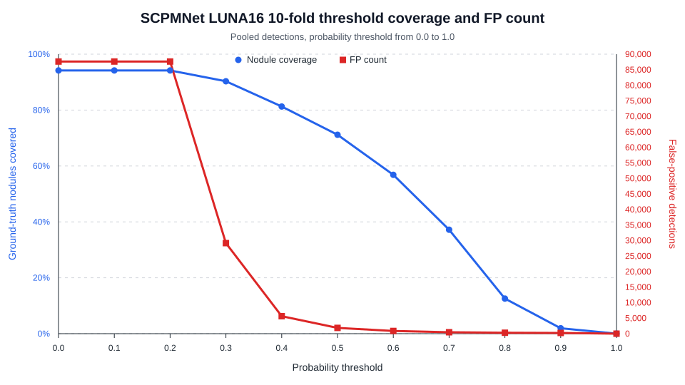

# SCPMNet LUNA16 10-Fold Detection Coverage by Threshold

Source predictions: `outputs/scpmnet_luna16_10fold/cv_aggregate/pooled_test_predictions.csv`

Coverage is measured after keeping detections with `probability >= threshold`. A ground-truth nodule is counted as covered when a detection center falls within that nodule radius, using the same one-to-one matching rule as `src/det/SCPMNet/aggregate_luna16_cv.py`. Unmatched detections, including duplicate hits after a nodule has already been matched, are counted as false positives.

## Summary

- Test scans in pooled evaluation: **888**
- Positive test scans in pooled evaluation: **601**
- Ground-truth nodules in pooled evaluation: **1186**
- At threshold **0.0**, pooled nodule coverage is **94.2%** with **87,627** false positives.
- At threshold **1.0**, pooled nodule coverage is **0.0%** with **0** false positives.

## Threshold Table

| Threshold | Detections kept | Covered nodules | Nodule coverage | Positive-scan coverage | FP count | FP/scan |
|---:|---:|---:|---:|---:|---:|---:|
| 0.0 | 88,744 | 1117/1186 | 94.2% | 587/601 (97.7%) | 87,627 | 98.68 |
| 0.1 | 88,744 | 1117/1186 | 94.2% | 587/601 (97.7%) | 87,627 | 98.68 |
| 0.2 | 88,744 | 1117/1186 | 94.2% | 587/601 (97.7%) | 87,627 | 98.68 |
| 0.3 | 30,227 | 1071/1186 | 90.3% | 571/601 (95.0%) | 29,156 | 32.83 |
| 0.4 | 6,581 | 964/1186 | 81.3% | 534/601 (88.9%) | 5,617 | 6.33 |
| 0.5 | 2,711 | 844/1186 | 71.2% | 487/601 (81.0%) | 1,867 | 2.10 |
| 0.6 | 1,537 | 674/1186 | 56.8% | 423/601 (70.4%) | 863 | 0.97 |
| 0.7 | 898 | 441/1186 | 37.2% | 305/601 (50.7%) | 457 | 0.51 |
| 0.8 | 456 | 149/1186 | 12.6% | 120/601 (20.0%) | 307 | 0.35 |
| 0.9 | 248 | 23/1186 | 1.9% | 23/601 (3.8%) | 225 | 0.25 |
| 1.0 | 0 | 0/1186 | 0.0% | 0/601 (0.0%) | 0 | 0.00 |

## Output Files

- Plot: `docs/scpmnet_luna16_10fold_detection_coverage/assets/threshold_detection_coverage.svg`
- Threshold values: `docs/scpmnet_luna16_10fold_detection_coverage/threshold_detection_coverage.csv`
