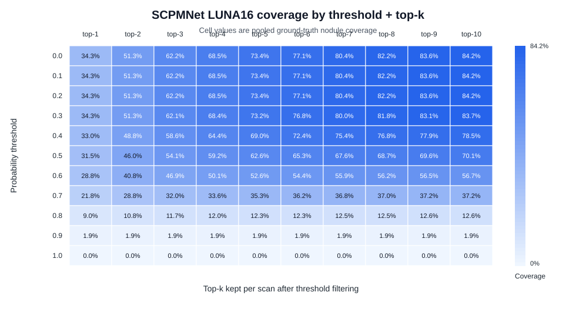

# SCPMNet LUNA16 10-Fold Detection Coverage by Threshold + Top-k

Source predictions: `outputs/scpmnet_luna16_10fold/cv_aggregate/pooled_test_predictions.csv`

Coverage is measured after first keeping detections with `probability >= threshold`, then keeping the top-k remaining detections per scan by `probability`. A ground-truth nodule is counted as covered when a detection center falls within that nodule radius, using the same one-to-one matching rule as `src/det/SCPMNet/aggregate_luna16_cv.py`. Unmatched detections, including duplicate hits after a nodule has already been matched, are counted as false positives.

## Summary

- Test scans in pooled evaluation: **888**
- Positive test scans in pooled evaluation: **601**
- Ground-truth nodules in pooled evaluation: **1186**
- Default detector-saliency setting `threshold=0.5`, `top-k=5`: **62.6%** nodule coverage, **1.53** FP/scan, **2,097** detections kept.
- Best coverage with `FP/scan <= 1.0`: threshold **0.6**, top-k **10**, coverage **56.7%**, FP/scan **0.95**.

## Threshold Sweep at Top-k = 5

| Threshold | Top-k | Detections kept | Covered nodules | Nodule coverage | Positive-scan coverage | FP count | FP/scan |
|---:|---:|---:|---:|---:|---:|---:|---:|
| 0.0 | 5 | 4,440 | 870/1186 | 73.4% | 537/601 (89.4%) | 3,570 | 4.02 |
| 0.1 | 5 | 4,440 | 870/1186 | 73.4% | 537/601 (89.4%) | 3,570 | 4.02 |
| 0.2 | 5 | 4,440 | 870/1186 | 73.4% | 537/601 (89.4%) | 3,570 | 4.02 |
| 0.3 | 5 | 4,345 | 868/1186 | 73.2% | 536/601 (89.2%) | 3,477 | 3.92 |
| 0.4 | 5 | 3,482 | 818/1186 | 69.0% | 506/601 (84.2%) | 2,664 | 3.00 |
| 0.5 | 5 | 2,097 | 742/1186 | 62.6% | 463/601 (77.0%) | 1,355 | 1.53 |
| 0.6 | 5 | 1,319 | 624/1186 | 52.6% | 404/601 (67.2%) | 695 | 0.78 |
| 0.7 | 5 | 809 | 419/1186 | 35.3% | 293/601 (48.8%) | 390 | 0.44 |
| 0.8 | 5 | 421 | 146/1186 | 12.3% | 118/601 (19.6%) | 275 | 0.31 |
| 0.9 | 5 | 238 | 23/1186 | 1.9% | 23/601 (3.8%) | 215 | 0.24 |
| 1.0 | 5 | 0 | 0/1186 | 0.0% | 0/601 (0.0%) | 0 | 0.00 |

## Top-k Sweep at Threshold = 0.5

| Threshold | Top-k | Detections kept | Covered nodules | Nodule coverage | Positive-scan coverage | FP count | FP/scan |
|---:|---:|---:|---:|---:|---:|---:|---:|
| 0.5 | 1 | 704 | 374/1186 | 31.5% | 374/601 (62.2%) | 330 | 0.37 |
| 0.5 | 2 | 1,241 | 546/1186 | 46.0% | 414/601 (68.9%) | 695 | 0.78 |
| 0.5 | 3 | 1,629 | 642/1186 | 54.1% | 439/601 (73.0%) | 987 | 1.11 |
| 0.5 | 4 | 1,899 | 702/1186 | 59.2% | 454/601 (75.5%) | 1,197 | 1.35 |
| 0.5 | 5 | 2,097 | 742/1186 | 62.6% | 463/601 (77.0%) | 1,355 | 1.53 |
| 0.5 | 6 | 2,255 | 774/1186 | 65.3% | 470/601 (78.2%) | 1,481 | 1.67 |
| 0.5 | 7 | 2,375 | 802/1186 | 67.6% | 480/601 (79.9%) | 1,573 | 1.77 |
| 0.5 | 8 | 2,461 | 815/1186 | 68.7% | 483/601 (80.4%) | 1,646 | 1.85 |
| 0.5 | 9 | 2,530 | 825/1186 | 69.6% | 485/601 (80.7%) | 1,705 | 1.92 |
| 0.5 | 10 | 2,582 | 831/1186 | 70.1% | 486/601 (80.9%) | 1,751 | 1.97 |

## Output Files

- Plot: `docs/scpmnet_luna16_10fold_detection_coverage/assets/threshold_topk_detection_coverage.svg`
- Full threshold x top-k values: `docs/scpmnet_luna16_10fold_detection_coverage/threshold_topk_detection_coverage.csv`
