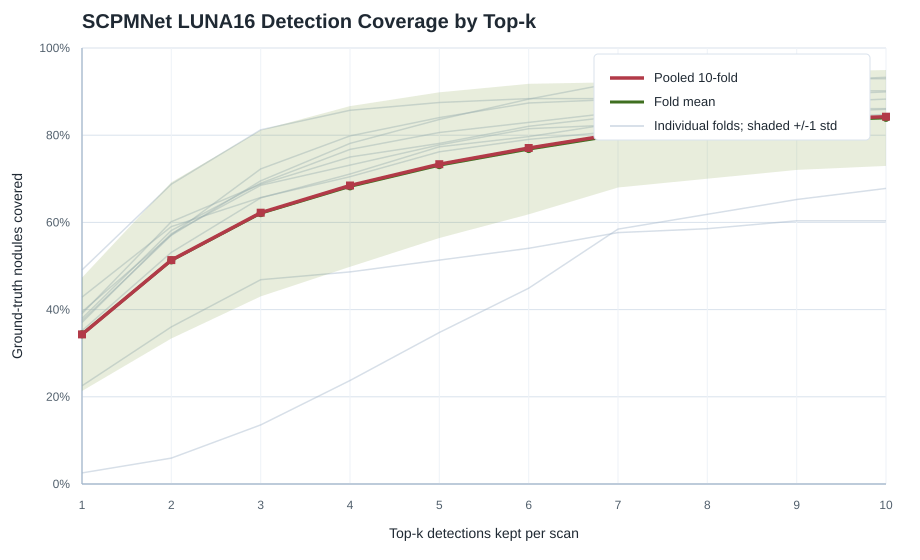

# SCPMNet LUNA16 10-Fold Detection Coverage by Top-k

Source predictions: `outputs/scpmnet_luna16_10fold`

Coverage is measured after keeping the top-k detections per scan by `probability`. A ground-truth nodule is counted as covered when a detection center falls within that nodule radius, using the same one-to-one matching rule as `src/det/SCPMNet/aggregate_luna16_cv.py`.

## Summary

- Test folds analyzed: **10**
- Positive test scans in pooled evaluation: **601**
- Ground-truth nodules in pooled evaluation: **1186**
- Pooled nodule coverage rises from **34.3%** at top-1 to **84.2%** at top-10.
- Pooled positive-scan coverage rises from **67.7%** at top-1 to **94.3%** at top-10.

## Coverage Table

| Top-k | Pooled covered nodules | Pooled nodule coverage | Fold mean +/- std | Fold min-max | Pooled positive-scan coverage |
|---:|---:|---:|---:|---:|---:|
| 1 | 407/1186 | 34.3% | 34.3% +/- 13.0 pp | 2.5%-49.1% | 407/601 (67.7%) |
| 2 | 609/1186 | 51.3% | 51.3% +/- 17.9 pp | 5.9%-68.8% | 467/601 (77.7%) |
| 3 | 738/1186 | 62.2% | 62.1% +/- 19.1 pp | 13.6%-81.2% | 506/601 (84.2%) |
| 4 | 812/1186 | 68.5% | 68.3% +/- 18.4 pp | 23.7%-85.7% | 525/601 (87.4%) |
| 5 | 870/1186 | 73.4% | 73.1% +/- 16.7 pp | 34.7%-87.5% | 537/601 (89.4%) |
| 6 | 914/1186 | 77.1% | 76.8% +/- 15.0 pp | 44.9%-88.4% | 547/601 (91.0%) |
| 7 | 953/1186 | 80.4% | 80.1% +/- 12.1 pp | 57.7%-92.2% | 558/601 (92.8%) |
| 8 | 975/1186 | 82.2% | 81.9% +/- 11.9 pp | 58.6%-93.0% | 563/601 (93.7%) |
| 9 | 991/1186 | 83.6% | 83.3% +/- 11.3 pp | 60.4%-93.0% | 566/601 (94.2%) |
| 10 | 999/1186 | 84.2% | 84.0% +/- 11.0 pp | 60.4%-93.3% | 567/601 (94.3%) |

## Output Files

- Plot: `docs/scpmnet_luna16_10fold_detection_coverage/assets/topk_detection_coverage.svg`
- Per-fold and pooled values: `docs/scpmnet_luna16_10fold_detection_coverage/topk_detection_coverage.csv`
- Summary values: `docs/scpmnet_luna16_10fold_detection_coverage/topk_detection_coverage_summary.csv`
