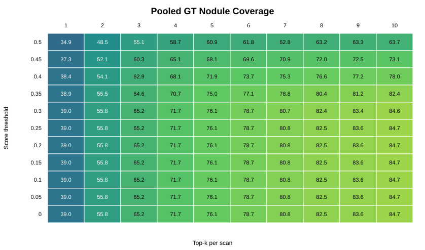
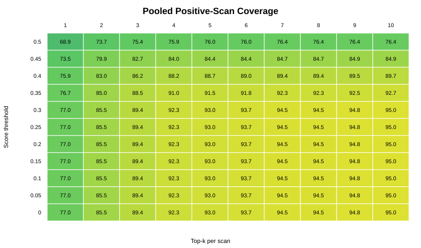

# FPR Training and Detection Coverage Comparison

## Scope

This report summarizes the false-positive reduction (FPR) module used in:

`outputs/scpmnet_luna16_10fold_fpr_top100_focal_balanced_average`

and compares the current FPR-based detection coverage map with the previous SCPMNet coverage map:

`docs/scpmnet_luna16_10fold_detection_coverage`

The current coverage outputs are in:

`docs/scpmnet_luna16_10fold_fpr_detection_coverage`

## FPR Training Setup

The FPR module is trained as a second-stage classifier on SCPMNet candidate detections. For each fold, candidates are built from the original detector predictions using the top 100 detections per scan. Train and validation candidates are labeled by geometric matching against LUNA16 ground-truth nodules: a candidate is positive when its center falls inside a GT nodule radius, and near misses within an ignore margin are excluded from training.

The run script uses these defaults:

| Parameter | Value |
| --- | --- |
| Candidate source | `outputs/scpmnet_luna16_10fold` |
| Candidates per scan | `100` |
| Loss | focal loss |
| Focal alpha | `0.5` |
| Focal gamma | `2.0` |
| Balanced sampler | enabled |
| Samples per epoch | `10000` |
| Positive weight | disabled |
| Batch size | `128` |
| Epochs | `30` |
| Optimizer | AdamW |
| Learning rate | `1e-4` |
| Weight decay | `1e-4` |
| Precision | `16-mixed` |
| Checkpoint monitor | `val/mcc`, maximize |
| Test fusion | `0.5 * scpm_probability + 0.5 * classifier_probability` |

The reason for using `alpha=0.5` is that the train loader already uses a balanced sampler. Therefore each training epoch sees approximately equal positive and negative samples. A larger positive alpha would double-count the positive class emphasis.

The validation loader is not balanced: it evaluates the full natural validation candidate set. This is important because `val/accuracy` is misleading under the natural imbalance, while `val/mcc` and `val/auc` better reflect whether the classifier separates positives from false positives. The best checkpoint is therefore selected with `val/mcc`.

## FPR Architecture

Each FPR input is a 3D patch centered on a candidate detection plus a small metadata vector.

Image input:

- one CT patch
- shape: `1 x 32 x 32 x 32`
- source volume already lung-windowed by LUNA16 preprocessing from HU `[-1200, 600]` to uint8-like `[0, 255]`
- the FPR dataset then applies its generic `normalize_ct(..., clip=(-1000, 400))` transform to the extracted patch
- training augmentation: random 3D flips and light Gaussian noise

Important detail: the saved LUNA16 `_volume.nii.gz` files are not raw HU volumes. They are already windowed by `lumTrans` during preprocessing. Therefore the FPR `clip=(-1000, 400)` step should be interpreted as a legacy/generic normalization step inherited from the SCPMNet dataset code, not as the first HU windowing operation.

Metadata input:

| Feature | Meaning |
| --- | --- |
| `probability` | original SCPMNet candidate score |
| `radius / 32` | candidate radius normalized by patch size |
| `coordZ / depth` | normalized z position |
| `coordY / height` | normalized y position |
| `coordX / width` | normalized x position |

Network:

| Block | Layers |
| --- | --- |
| 3D feature extractor | `Conv3d(1,16) -> BN -> ReLU -> MaxPool3d` |
|  | `Conv3d(16,32) -> BN -> ReLU -> MaxPool3d` |
|  | `Conv3d(32,64) -> BN -> ReLU -> AdaptiveAvgPool3d(1)` |
| Classifier head | concatenate 64 image features + 5 metadata features |
|  | `Linear(69,64) -> ReLU -> Dropout(0.2) -> Linear(64,1)` |
| Output | sigmoid probability of true positive candidate |

During rescoring, the final score used for coverage and FROC is:

```text
probability = 0.5 * scpm_probability + 0.5 * classifier_probability
```

## Coverage Method

Coverage is computed by selecting candidate detections per scan using a score threshold and top-k cap:

```text
keep candidates with score >= threshold
then keep top-k per scan
```

A GT nodule is counted as covered when one selected detection center falls inside the GT nodule radius. Matching is one-to-one, so multiple detections cannot cover the same GT nodule multiple times.

Current FPR coverage map:



Current FPR positive-scan coverage map:



## Old vs Current Coverage

The table below compares the previous SCPMNet coverage with the current FPR-fused coverage at shared working points.

| Threshold | Top-k | Old nodule coverage | Current nodule coverage | Delta | Old positive-scan coverage | Current positive-scan coverage | Delta | Old FP/scan | Current FP/scan | Delta |
| ---: | ---: | ---: | ---: | ---: | ---: | ---: | ---: | ---: | ---: | ---: |
| 0.40 | 7 | 75.38% | 75.30% | -0.08 pp | 87.52% | 89.35% | +1.83 pp | 3.92 | 3.14 | -0.78 |
| 0.30 | 7 | 80.02% | 80.69% | +0.67 pp | 92.51% | 94.51% | +2.00 pp | 5.69 | 5.76 | +0.07 |
| 0.00 | 10 | 84.23% | 84.74% | +0.51 pp | 94.34% | 95.01% | +0.67 pp | 8.88 | 8.87 | -0.01 |
| 0.30 | 10 | 83.73% | 84.57% | +0.84 pp | 93.84% | 95.01% | +1.16 pp | 8.37 | 8.47 | +0.11 |

The current FPR-fused detections are not dramatically different in maximum coverage, but they are slightly better at high-coverage operating points and can be cleaner at moderate coverage. The clearest gain is at `threshold=0.40, topk=7`: nodule coverage is essentially unchanged, positive-scan coverage improves, and FP/scan drops from `3.92` to `3.14`.

## Recommended Working Points

### Balanced Default

```text
threshold = 0.30
topk = 7
```

This is the best default if the goal is to generate synthetic samples from detector-guided candidate locations while keeping strong GT coverage.

| Metric | Value |
| --- | ---: |
| Covered nodules | `957 / 1186` |
| Nodule coverage | `80.69%` |
| Positive-scan coverage | `94.51%` |
| FP/scan | `5.76` |
| Detections kept | `6072` |

### Cleaner Moderate-Coverage Point

```text
threshold = 0.40
topk = 7
```

This is useful if synthetic generation cost is high or if too many false candidate locations degrade the downstream classifier.

| Metric | Value |
| --- | ---: |
| Covered nodules | `893 / 1186` |
| Nodule coverage | `75.30%` |
| Positive-scan coverage | `89.35%` |
| FP/scan | `3.14` |
| Detections kept | `3680` |

Compared with the old detector at the same working point, this keeps nearly the same nodule coverage but reduces false positives by about `0.78 FP/scan`.

### High-Coverage Point

```text
threshold = 0.30
topk = 10
```

This is the best option if the priority is to cover as many GT nodules as possible and the synthetic pipeline can tolerate more candidate locations.

| Metric | Value |
| --- | ---: |
| Covered nodules | `1003 / 1186` |
| Nodule coverage | `84.57%` |
| Positive-scan coverage | `95.01%` |
| FP/scan | `8.47` |
| Detections kept | `8527` |

### Highest Coverage in the Current Grid

```text
threshold = 0.00
topk = 10
```

This gives the maximum current coverage, but it is only slightly better than `threshold=0.30, topk=10` while keeping more detections.

| Metric | Value |
| --- | ---: |
| Covered nodules | `1005 / 1186` |
| Nodule coverage | `84.74%` |
| Positive-scan coverage | `95.01%` |
| FP/scan | `8.87` |
| Detections kept | `8880` |

## Practical Recommendation

Use two synthetic-generation settings rather than one:

| Setting | Threshold | Top-k | Why |
| --- | ---: | ---: | --- |
| Detector-guided balanced | `0.30` | `7` | good coverage with manageable noise |
| Detector-guided clean | `0.40` | `7` | fewer false locations, useful for a cleaner ablation |

If compute is available, add:

| Setting | Threshold | Top-k | Why |
| --- | ---: | ---: | --- |
| Detector-guided high coverage | `0.30` | `10` | almost maximum GT coverage without keeping all low-score candidates |

The old setting `top7_minprob0.3` remains a good baseline, but with the current FPR-fused scores it covers slightly more nodules and more positive scans. The clean setting `threshold=0.40, topk=7` is especially interesting because it preserves about 75% nodule coverage while reducing false positives substantially.

## Generated Files

- `pooled_coverage.csv`: pooled threshold/top-k coverage for current FPR scores.
- `coverage_by_threshold_topk.csv`: fold-level and pooled coverage for current FPR scores.
- `coverage_old_vs_fpr_selected_points.csv`: direct comparison between previous and current coverage at selected shared working points.
- `missed_nodules.csv`: GT nodules missed by the best current pooled coverage row.
- `assets/nodule_coverage_heatmap.svg`: current FPR nodule coverage map.
- `assets/positive_scan_coverage_heatmap.svg`: current FPR positive-scan coverage map.
